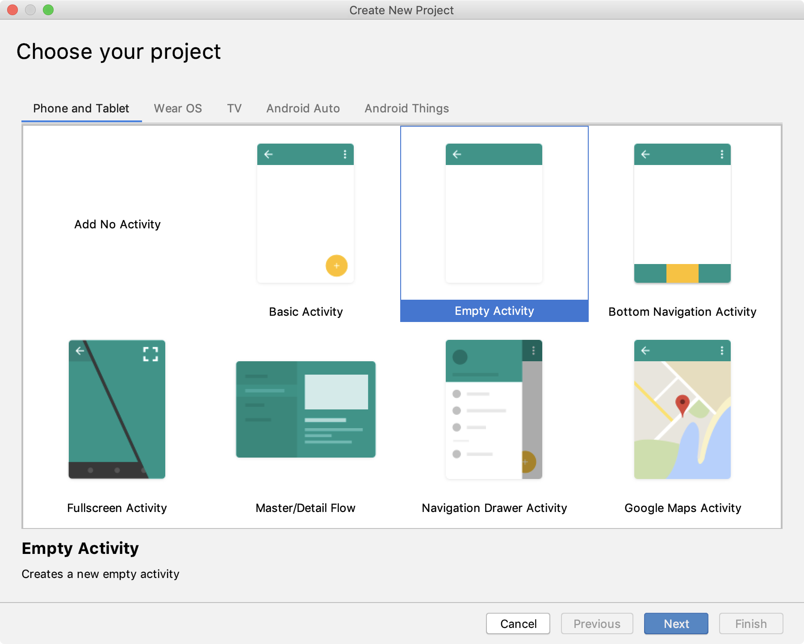
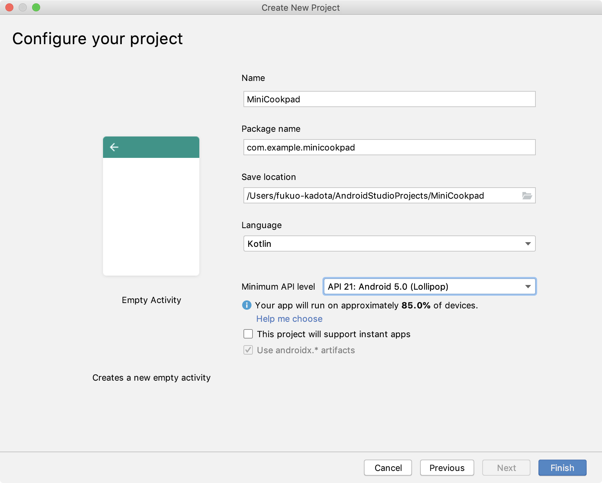
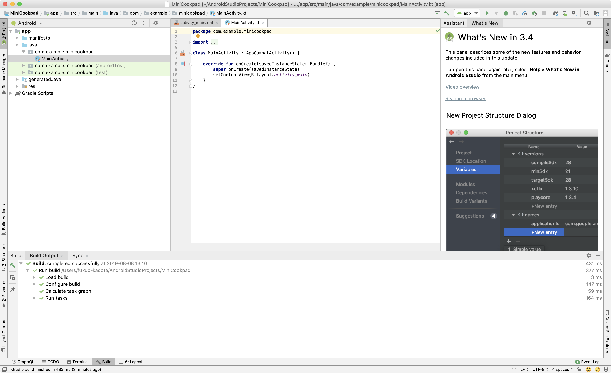
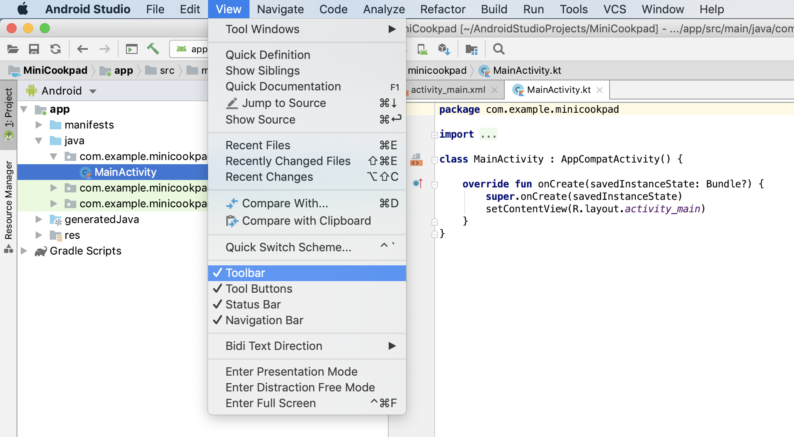
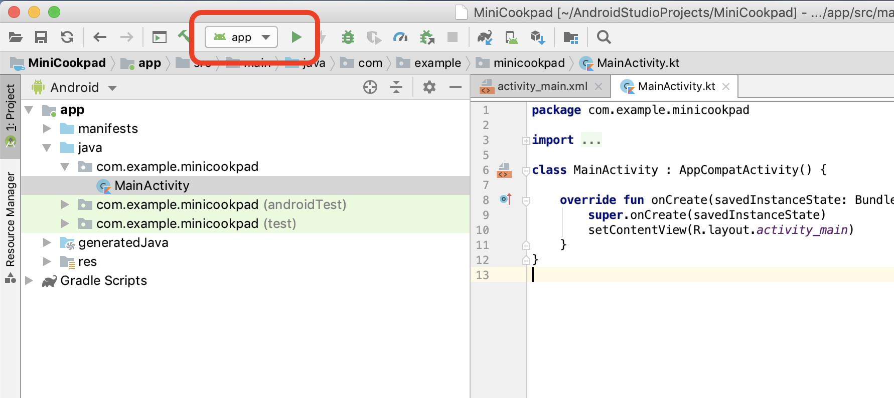
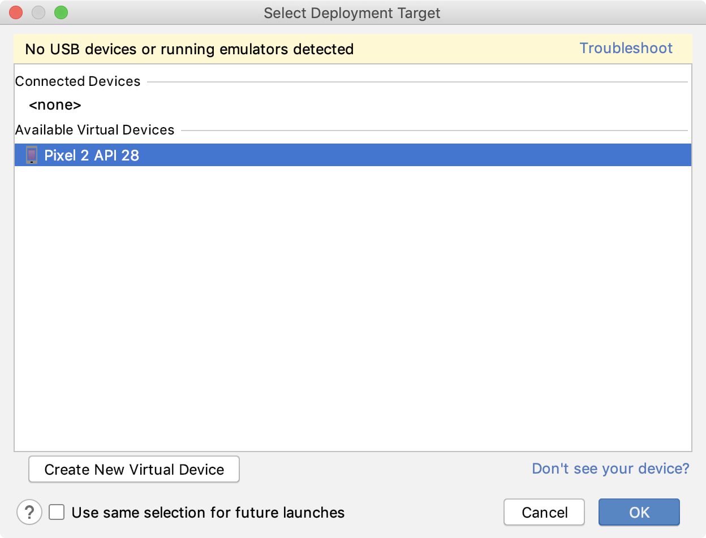
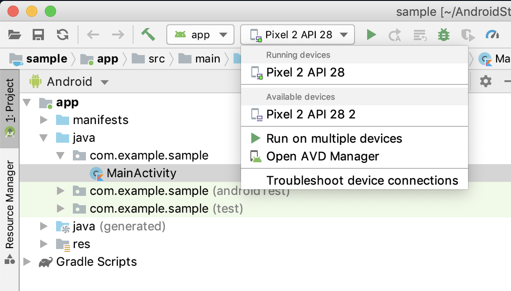
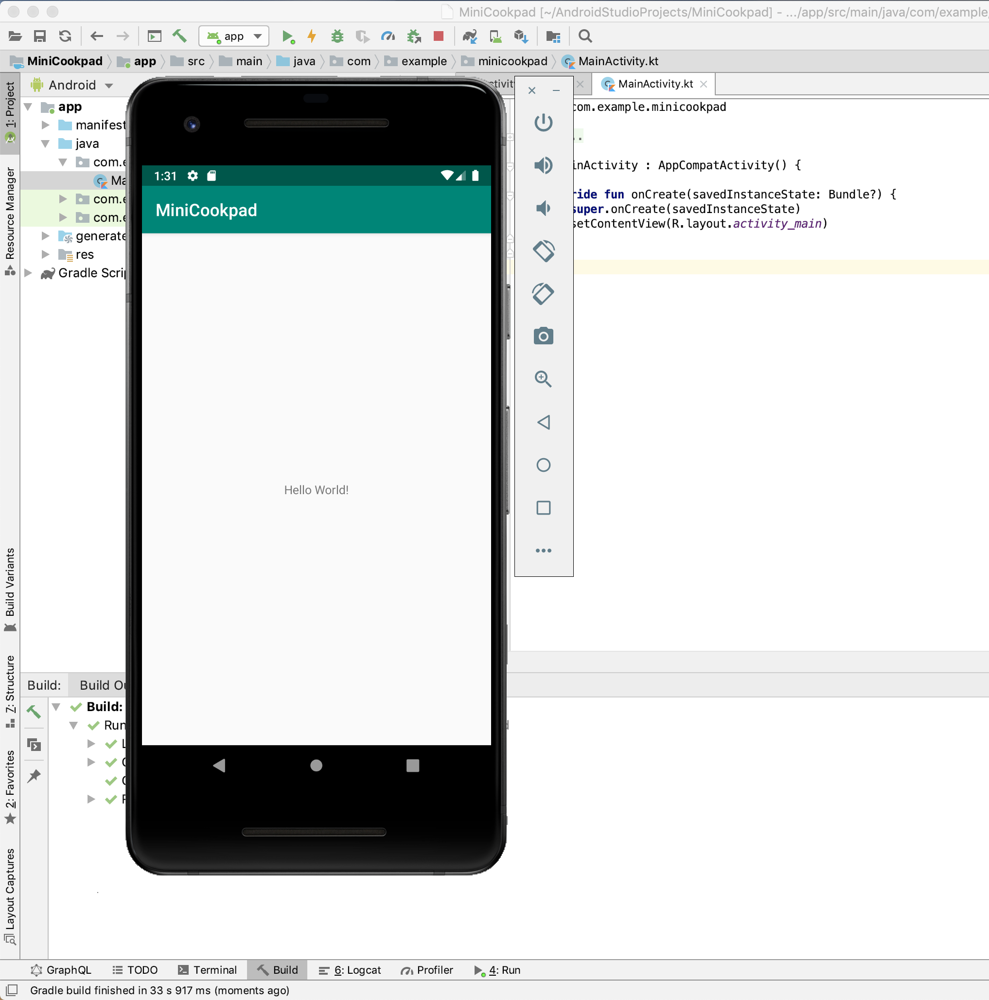

# 第1章: Androidアプリをビルドする

まずは、Androidアプリプロジェクトを作成しましょう。
この章では、以下の項目について説明します。

- Android Studio上でプロジェクトを作成
- アプリをビルドして、エミュレータ上で起動する

## プロジェクトを作成する

はじめに、Projectのデフォルト構成を選択します。
なにも考えずにPhone and Table > Empty Activityを選択して次に進みます。

この画面では、Projectのデフォルト設定を記述します。

- Name: アプリ名, プロジェクト名
- Package Name: アプリを一意に定めるための識別子
- Save location: プロジェクトの保存先
- Language: デフォルトの使用言語
- Minimum API level: サポート対象OSの最小バージョン

これらの値は後から変更もできるのですが、最低限以下の設定は行ってください。

- Language: **「Kotlin」**
- Minimum API level: **「API 21: Android 5.0(Lollipop)」**

設定が完了したらOKを押して次へ進みます。

起動が完了したら、この状態になるはずです。（ここでGradle Syncが終わるまでしばらく待つ）

ファイルが開いてなくても気にせず進みましょう（開かれている必要はありません）

実行ボタンが右側にあるのは僕が見慣れないので、「View > Toolbar」のチェックを入れていつもの見慣れた形に変えます。

左上に起動ボタン ▶ があるので、それを押します。

アプリを起動する端末を選択する画面が表示されるので、事前に作ってあったエミュレータを選択してOKを押します。

Android Studio 3.5では、この端末選択画面がシンプルになりました。

エミュレータが起動し、下の画像のようにアプリが起動すれば成功です。

おめでとうございます！アプリが完成しました！ :tada:

これであなたも立派なAndroidエンジニアを名乗れます。
