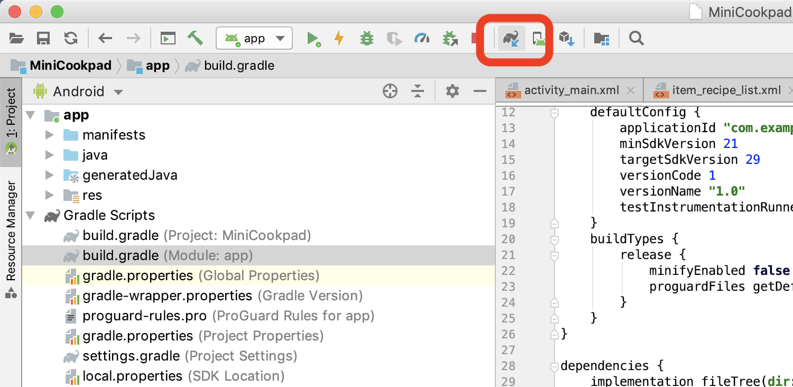
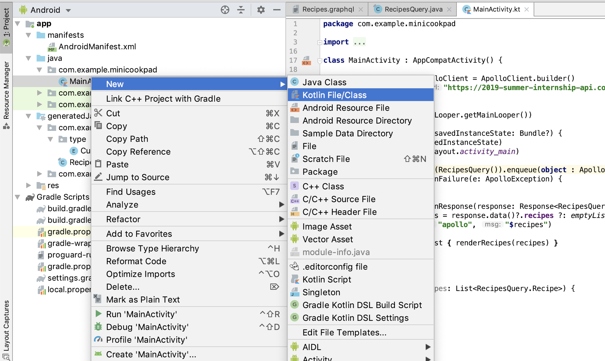
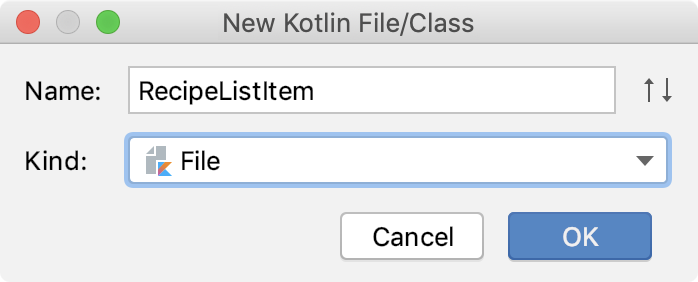

# 第2章: レシピ一覧を表示する

前章では、画面上に「Hello, World!」と表示されるだけのアプリを作成しました。

ここからは、前日に作ったAPIを使ってアプリに情報を表示していきます。
まずは、レシピの一覧をアプリ上で表示する画面を作成していきます。

この章では、以下の作業を行っていきます。

- GraphQL APIを実行し、実行結果をログに出力する
- RecyclerViewを使用したリスト画面のレイアウトを作成する
- APIの実行結果とレイアウトを紐付ける

## 必要な依存を追加する

ここで、Androidアプリ開発でのライブラリの追加方法について軽く説明します。
Androidアプリ開発では、Gradleと呼ばれるビルドツールを用いて開発を行います。Gradleは、 build.gradle と呼ばれる設定ファイルに様々な設定を記述し、実行することができます。

今回は、GraphQLのクエリをJavaのコードに変換するためのライブラリも導入するため、Gradle Pluginの導入も同時に行います。

プロジェクトのRootにあるbuild.gradleを開きます。


以下のように、apollo-gradle-pluginを追加しましょう。

```diff
// Top-level build file where you can add configuration options common to all sub-projects/modules.

buildscript {
    ext.kotlin_version = '1.3.31'
    repositories {
        google()
        jcenter()
    }
    dependencies {
        classpath 'com.android.tools.build:gradle:3.4.1'
        classpath "org.jetbrains.kotlin:kotlin-gradle-plugin:$kotlin_version"
        // NOTE: Do not place your application dependencies here; they belong
        // in the individual module build.gradle files
+        classpath "com.apollographql.apollo:apollo-gradle-plugin:1.0.2"
    }
}
```

では次に、 app/build.gradle ファイルを開いてみましょう。


ここにはAndroidアプリの様々な設定を記述する項目があります。
まずは、先ほど導入したapollo-gradle-pluginを有効にするよう設定します。

これで、Gradle Pluginを使う準備は整いました。

```diff

apply plugin: 'com.android.application'

apply plugin: 'kotlin-android'

apply plugin: 'kotlin-android-extensions'

+apply plugin: 'com.apollographql.android'

android {
    compileSdkVersion 28
    defaultConfig {
```

次に、ライブラリを導入していきます。
同じく app/build.gradle ファイルの下の方にある、 `dependencies {}` という箇所に注目してください。

これは、Androidアプリ開発におけるライブラリの依存関係を解決するための仕組みで、ここに必要なライブラリを追加していくことで利用することができます。

以下のように追加しましょう。

```diff
dependencies {
    implementation fileTree(dir: 'libs', include: ['*.jar'])
    implementation"org.jetbrains.kotlin:kotlin-stdlib-jdk7:$kotlin_version"
    implementation 'androidx.appcompat:appcompat:1.0.2'
    implementation 'androidx.core:core-ktx:1.0.2'
    implementation 'androidx.constraintlayout:constraintlayout:1.1.3'
    testImplementation 'junit:junit:4.12'
    androidTestImplementation 'androidx.test:runner:1.2.0'
    androidTestImplementation 'androidx.test.espresso:espresso-core:3.2.0'
+    implementation 'androidx.recyclerview:recyclerview:1.0.0'
+    implementation "com.xwray:groupie:2.3.0"
+    implementation 'com.github.bumptech.glide:glide:4.9.0'
+    annotationProcessor 'com.github.bumptech.glide:compiler:4.9.0'
+    implementation "com.apollographql.apollo:apollo-runtime:1.0.2"
+    compileOnly 'org.jetbrains:annotations:13.0'
}
```

今回は、以下のライブラリを追加しました。

- RecyclerView
  - リスト表示するためのViewコンポーネントを提供するライブラリ
- Groupie
  - RecyclerViewで複雑なレイアウトを簡単に構築できるようにする便利ライブラリ
- Glide
  - 画像を読み込む際に使用するライブラリ
- ApolloClient
  - GraphQLでの通信を行うためのライブラリ

他にも様々なライブラリが存在しています。アプリ開発を有利に進める上では必要不可欠なので、これらのライブラリを導入する手順は覚えておくと良いでしょう。

最後に、この変更を適用させます。左上にある🐘のアイコンを押すと、今修正した内容を基にライブラリのダウンロードを行ってくれます。



Gradle Syncが成功すればOKです。次に進みましょう。

## GraphQLからデータを読み込む

さて、GraphQLから必要なデータを読み込む作業に入っていきましょう。
今回は、Androidアプリ上でGraphQLを扱うためのライブラリとして、apollo-androidを利用します。
[https://github.com/apollographql/apollo-android](https://github.com/apollographql/apollo-android)

このライブラリを使用するときは、以下のステップを踏む必要があります。

- apollo-cliを使って取得できる schema.json を所定の位置に置く
- 所定の位置にクエリを書く
  - ここで、schema.json と クエリ に対応したJavaのコードが生成される
- プログラム上から必要なタイミングで扱う
- アプリからのインターネット通信を許可する

一つずつ進んでいきましょう。

### apollo-cli を使って schema.json を入手する

まずは、apollo-cli を使って schema.json をプロジェクトの所定の位置に置きます。
ターミナルから、以下のコマンドを使って schema.json を取得します。

```sh
# endpointには自分で作ったAPIのエンドポイントを指定する
$ apollo client:download-schema --endpoint=https://bff-demo.xn--eckuc3hb8b.xn--fow072g.jp
```

取得できた schema.json は、プロジェクトの所定の位置に配置します。

- 「`app/src/main/graphql/<package>/schema.json`」

例えば、 `com.example.minicookpad` というパッケージでプロジェクトを作っている場合、配置する場所は以下のようになります。

- 「`app/src/main/graphql/com/example/minicookpad/schema.json`」

ターミナルから実行する場合は以下のようになります。

```sh
$ mkdir -p app/src/main/graphql/com/example/minicookpad/
$ mv schema.json app/src/main/graphql/com/example/minicookpad/
```

### GraphQLのクエリを書く

次は、必要なデータを取り出すためのクエリを書きましょう。
schema.json を配置した場所と同じところに、 `Recipes.graphql` というファイルを作成して配置しましょう。

- 「`app/src/main/graphql/<package>/Recipes.graphql`」

中身には、GraphQLのクエリをそのまま書けばOKです。

```graphql
query RecipesQuery {
    recipes {
        id
        name
        description
        media {
            thumbnail
        }
    }
}
```

ここまで済んだら、一度ビルドをしてみます。

- 「Build > Rebuild Project」


成功している場合、以下の場所にJavaのファイルが生成されます。

- 「`app/generatedJava/<package>/RecipesQuery`」


### プログラム上から呼び出す

さて、これを実際にアプリから扱ってみましょう。まず、GraphQLを扱うために、ApolloClientを初期化します。
MainActivity.kt が配置してある付近で右クリックして ApolloClient.kt というファイルを作成します。

- 「New > Kotlin File/Class」

中には、このように記述します。
ここでは、AuthoCenterとの通信に必要な記述も用意しています。必要に応じて内容は修正しましょう。

```kt
private const val authoCenterEndpoint = "<認証サーバーのエンドポイントを入れる>"
private const val dankaiEndpoint = "<3日目に作ったGraphQLサーバーのエンドポイントを入れる>"

private val authoCenterClient = OkHttpClient()

fun getToken(): String {
    val userId = "userId"
    val password = "password"

    val tokenRequest = Request.Builder()
        .url(authoCenterEndpoint)
        .post(
            FormBody.Builder()
                .add("grant_type", "big_fake_password")
                .add("user_id", userId)
                .add("password", password)
                .build()
        )
        .build()
    val tokenResponse = authoCenterClient.newCall(tokenRequest).execute()

    return if (tokenResponse.isSuccessful) {
        val json = JSONObject(tokenResponse.body()?.string())
        json["id_token"].toString()
    } else {
        ""
    }
}

val apolloClient: ApolloClient = ApolloClient.builder()
    .serverUrl(dankaiEndpoint)
    .okHttpClient(
        OkHttpClient.Builder()
            .addInterceptor { chain -> // headerにID Tokenを載せます
                val newRequest = chain.request().newBuilder()
                    .addHeader("Authorization", "Bearer ${getToken()}")
                    .build()
                chain.proceed(newRequest)
            }
            .build()
    )
    .build()
```

ここまでで、ApolloClientを使うための用意は完了しました。

続いて、先ほど作成したGraphQLのクエリを扱う実装を行っていきます。MainActivity.kt を開きましょう。

- 「app > java > package > MainActivity.kt」


```kt
class MainActivity : AppCompatActivity() {

    override fun onCreate(savedInstanceState: Bundle?) {
        super.onCreate(savedInstanceState)
        setContentView(R.layout.activity_main)
    }
}
```

ここに、以下のように書き加えます。

```diff
class MainActivity : AppCompatActivity() {

    override fun onCreate(savedInstanceState: Bundle?) {
        super.onCreate(savedInstanceState)
        setContentView(R.layout.activity_main)
+
+        apolloClient.query(RecipesQuery()).enqueue(object : ApolloCall.Callback<RecipesQuery.Data>() {
+            override fun onFailure(e: ApolloException) {
+            }
+
+            override fun onResponse(response: Response<RecipesQuery.Data>) {
+                val recipes = response.data()?.recipes ?: emptyList()
+                Log.d("apollo", "$recipes")
+            }
+        })
    }
}
```

細かい説明は省きます。

- 「ApolloClientに対して、さっき作ったクエリを実行して、結果を受け取る」

だけ覚えてください。

ここでは、結果を Log に出力するような実装を行いました。

### アプリからのインターネット通信を許可する

最後に、アプリからインターネット通信を許可するようにパーミッションを与えます。
AndroidManifest.xml という箇所に、アプリのパーミッションや起動するApplicationの設定を行う箇所があります。これを開きましょう。

- 「app > manifests > AndroidManifest.xml」


以下のように書き加えます。

```diff
<?xml version="1.0" encoding="utf-8"?>
<manifest xmlns:android="http://schemas.android.com/apk/res/android"
          package="com.example.minicookpad">

+    <uses-permission android:name="android.permission.INTERNET" />

    <application
            android:allowBackup="true"
            android:icon="@mipmap/ic_launcher"
            android:label="@string/app_name"
```

これですべての準備は整いました。
一度、アプリをビルドして起動してみましょう。

とくになにも起こりませんね。

では、先ほど仕込んだLogを見てみます。
Android Studioの左下に LogCat というものがあるので、それを開きます。


タブ内の上の方に、ログを表示する端末と、ログを表示したいアプリを選択できる箇所があるので、設定してみましょう。
そうすると、先ほどアプリから出力したログが表示されていることが確認できると思います。

ここで表示されていれば、成功です！次のステップに進みましょう。
表示されていない場合は、GraphQLでのリクエスト時にエラーが出ている可能性があります。そちらもログを出して確認してみると良いでしょう。

## 表示するためのViewを用意する

それでは、上で受け取ったデータを表示するための画面を作成していきます。

デフォルトで作成したプロジェクトは、MainActivityというクラスがアプリのエントリポイントになっており、そこに登録されたレイアウトが表示される仕組みになっています。

```kt
class MainActivity : AppCompatActivity() {

    // Activityが起動するときに呼び出される
    override fun onCreate(savedInstanceState: Bundle?) {
        super.onCreate(savedInstanceState)
        // レイアウトを指定してActivityに設定する
        setContentView(R.layout.activity_main)
    }
}
```

まずは、このレイアウトにレシピ一覧を表示するためのViewコンポーネントを設定しましょう。

Android Studioの左側に開いているProject Viewから、

- 「app > res > layout > activity_main.xml」

を探して開きましょう。


res/ ディレクトリ以下にあるものは「リソース」と呼ばれ、プログラム上で扱う際には各リソースごとに一意のIDが振られます。
今回見ているリソースは activity_main.xml という layout リソースなので、プログラム上では

`R.layout.activity_main`

というIDでリソースを参照することができます。

### レイアウトエディタの簡単な説明

Android Studioでは、レイアウトリソースに対して専用のGUIエディタ（レイアウトエディタ）が表示されます。

簡単に全体の構成を説明します。


- ① Palette: レイアウト上に配置できるViewの一覧
- ② Component Tree: レイアウトのツリー構造を俯瞰できる
- ③ Preview: 組んだレイアウトのプレビュー
- ④ Attributes: 選択中のViewのプロパティを変更できる

また、AndroidのレイアウトはXMLで表現されているため、XMLを直接編集するための切り替えも左下についています。

講義では簡単にレイアウトエディタの使い方を説明しますが、資料では完成形のみを載せます。

### 一覧を表示するためのViewコンポーネントを配置する

Androidには、あるデータ構造に対してリスト表示することを実現するための仕組みとして、RecyclerViewというViewコンポーネントが用意されています。
今回はそれを使用するので、そのViewコンポーネントを配置しましょう。

完成形は以下のようになります。


```xml
<?xml version="1.0" encoding="utf-8"?>
<androidx.constraintlayout.widget.ConstraintLayout xmlns:android="http://schemas.android.com/apk/res/android"
    xmlns:app="http://schemas.android.com/apk/res-auto"
    xmlns:tools="http://schemas.android.com/tools"
    android:layout_width="match_parent"
    android:layout_height="match_parent"
    tools:context=".MainActivity">

    <androidx.recyclerview.widget.RecyclerView
        android:id="@+id/recipe_list"
        android:layout_width="match_parent"
        android:layout_height="match_parent"
        app:layout_constraintBottom_toBottomOf="parent"
        app:layout_constraintEnd_toEndOf="parent"
        app:layout_constraintStart_toStartOf="parent"
        app:layout_constraintTop_toTopOf="parent" />
</androidx.constraintlayout.widget.ConstraintLayout>
```

配置したViewをプログラムから扱うために android:id プロパティを設定しておきます。
こうすることで、プログラムから指定のIDのViewに対して変更を加えることができます。

## リストの各要素となるViewを作成する

リスト全体をまとめるViewの配置が完了しました。
次は、リストの各行ごとのレイアウトを作成しましょう。

res/layout フォルダの上で右クリックをして、レイアウトファイルを作成します。

- 「New > layout resource file」


- File name: **item_recipe_list**
- Root element: **androidx.constraintlayout.widget.ConstraintLayout**

と入力して、OKを選択します。


ここに、レイアウトを作成していきます。
どのような形でもいいですが、最低限以下のコンポーネントは配置しましょう。

- レシピ名を表示するTextView
  - ID: recipe_name
- レシピ画像を表示するImageView
  - ID: recipe_thumbnail
- レシピの説明文を表示するTextView
  - ID: recipe_description

だいたい下のような形になっていればOKです。


```xml
<androidx.constraintlayout.widget.ConstraintLayout xmlns:android="http://schemas.android.com/apk/res/android"
      xmlns:app="http://schemas.android.com/apk/res-auto"
      xmlns:tools="http://schemas.android.com/tools"
      android:layout_width="match_parent"
      android:layout_height="wrap_content">

      <ImageView
          android:id="@+id/recipe_thumbnail"
          android:layout_width="60dp"
          android:layout_height="60dp"
          android:layout_marginStart="8dp"
          android:layout_marginTop="12dp"
          android:layout_marginEnd="8dp"
          android:layout_marginBottom="12dp"
          android:src="@mipmap/ic_launcher"
          app:layout_constraintBottom_toBottomOf="parent"
          app:layout_constraintStart_toStartOf="parent"
          app:layout_constraintTop_toTopOf="parent" />

      <TextView
          android:id="@+id/recipe_name"
          android:layout_width="0dp"
          android:layout_height="wrap_content"
          android:layout_marginStart="8dp"
          android:layout_marginEnd="8dp"
          app:layout_constraintBottom_toTopOf="@+id/recipe_description"
          app:layout_constraintEnd_toEndOf="parent"
          app:layout_constraintStart_toEndOf="@+id/recipe_thumbnail"
          app:layout_constraintTop_toTopOf="parent"
          app:layout_constraintVertical_chainStyle="packed"
          tools:text="レシピ名" />

      <TextView
          android:id="@+id/recipe_description"
          android:layout_width="0dp"
          android:layout_height="wrap_content"
          android:layout_marginStart="8dp"
          android:layout_marginEnd="8dp"
          app:layout_constraintBottom_toBottomOf="parent"
          app:layout_constraintEnd_toEndOf="parent"
          app:layout_constraintStart_toEndOf="@+id/recipe_thumbnail"
          app:layout_constraintTop_toBottomOf="@+id/recipe_name"
          tools:text="説明文" />

  </androidx.constraintlayout.widget.ConstraintLayout>
```

レイアウトルートの layout_height は wrap_content に設定しましょう。
match_parent にしてしまうと、親のRecyclerViewの高さ分に設定されてしまい、一つのセルが大きくなりすぎてしまいます。

ここまででレイアウトファイルの用意は完了です。

次は、GraphQLとの接続部分を実装していきます。

## Viewとデータをつないで表示する

GraphQLを使って取得したデータと、作成したレイアウトファイルを繋いでいきましょう。

まず、MainActivity.ktを開き、以下のように修正します。

```diff
class MainActivity : AppCompatActivity() {

+    val handler = Handler(Looper.getMainLooper())
+
```

```diff
        apolloClient.query(RecipesQuery()).enqueue(object : ApolloCall.Callback<RecipesQuery.Data>() {
            override fun onFailure(e: ApolloException) {
            }

            override fun onResponse(response: Response<RecipesQuery.Data>) {
                val recipes = response.data()?.recipes ?: emptyList()
                Log.d("apollo", "$recipes")
+
+                handler.post { renderRecipes(recipes) }
            }
        })
    }
+
+    fun renderRecipes(recipes: List<RecipesQuery.Recipe>) {
+
+    }
}
```

Androidでは、メインスレッド以外のスレッドからUIを更新することができないようになっています。
そのため、apolloClient の結果が返ってきたところでUIの更新を行おうとするとクラッシュするようになるので、それを回避するようにメインスレッドに戻す処理を書きました。

スレッドに関する決まりごとは、以下の2つを覚えておけばよいでしょう。

- APIリクエストはメインスレッドとは別スレッドで行う必要がある
- UIの更新を行うときは必ずメインスレッド上で実行する必要がある

ApolloClientは、APIリクエスト自体はメインスレッドとは別スレッドで行ってくれることを保証しますが、コールバック内の処理も別スレッドで返ってくるようになっています。

そのため、今回のようにHandler等を利用してメインスレッドでのUI更新を行うように実装する必要があります。

### レシピをRecyclerViewを使って一覧表示する

さて、RecyclerViewを使ってレシピを一覧表示していきましょう。

本来、RecyclerViewには

- Adapter
- LayoutManager
- Decorator

等の様々な仕組みがありますが、特にAdapterの実装はとても複雑で初心者にはとっつきにくいものになっています。

そのため、Adapterの実装を簡略化するために今回はGroupieというライブラリを使います。

まずは下準備として、以下のように実装しましょう。

```diff
    val handler = Handler(Looper.getMainLooper())

+    val adapter = GroupAdapter<ViewHolder>()
+
    override fun onCreate(savedInstanceState: Bundle?) {
        super.onCreate(savedInstanceState)
        setContentView(R.layout.activity_main)

+        recipe_list.adapter = adapter
+        recipe_list.layoutManager = LinearLayoutManager(this)
+
        apolloClient.query(RecipesQuery())
            .enqueue(object : ApolloCall.Callback<RecipesQuery.Data>() {
```

上で定義しているGroupAdapterがGroupieで提供されているRecyclerView.Adapterです。

これを、レイアウトに配置した recipe_list のRecyclerViewにセットします。

また、このタイミングで縦方向に一覧表示するための LinearLayoutManager もあわせてセットしておきます。

次は、レシピのデータをGroupieで使う形に変換して、adapterに登録するように実装します。

```diff
    fun renderRecipes(recipes: List<RecipesQuery.Recipe>) {
+        val items = recipes.map { recipe ->
+            RecipeListItem(recipe)
+        }
+
+        adapter.update(items)
    }
```

この時点ではまだ RecipeListItem は実装していないので、赤い状態でOKです。
ここで行っているのは、以下の作業です。

- レシピの一覧を、Groupieで表示できるItemに変換する
- ItemをGroupAdapterに渡すことで、表示を行う

次は、RecipeListItem を実装していきましょう。

### GroupieのItemを実装する

まずはファイルを作ります。MainActivity.kt の付近で右クリックをして、Kotlinのファイルを作成します。

- 「New > Kotlin File/Class」



RecipeListItem ファイルを作成します。



ファイルを作成したら、以下のように実装します。

```kt
class RecipeListItem(
    // Viewに紐付けるためのデータを渡す
    val recipe: RecipesQuery.Recipe
) : Item<ViewHolder>() {
    override fun getLayout(): Int {
        // 各項目用のレイアウトファイルのリソースIDを指定する
        return R.layout.item_recipe_list
    }

    override fun bind(viewHolder: ViewHolder, position: Int) {
        // ここでデータとViewの紐付けを行う
        viewHolder.root.recipe_name.text = recipe.name()
        viewHolder.root.recipe_description.text = recipe.description()

        // 画像読み込みにはGlideを使用する
        Glide.with(viewHolder.root.recipe_thumbnail)
            .load(recipe.media?.thumbnail)
            .into(viewHolder.root.recipe_thumbnail)
    }
}
```

実装する必要のある項目は2点だけです。

- `getLayout()`
  - このItemが表すレイアウトファイルを指定します
- `bind()`
  - このItemが表示されるときにViewの状態を変更するために使用します
  - 引数に渡された `viewHolder.root` から各ViewのリソースIDに対してアクセスすることで、Viewの状態を変更することができます

ここまでの実装が完了したら、再度アプリをビルドして起動してみましょう。

おめでとうございます！

無事にサーバーから受け取った値をアプリで表示することができました！ :tada:

これであなたも一人前のAndroidエンジニアを名乗れることでしょう。
