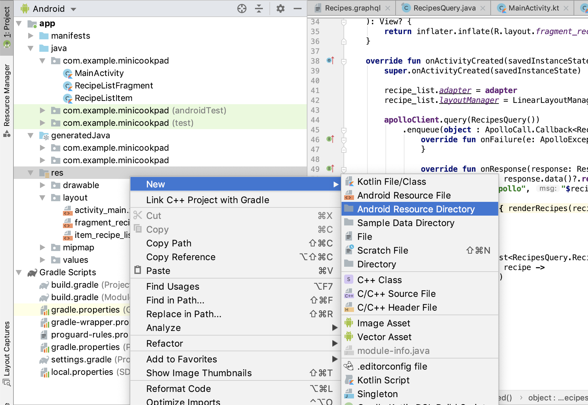

# 第3章: レシピ詳細に遷移する

前章では、レシピの一覧画面を作成しました。

この章では、レシピの一覧からひとつレシピを選択して、レシピの詳細を表示するように実装していきましょう。

この章で行う作業はこちらです。

- Navigationを導入し、Fragmentを表示する
- レシピ一覧画面からレシピ詳細画面へと遷移する
- Groupieを使用したレシピ詳細画面の実装を行う

## Navigation

今回は、画面遷移の仕組みとして最近導入された Navigation と呼ばれるものを使っていきたいと思います。

こちらもライブラリになっているので、まずはライブラリを追加しましょう。

前章で行ったように、ライブラリを追加する際は app/build.gradle を開いて、 dependencies にライブラリを追加します。

```diff
dependencies {
    implementation fileTree(dir: 'libs', include: ['*.jar'])
    implementation "org.jetbrains.kotlin:kotlin-stdlib-jdk7:$kotlin_version"
    implementation 'androidx.appcompat:appcompat:1.0.2'
    implementation 'androidx.core:core-ktx:1.0.2'
    implementation 'androidx.constraintlayout:constraintlayout:1.1.3'
    testImplementation 'junit:junit:4.12'
    androidTestImplementation 'androidx.test:runner:1.2.0'
    androidTestImplementation 'androidx.test.espresso:espresso-core:3.2.0'
    implementation 'androidx.recyclerview:recyclerview:1.0.0'
    implementation "com.xwray:groupie:2.3.0"
    implementation 'com.github.bumptech.glide:glide:4.9.0'
    annotationProcessor 'com.github.bumptech.glide:compiler:4.9.0'
    implementation "com.apollographql.apollo:apollo-runtime:1.0.2"
    compileOnly 'org.jetbrains:annotations:13.0'
+    implementation "androidx.navigation:navigation-fragment-ktx:2.1.0-rc01"
+    implementation "androidx.navigation:navigation-ui-ktx:2.1.0-rc01"
}
```

前回と同様、追加したらGradle Syncを行います。成功したら次へ進みましょう。

## Navigationに使用するFragmentを用意する

さて、今回はNavigationを扱う際に、Fragmentという仕組みを使っていきます。

これは、次の章でボトムナビゲーションを導入するためにも必要な作業です。

では進めていきましょう。

### リスト画面のFragmentを作成する

まず、MainActivityに書いていたリスト表示の処理を、Fragmentに載せ替えます。

そのためのFragmentを作っていきましょう。

まずはファイルを作ります。MainActivity.kt の付近で右クリックをして、Kotlinのファイルを作成します。

- 「New > Kotlin File/Class」


今回は、「RecipeListFragment」という名前でファイルを作成しましょう。

作成したファイルには、以下のクラスを実装します。

```kt
class RecipeListFragment : Fragment() {

    override fun onCreateView(
        inflater: LayoutInflater,
        container: ViewGroup?,
        savedInstanceState: Bundle?
    ): View? {
        return inflater.inflate(R.layout.fragment_recipe_list, container, false)
    }
}
```

見てくれは多少異なりますが、Activityに似た雰囲気を感じるクラスです。
このFragmentでは、MainActivityの代わりにレシピの一覧を表示するような処理を実装していきます。

`onCreateView()` の処理の中で、Fragmentが表示するレイアウトファイルを指定してViewを作成しています。

このファイルはまだ作っていませんでした。レイアウトファイルを作りましょう。

### RecipeListFragmentのためのレイアウトファイルを作成する

res/layout フォルダの上で右クリックをして、レイアウトファイルを作成します。

- 「New > layout resource file」


- File name: **fragment_recipe_list**
- Root element: **androidx.constraintlayout.widget.ConstraintLayout**

と入力して、OKを選択します。

現在のMainActivityで行っている一覧表示を行う必要があるので、レイアウトファイルも当然同じ形にします。

つまり、RecyclerViewを配置するわけですね。

```xml
<?xml version="1.0" encoding="utf-8"?>
<androidx.constraintlayout.widget.ConstraintLayout xmlns:android="http://schemas.android.com/apk/res/android"
    xmlns:app="http://schemas.android.com/apk/res-auto"
    android:layout_width="match_parent"
    android:layout_height="match_parent">

    <androidx.recyclerview.widget.RecyclerView
        android:id="@+id/recipe_list"
        android:layout_width="match_parent"
        android:layout_height="match_parent"
        app:layout_constraintBottom_toBottomOf="parent"
        app:layout_constraintEnd_toEndOf="parent"
        app:layout_constraintStart_toStartOf="parent"
        app:layout_constraintTop_toTopOf="parent" />
</androidx.constraintlayout.widget.ConstraintLayout>
```

RecyclerViewの android:id プロパティには同じく `recipe_list` と入れておきましょう。

### MainActivityからレシピ一覧の表示ロジックをRecipeListFragmentに移す

では、MainActivityからRecipeListFragmentに処理を移していきましょう。

まずは、RecipeListFragmentの実装を行います。部分的にMainActivityからコピペしてくるのが早いでしょう。

```diff
class RecipeListFragment : Fragment() {

+    val handler = Handler(Looper.getMainLooper())
+
+    val adapter = GroupAdapter<ViewHolder>()

    override fun onCreateView(
        inflater: LayoutInflater,
        container: ViewGroup?,
        savedInstanceState: Bundle?
    ): View? {
        return inflater.inflate(R.layout.fragment_recipe_list, container, false)
    }
+
+    override fun onActivityCreated(savedInstanceState: Bundle?) {
+        super.onActivityCreated(savedInstanceState)
+
+        recipe_list.adapter = adapter
+         // FragmentはContextを継承していないので、ここは requireContext() にする
+        recipe_list.layoutManager = LinearLayoutManager(requireContext())
+
+        apolloClient.query(RecipesQuery())
+            .enqueue(object : ApolloCall.Callback<RecipesQuery.Data>() {
+                override fun onFailure(e: ApolloException) {
+                }
+
+                override fun onResponse(response: Response<RecipesQuery.Data>) {
+                    val recipes = response.data()?.recipes ?: emptyList()
+                    Log.d("apollo", "$recipes")
+
+                    handler.post { renderRecipes(recipes) }
+                }
+            })
+    }
+
+    fun renderRecipes(recipes: List<RecipesQuery.Recipe>) {
+        val items = recipes.map { recipe ->
+            RecipeListItem(recipe)
+        }
+
+        adapter.update(items)
+    }
}
```

ここまでで、RecipeListFragment上でレシピ一覧を表示するロジックが完成しました。

では、MainActivityでRecipeListFragmentを表示するようにしていきましょう。

### Navigationを使ってRecipeListFragmentを表示する

ここでNavigationを使っていきます。

Navigationは、アプリの画面遷移をXMLで記述し、扱うことができる仕組みです。
ここ1,2年ほどで出てきたもので非常に新しい概念なのですが、シンプルで扱いやすいため今回は採用しました。

まずは、Navigationの定義を行うためのXML（リソース）を作成します。

res フォルダの上で右クリックをして以下を選択します。

- 「New > Android Resource Directory」



- Directory name: **navigation** （resource typeを選択すると自動で変わります）
- Resource type: **navigation**

を選択して、OKを押しましょう。


そうすると app > res > navigation ディレクトリが作成されるので、その上で右クリックをしてNavigationリソースを作成します。

- 「New > Navigation resource file」


ファイル名はなんでも良いですが、今回は「nav_main」としました。

- File name: **nav_main**

入力したらOKを押して作成しましょう。


では、navigationを作成していきましょう。

画面上で指示されている通り、左上にあるプラスボタンを押して RecipeListFragment を選択します。


画面上にこのように表示されたら成功です！

### MainActivityを修正する

では、ここまでで作ったNavigationをMainActivityで使うように修正していきます。

app > res > activity_main.xml を開いて、以下のように修正してください。

```xml
<?xml version="1.0" encoding="utf-8"?>
<androidx.constraintlayout.widget.ConstraintLayout xmlns:android="http://schemas.android.com/apk/res/android"
    xmlns:app="http://schemas.android.com/apk/res-auto"
    xmlns:tools="http://schemas.android.com/tools"
    android:layout_width="match_parent"
    android:layout_height="match_parent"
    tools:context=".MainActivity">

    <!-- RecyclerViewを置き換える形で配置する -->
    <fragment
        android:id="@+id/nav_host_fragment"
        android:name="androidx.navigation.fragment.NavHostFragment"
        android:layout_width="match_parent"
        android:layout_height="match_parent"
        app:defaultNavHost="true"
        app:layout_constraintBottom_toBottomOf="parent"
        app:layout_constraintEnd_toEndOf="parent"
        app:layout_constraintStart_toStartOf="parent"
        app:layout_constraintTop_toTopOf="parent"
        app:navGraph="@navigation/nav_main" />

</androidx.constraintlayout.widget.ConstraintLayout>
```

NavHostFragmentに `app:navGraph="@navigation/nav_main"` と設定することで、上で作ったNavigationが設定されることになります。

Navigationには startDestination と呼ばれるものがあり、要は出発地点を表す画面を設定できるのですが、最初の実装時にRecipeListFragmentが startDestination として登録されたため、アプリ起動時にRecipeListFragmentが表示されるという流れになります。

それでは、MainActivity.kt にある不要な処理を剥がしていきましょう。

```diff

class MainActivity : AppCompatActivity() {

-    val handler = Handler(Looper.getMainLooper())
-
-    val adapter = GroupAdapter<ViewHolder>()
-
    override fun onCreate(savedInstanceState: Bundle?) {
        super.onCreate(savedInstanceState)
        setContentView(R.layout.activity_main)
-
-        recipe_list.adapter = adapter
-        recipe_list.layoutManager = LinearLayoutManager(this)
-
-        apolloClient.query(RecipesQuery())
-            .enqueue(object : ApolloCall.Callback<RecipesQuery.Data>() {
-                override fun onFailure(e: ApolloException) {
-                }
-
-                override fun onResponse(response: Response<RecipesQuery.Data>) {
-                    val recipes = response.data()?.recipes ?: emptyList()
-                    Log.d("apollo", "$recipes")
-
-                    handler.post { renderRecipes(recipes) }
-                }
-            })
-    }
-
-    fun renderRecipes(recipes: List<RecipesQuery.Recipe>) {
-        val items = recipes.map { recipe ->
-            RecipeListItem(recipe)
-        }
-
-        adapter.update(items)
    }
}
```

要は前章で実装したものはすべて消してください。出来上がったものがこちらです。

```kt
class MainActivity : AppCompatActivity() {

    override fun onCreate(savedInstanceState: Bundle?) {
        super.onCreate(savedInstanceState)
        setContentView(R.layout.activity_main)
    }
}
```

ここまででアプリを起動してみましょう。

先ほどと変わらず、レシピ一覧を表示することが出来ていれば成功です。

## 画面遷移を実装する

さて、次はいよいよ画面遷移を実装していきます。

まずは、画面遷移先のFragmentを作成しましょう。
何度もやっているのでそろそろ説明は省いていきます。

今回は、「RecipeDetailFragment」という名前でファイルを作成しましょう。

ファイル内の実装も、RecipeListFragmentを実装したときとほぼ同じです。

```kt
class RecipeDetailFragment : Fragment() {

    override fun onCreateView(
        inflater: LayoutInflater,
        container: ViewGroup?,
        savedInstanceState: Bundle?
    ): View? {
        return inflater.inflate(R.layout.fragment_recipe_detail, container, false)
    }
}
```

レイアウトファイルも作成しましょう。
こちらは、RecyclerViewではなくいったんTextViewかなにかを置いておきましょう。

```xml
<?xml version="1.0" encoding="utf-8"?>
<androidx.constraintlayout.widget.ConstraintLayout xmlns:android="http://schemas.android.com/apk/res/android"
    xmlns:app="http://schemas.android.com/apk/res-auto"
    android:layout_width="match_parent"
    android:layout_height="match_parent">

    <TextView
        android:text="recipe detail"
        android:layout_width="match_parent"
        android:layout_height="match_parent"
        app:layout_constraintBottom_toBottomOf="parent"
        app:layout_constraintEnd_toEndOf="parent"
        app:layout_constraintStart_toStartOf="parent"
        app:layout_constraintTop_toTopOf="parent" />

</androidx.constraintlayout.widget.ConstraintLayout>
```

これでFragmentの準備はひとまず整いました。

次は、Navigationの設定を行います。

### RecipeListFragmentからRecipeDetailFragmentへ遷移する

Navigationの編集をしていきます。

まず、以下のファイルを開いてください。

- 「app > res > navigation > nav_main.xml」


次に、先ほど作成したRecipeDetailFragmentを最初と同じように追加してみましょう。


そうすると、以下のようになったかと思います。
見た目は適宜スクロールしたりドラッグアンドドロップで配置を変えられます。


RecipeListFragment から RecipeDetailFragment への遷移を設定します。

recipeListFragment にマウスカーソルを当てると、黒い丸が浮かび上がってきます。
それをドラッグして recipeDetailFragment に持っていき、離します。

これだけです。

言葉で表現するのは難しいので、以下のGIFを見てください。


なんと！直感的に画面遷移を設定することが出来ました。

recipeListFragment -> recipeDetailFragment の矢印が繋がっていれば成功です。

この矢印は Action として画面右側に定義されることになります


この時点では、「RecipeListFragmentからRecipeDetailFragmentへの遷移(アクション)を定義した」状態に過ぎず、どのタイミングで遷移するかは決定していません。

なので、その実装をこれからしていきましょう。

### コードからNavigationを呼び出す

今回は、「レシピ一覧のあるレシピのセルをタップしたらレシピ詳細に遷移する」という機能を実現します。

前章でも説明したとおり、今回はGroupieを使用しており、各セルの実装は RecipeListItem クラスに集約されている状態になっています。

そのため、RecipeListItem のViewをタップしたときに、画面遷移を実行することができれば、要件を満たせることになります。

では、RecipeListItem.kt を見ていきましょう。

```diff
class RecipeListItem(
    val recipe: RecipesQuery.Recipe
) : Item<ViewHolder>() {
    override fun getLayout(): Int {
        return R.layout.item_recipe_list
    }

    override fun bind(viewHolder: ViewHolder, position: Int) {
+        viewHolder.root.setOnClickListener { view ->
+            view.findNavController()
+                .navigate(R.id.action_recipeListFragment_to_recipeDetailFragment)
+        }

        viewHolder.root.recipe_name.text = recipe.name()
        viewHolder.root.recipe_description.text = recipe.description()

        Glide.with(viewHolder.root.recipe_thumbnail)
            .load(recipe.media?.thumbnail)
            .into(viewHolder.root.recipe_thumbnail)
    }
}
```

`viewHolder.root` がItemのルートのViewであるため、そのViewに対してタップしたときの処理を設定します。

`setOnClickListener {}` を設定すると、Viewがタップされたときに `{}` の中の処理を実行するという記述になります。

今回はNavigationを使っているので、Viewから NavController を取り出して、そこに対して上で設定したアクションを指定するだけで、簡単に画面遷移を実現することが出来ました。

ではアプリを起動してみましょう。レシピ一覧からレシピをタップすると、レシピ詳細画面に遷移できたはずです。

ここまでで、基本的な画面遷移を実現することが出来ました。

## 画面間の値渡し

レシピ詳細画面の実装に移りたいのですが、レシピ詳細画面でレシピを読み込もうにも、必要な情報がありません。

そのため、レシピ一覧画面から遷移してくる際に、レシピ詳細画面へ必要な情報を渡す必要があります。

Navigationを使ってその情報に対しても設定することができるので、次は値渡しを実装していきましょう。

### NavigationでActionに渡す値を定義する

Navigation上で、遷移先のFragmentが起動するのに必要な値を定義することが出来ます。

Navigationエディタ上で recipeDetailFragment を指定して、右側のArgumentsのところにあるプラスボタンを押しましょう。


今回は、レシピを読み込むために必要な `recipeId` を値として定義します。

- Name: **recipeId**
- Type: **String**

と指定して、追加しましょう。


次は、Navigationで実際に遷移するときに必要な値を渡すように変更します。

RecipeListItem を開き、以下のように変更しましょう。

```diff
    override fun bind(viewHolder: ViewHolder, position: Int) {
        viewHolder.root.setOnClickListener {
+            val args = bundleOf("recipeId" to recipe.id)
            viewHolder.root.findNavController()
-                .navigate(R.id.action_recipeListFragment_to_recipeDetailFragment)
+                .navigate(R.id.action_recipeListFragment_to_recipeDetailFragment, args)
        }
```

これで、Navigationを使って値を渡すことが出来ました。

後は、RecipeDetailFragmentで値を受け取れたことを確認しましょう。

```diff
class RecipeDetailFragment : Fragment() {
+
+    val recipeId: String
+        get() = arguments?.getString("recipeId")!! // 無理やりNon-Nullに変換

    override fun onCreateView(
        inflater: LayoutInflater,
        container: ViewGroup?,
        savedInstanceState: Bundle?
    ): View? {
        return inflater.inflate(R.layout.fragment_recipe_detail, container, false)
    }
+
+    override fun onActivityCreated(savedInstanceState: Bundle?) {
+        super.onActivityCreated(savedInstanceState)
+
+        Log.d("recipeDetailFragment", "recipeId: $recipeId")
+    }
}
```

渡された値は、Fragmentの持つ arguments という変数に入っています。

それを取り出して、ログとして表示して見るところまでを実装しています。

アプリを起動して、LogCatを見てみましょう。

ログが送られ、recipeId に数字が入っていれば成功です！

## レシピ詳細画面を実装する

ここからは、これまでの実装を復習しながら進みます。

- GraphQLのクエリを書く
- サーバーから値を受け取り、表示する
- レイアウトファイルを編集し、サーバーからの値とつなぎ合わせる

### GraphQLのクエリを書く

`app/src/main/graphql/<package>/Recipe.graphql` を作成して、以下のクエリを書きましょう。

```graphql
query RecipeQuery($id: ID!) {
    recipe(id: $id) {
        id
        name
        ingredients {
            name
            quantity
        }
        description
        media {
            original
            thumbnail
        }
    }
}
```

前回と違い、今回はクエリに変数が設定されました。

これで、特定のIDのレシピを取得するようなクエリが作成できました。

クエリを作成したら、コードの自動生成のためにプロジェクトをRebuildしましょう。

### サーバーから値を受け取り、表示する

RecipeDetailFragment で上で作成したクエリを使うようにします。

```diff
class RecipeDetailFragment : Fragment() {

    val recipeId: String
        get() = arguments?.getString("recipeId")!!
+
+    val handler = Handler(Looper.getMainLooper())

    override fun onCreateView(
        inflater: LayoutInflater,
```

```diff
    override fun onActivityCreated(savedInstanceState: Bundle?) {
        super.onActivityCreated(savedInstanceState)

        Log.d("recipeDetailFragment", "recipeId: $recipeId")
+
+        apolloClient.query(RecipeQuery(recipeId))
+            .enqueue(object : ApolloCall.Callback<RecipeQuery.Data>() {
+                override fun onFailure(e: ApolloException) {
+                }
+
+                override fun onResponse(response: Response<RecipeQuery.Data>) {
+                    val recipe = response.data()?.recipe!!
+                    Log.d("apollo", "$recipe")
+
+                    handler.post { renderRecipe(recipe) }
+                }
+            })
+    }
+
+    fun renderRecipe(recipe: RecipeQuery.Recipe) {
+
    }
}
```

あとは、画面上にレシピのデータを表示するだけです。

### レイアウトファイルを編集する

せっかくなので、今回はGroupieを使ってレシピ詳細画面も組み立ててみましょう。

まず、 fragment_recipe_detail.xml を開いて、RecyclerViewを追加してください。

```xml
<?xml version="1.0" encoding="utf-8"?>
<androidx.constraintlayout.widget.ConstraintLayout xmlns:android="http://schemas.android.com/apk/res/android"
    xmlns:app="http://schemas.android.com/apk/res-auto"
    android:layout_width="match_parent"
    android:layout_height="match_parent">

    <androidx.recyclerview.widget.RecyclerView
        android:id="@+id/recipe_detail"
        android:layout_width="match_parent"
        android:layout_height="match_parent"
        app:layout_constraintBottom_toBottomOf="parent"
        app:layout_constraintEnd_toEndOf="parent"
        app:layout_constraintStart_toStartOf="parent"
        app:layout_constraintTop_toTopOf="parent" />

</androidx.constraintlayout.widget.ConstraintLayout>
```

次は、RecipeDetailFragmentでGroupieを使う準備をしましょう。

```diff
    val handler = Handler(Looper.getMainLooper())

+    val adapter = GroupAdapter<ViewHolder>()
+
    override fun onCreateView(
        inflater: LayoutInflater,
        container: ViewGroup?,
        savedInstanceState: Bundle?
    ): View? {
```

```diff
    override fun onActivityCreated(savedInstanceState: Bundle?) {
        super.onActivityCreated(savedInstanceState)

        Log.d("recipeDetailFragment", "recipeId: $recipeId")

+        recipe_detail.adapter = adapter
+        recipe_detail.layoutManager = LinearLayoutManager(requireContext())
+
        apolloClient.query(RecipeQuery(recipeId))
            .enqueue(object : ApolloCall.Callback<RecipeQuery.Data>() {
                override fun onFailure(e: ApolloException) {
                }
```

```diff
    fun renderRecipe(recipe: RecipeQuery.Recipe) {
+        val items = mutableListOf<Item<ViewHolder>>()
+        adapter.update(items)
    }
```

前半2つはRecipeListFragmentと同じですね。

最後の一つは、RecipeDetailFragmentで初めて実装した形です。

前回は、Recipeの配列をItemに変換して、そのままadapterに渡していました。

それに対して今回は、

- 画像
- レシピ名
- レシピの説明文
- レシピのID
- レシピの材料一覧

という5つを縦に並べるようなレイアウトを考えます。

縦に並ぶ5つをそれぞれ Item として表現し、GroupAdapterに対して渡してあげれば、レシピ詳細画面を作成することが出来そうです。

ということでここからは各Itemの実装に入ります。

### Groupieの各Itemを実装する

まずは、画像を表示する RecipeImageItem を実装します。

Itemクラスの実装とレイアウトファイルをそれぞれ用意します。

```kt
class RecipeImageItem(
    val recipe: RecipeQuery.Recipe
) : Item<ViewHolder>() {
    override fun getLayout(): Int {
        return R.layout.item_recipe_image
    }

    override fun bind(viewHolder: ViewHolder, position: Int) {
        Glide.with(viewHolder.root.recipe_image)
            .load(recipe.media?.original)
            .into(viewHolder.root.recipe_image)
    }
}
```

```xml
<?xml version="1.0" encoding="utf-8"?>
<androidx.constraintlayout.widget.ConstraintLayout xmlns:android="http://schemas.android.com/apk/res/android"
    xmlns:app="http://schemas.android.com/apk/res-auto"
    android:layout_width="match_parent"
    android:layout_height="wrap_content">

    <ImageView
        android:id="@+id/recipe_image"
        android:layout_width="match_parent"
        android:layout_height="300dp"
        android:scaleType="centerCrop"
        app:layout_constraintBottom_toBottomOf="parent"
        app:layout_constraintEnd_toEndOf="parent"
        app:layout_constraintStart_toStartOf="parent"
        app:layout_constraintTop_toTopOf="parent" />

</androidx.constraintlayout.widget.ConstraintLayout>
```

どんどん行きましょう。次は、レシピ名を表示する RecipeNameItem を作成します。

```kt
class RecipeNameItem(
    val recipe: RecipeQuery.Recipe
) : Item<ViewHolder>() {
    override fun getLayout(): Int {
        return R.layout.item_recipe_name
    }

    override fun bind(viewHolder: ViewHolder, position: Int) {
        viewHolder.root.recipe_name.text = recipe.name
    }
}
```

```xml
<?xml version="1.0" encoding="utf-8"?>
<androidx.constraintlayout.widget.ConstraintLayout xmlns:android="http://schemas.android.com/apk/res/android"
    xmlns:app="http://schemas.android.com/apk/res-auto"
    android:layout_width="match_parent"
    android:layout_height="wrap_content">

    <TextView
        android:id="@+id/recipe_name"
        android:layout_width="wrap_content"
        android:layout_height="wrap_content"
        android:layout_marginStart="8dp"
        android:layout_marginTop="8dp"
        android:layout_marginEnd="8dp"
        android:layout_marginBottom="8dp"
        app:layout_constraintBottom_toBottomOf="parent"
        app:layout_constraintEnd_toEndOf="parent"
        app:layout_constraintStart_toStartOf="parent"
        app:layout_constraintTop_toTopOf="parent" />

</androidx.constraintlayout.widget.ConstraintLayout>
```

次は、レシピの説明文を表示する RecipeDescriptionItem を作成します。

```kt
class RecipeDescriptionItem(
    val recipe: RecipeQuery.Recipe
) : Item<ViewHolder>() {
    override fun getLayout(): Int {
        return R.layout.item_recipe_description
    }

    override fun bind(viewHolder: ViewHolder, position: Int) {
        viewHolder.root.recipe_description.text = recipe.description
    }
}
```

```xml
<?xml version="1.0" encoding="utf-8"?>
<androidx.constraintlayout.widget.ConstraintLayout xmlns:android="http://schemas.android.com/apk/res/android"
    xmlns:app="http://schemas.android.com/apk/res-auto"
    android:layout_width="match_parent"
    android:layout_height="wrap_content">

    <TextView
        android:id="@+id/recipe_description"
        android:layout_width="match_parent"
        android:layout_height="wrap_content"
        android:layout_marginStart="8dp"
        android:layout_marginTop="8dp"
        android:layout_marginEnd="8dp"
        android:layout_marginBottom="8dp"
        app:layout_constraintBottom_toBottomOf="parent"
        app:layout_constraintEnd_toEndOf="parent"
        app:layout_constraintStart_toStartOf="parent"
        app:layout_constraintTop_toTopOf="parent" />

</androidx.constraintlayout.widget.ConstraintLayout>
```

次は、レシピのIDを表示する RecipeIdItem を作成します。

```kt
class RecipeIdItem(
    val recipe: RecipeQuery.Recipe
) : Item<ViewHolder>() {
    override fun getLayout(): Int {
        return R.layout.item_recipe_id
    }

    override fun bind(viewHolder: ViewHolder, position: Int) {
        viewHolder.root.recipe_id.text = recipe.id
    }
}
```

```xml
<?xml version="1.0" encoding="utf-8"?>
<androidx.constraintlayout.widget.ConstraintLayout xmlns:android="http://schemas.android.com/apk/res/android"
    xmlns:app="http://schemas.android.com/apk/res-auto"
    android:layout_width="match_parent"
    android:layout_height="wrap_content">

    <TextView
        android:id="@+id/recipe_id"
        android:layout_width="match_parent"
        android:layout_height="wrap_content"
        android:layout_marginStart="8dp"
        android:layout_marginTop="8dp"
        android:layout_marginEnd="8dp"
        android:layout_marginBottom="8dp"
        android:gravity="end"
        app:layout_constraintBottom_toBottomOf="parent"
        app:layout_constraintEnd_toEndOf="parent"
        app:layout_constraintStart_toStartOf="parent"
        app:layout_constraintTop_toTopOf="parent" />

</androidx.constraintlayout.widget.ConstraintLayout>
```

レシピの材料一覧は、各材料を縦に並べることにして、 RecipeIngredientItem を作れば良さそうです。

```kt
class RecipeIngredientItem(
    val ingredient: RecipeQuery.Ingredient
) : Item<ViewHolder>() {
    override fun getLayout(): Int {
        return R.layout.item_recipe_ingredient
    }

    override fun bind(viewHolder: ViewHolder, position: Int) {
        viewHolder.root.recipe_ingredient_name.text = ingredient.name
        viewHolder.root.recipe_ingredient_quantity.text = ingredient.quantity
    }
}
```

```xml
<?xml version="1.0" encoding="utf-8"?>
<androidx.constraintlayout.widget.ConstraintLayout xmlns:android="http://schemas.android.com/apk/res/android"
    xmlns:app="http://schemas.android.com/apk/res-auto"
    xmlns:tools="http://schemas.android.com/tools"
    android:layout_width="match_parent"
    android:layout_height="wrap_content">

    <TextView
        android:id="@+id/recipe_ingredient_name"
        android:layout_width="0dp"
        android:layout_height="wrap_content"
        android:layout_marginStart="8dp"
        android:layout_marginTop="8dp"
        android:layout_marginEnd="8dp"
        android:layout_marginBottom="8dp"
        app:layout_constraintBottom_toBottomOf="parent"
        app:layout_constraintEnd_toStartOf="@+id/guideline"
        app:layout_constraintStart_toStartOf="parent"
        app:layout_constraintTop_toTopOf="parent"
        tools:text="なめこ" />

    <TextView
        android:id="@+id/recipe_ingredient_quantity"
        android:layout_width="0dp"
        android:layout_height="wrap_content"
        android:layout_marginStart="8dp"
        android:layout_marginTop="8dp"
        android:layout_marginEnd="8dp"
        android:layout_marginBottom="8dp"
        app:layout_constraintBottom_toBottomOf="parent"
        app:layout_constraintEnd_toEndOf="parent"
        app:layout_constraintStart_toStartOf="@+id/guideline"
        app:layout_constraintTop_toTopOf="parent"
        tools:text="100g" />

    <androidx.constraintlayout.widget.Guideline
        android:id="@+id/guideline"
        android:layout_width="wrap_content"
        android:layout_height="wrap_content"
        android:orientation="vertical"
        app:layout_constraintGuide_begin="150dp" />

</androidx.constraintlayout.widget.ConstraintLayout>
```

これで、いったんすべてのItemが揃いました。

### 各Itemを描画する

RecipeDetailFragmentに戻ります。

今作ったItemを順番に並べて使っていきます。

```diff
    fun renderRecipe(recipe: RecipeQuery.Recipe) {
        val items = mutableListOf<Item<ViewHolder>>()
+
+        items.add(RecipeImageItem(recipe))
+        items.add(RecipeNameItem(recipe))
+        items.add(RecipeDescriptionItem(recipe))
+        items.add(RecipeIdItem(recipe))
+
+        items.addAll(
+            recipe.ingredients.orEmpty().map { ingredient ->
+                RecipeIngredientItem(ingredient)
+            }
+        )
+
        adapter.update(items)
    }
```

ここまで出来たら、アプリを起動して確認してみましょう。

うまく表示されていれば成功です！

ここまでで、

- サーバーからデータを受け取る
- 受け取ったデータをアプリ上で表示する
- ユーザーの動作に対して処理を実行する
- 別の画面に遷移する

ということが実現できました！
もうここまでやれば立派なAndroidエンジニアを名乗れそうです！

まだまだ続きます。
