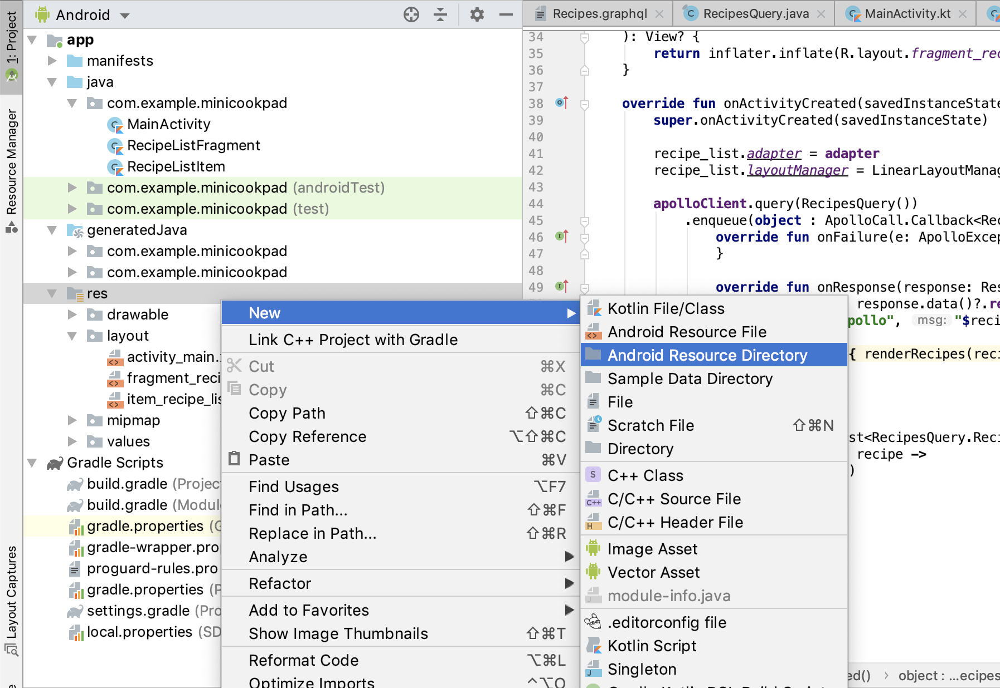
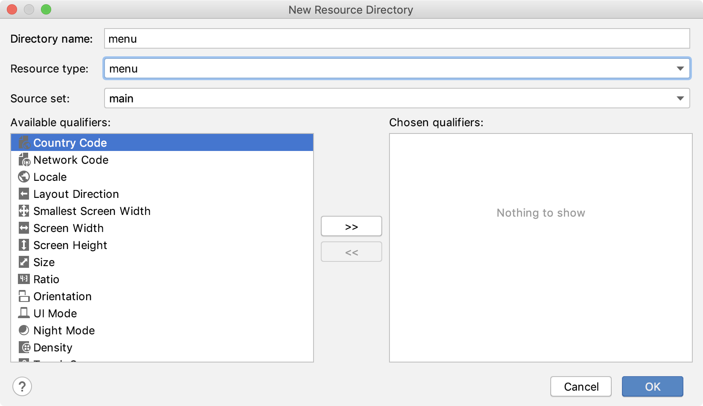
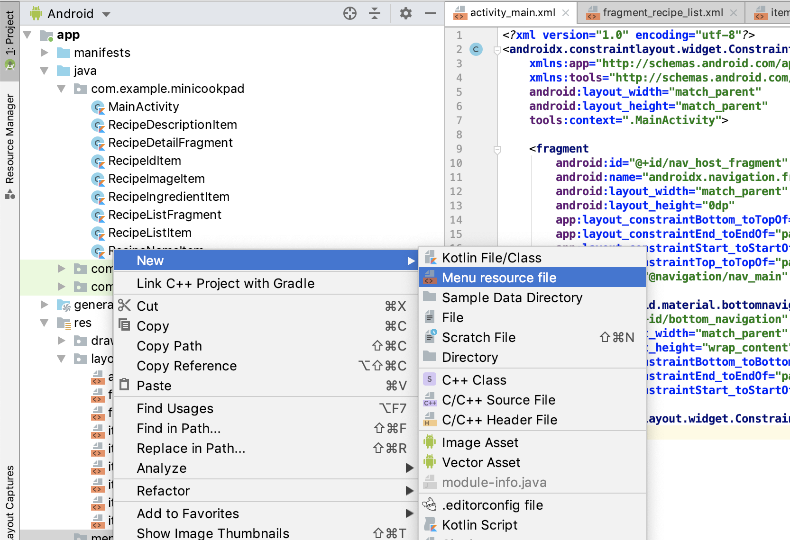
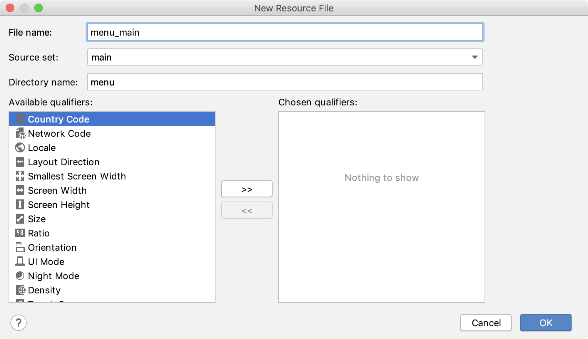
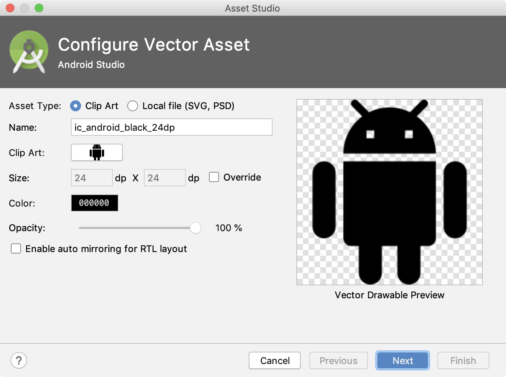
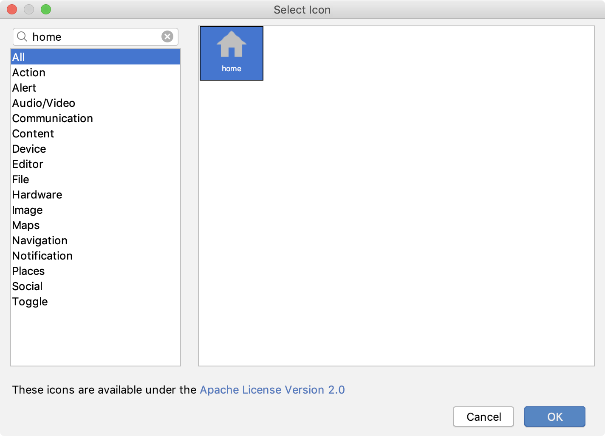
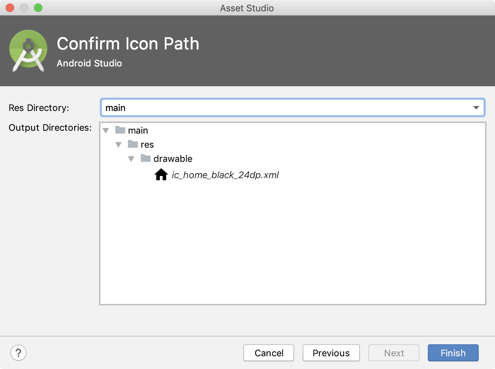
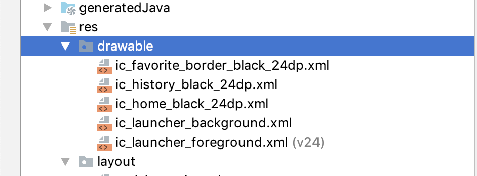
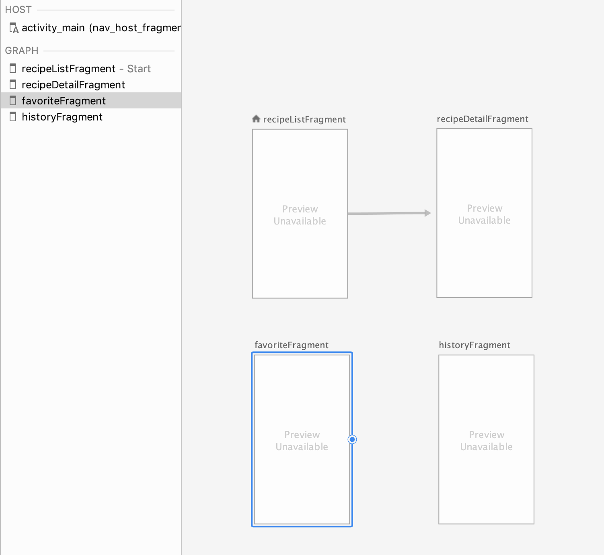
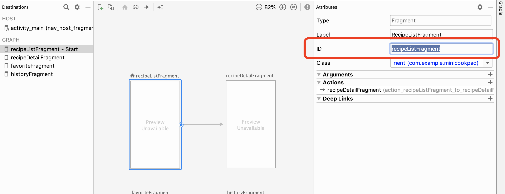

# 第4章: ボトムナビを導入する

さて、ここまででレシピ一覧、レシピ詳細画面を作ってきましたが、もっと色々な画面を増やせるように構成を変えてみましょう。

今回は、ボトムナビゲーションと呼ばれるUIを実装していきます。
最近はボトムナビゲーションを持ったアプリも数多く出てきており、いろんな画面を切り替えるのにとても都合が良いUIですね。ということで、さっそく導入していきましょう。

この章で行う作業はこちらです。

- ボトムナビに表示するメニューリソースを作成する
- ボトムナビの各タブで表示するFragmentを作成する
- Activity上でNavigationとBottomNavigationViewを関連付ける

## MainActivityにボトムナビを追加する

ボトムナビゲーションは、 BottomNavigationView と呼ばれるViewがあるのでこれを利用するだけで簡単に導入することが出来ます。
また、Navigation は BottomNavigationView と合わせて使うことも想定されており、そのための拡張関数も用意されています。

そのため、ボトムナビの各タブをタップしたら画面が切り替わる(画面遷移する)実装をとても簡単に行うことができるようになっています。

### ボトムナビに表示する各タブを定義する

まずは、ボトムナビに表示する各タブを定義します。
今回は、

- レシピ一覧
- お気に入り一覧
- 閲覧履歴

の3つのタブを定義します。

お気に入りに関しては、APIも実装していると思うので、講義後の自由時間に実装をしてみてください。

閲覧履歴に関しては、今回こちらからの追加課題として用意しましたが、実装は任意です。他の機能のための画面にしても良いでしょう。

それぞれを定義するために、まずはmenuリソースを作成します。
Navigationリソースを作成したときと同様の手順で、menuディレクトリとmenu_main.xmlを作成しましょう。

- 「New > Android Resource Directory」





- 「New > Menu resource file」





また、ボトムナビに使用するためのアイコンもこのタイミングで用意しておきましょう。

Android Studioには、アイコンを検索して生成するツールが用意されているので、それを使用します。

- 「New > Vector Assets」


真ん中の Clip Art: と書いてあるところのボタンを選択します。



すると、アイコンの一覧が並ぶので、好きなアイコンを選びましょう。

資料では、以下の3つのアイコンを作成します。

- home
- favorite_border
- history



選択したら、次に進んでFinishをすることで画像リソースが自動で追加されています。





では、ここまで準備が整ったら、先ほど作成したメニューリソースを編集していきましょう。

これに関してはGUIエディタは特に使いやすくないので、XMLで編集するのが手っ取り早いと思います。

```xml
<?xml version="1.0" encoding="utf-8"?>
<menu xmlns:android="http://schemas.android.com/apk/res/android">

    <item
        android:id="@+id/recipeListFragment"
        android:icon="@drawable/ic_home_black_24dp"
        android:title="home" />

    <item
        android:id="@+id/favoriteFragment"
        android:icon="@drawable/ic_favorite_border_black_24dp"
        android:title="favorite" />

    <item
        android:id="@+id/historyFragment"
        android:icon="@drawable/ic_history_black_24dp"
        android:title="history" />

</menu>
```

このように、それぞれに id, icon, title を設定します。

ここで最も重要なのは id です。このidを、Navigationリソースの各タブに対応するFragmentの id と一致させるようにします。

### FavoriteFragment, HistoryFragmentを作成する

さて、メニューリソースの実装が終わったら、次は各タブに対応するFragmentを作成します。

RecipeListFragment, RecipeDetailFragmentを作成したときと同様に、クラスファイルとレイアウトファイルをそれぞれ作成してください。

FavoriteFragment

```kt
class FavoriteFragment : Fragment() {

    override fun onCreateView(
        inflater: LayoutInflater,
        container: ViewGroup?,
        savedInstanceState: Bundle?
    ): View? {
        return inflater.inflate(R.layout.fragment_favorite, container, false)
    }
}
```

```xml
<?xml version="1.0" encoding="utf-8"?>
<androidx.constraintlayout.widget.ConstraintLayout xmlns:android="http://schemas.android.com/apk/res/android"
    xmlns:app="http://schemas.android.com/apk/res-auto"
    android:layout_width="match_parent"
    android:layout_height="match_parent">

    <TextView
        android:layout_width="wrap_content"
        android:layout_height="wrap_content"
        android:layout_marginStart="8dp"
        android:text="favorite fragment"
        app:layout_constraintStart_toStartOf="parent"
        app:layout_constraintTop_toTopOf="parent" />

</androidx.constraintlayout.widget.ConstraintLayout>
```

HistoryFragment

```kt
class HistoryFragment : Fragment() {

    override fun onCreateView(
        inflater: LayoutInflater,
        container: ViewGroup?,
        savedInstanceState: Bundle?
    ): View? {
        return inflater.inflate(R.layout.fragment_history, container, false)
    }
}
```

```xml
<?xml version="1.0" encoding="utf-8"?>
<androidx.constraintlayout.widget.ConstraintLayout xmlns:android="http://schemas.android.com/apk/res/android"
    xmlns:app="http://schemas.android.com/apk/res-auto"
    android:layout_width="match_parent"
    android:layout_height="match_parent">

    <TextView
        android:layout_width="wrap_content"
        android:layout_height="wrap_content"
        android:layout_marginStart="8dp"
        android:text="history fragment"
        app:layout_constraintStart_toStartOf="parent"
        app:layout_constraintTop_toTopOf="parent" />

</androidx.constraintlayout.widget.ConstraintLayout>
```

このあたりは何度かやっている作業なので、サクサク進みましょう。
講義では、いくつかのAndroid Studio 便利Tipsを紹介します。

### NavigationにそれぞれのFragmentを追加する

さて、ここで上で作成した2つのFragmentをNavigationに登録しましょう。

これも RecipeListFragment, RecipeDetailFragmentのときと同様の作業です。

- 「app > res > navigation > nav_main.xml」

このようになっていれば成功です。



ここで、各タブに表示するべきFragmentの id が、menuリソースで定義した id と一致することを確認しましょう。



ここが一致していれば、ボトムナビの各タブを選択したときに、Navigationが自動的にFragmentを切り替えるように動作します。


### MainActivityにBottomNavigationViewを追加する

さてここまでが下準備で、ようやくボトムナビ本体を追加します。

activity_main.xml を開いて、以下のように修正しましょう。

```diff
<?xml version="1.0" encoding="utf-8"?>
<androidx.constraintlayout.widget.ConstraintLayout xmlns:android="http://schemas.android.com/apk/res/android"
    xmlns:app="http://schemas.android.com/apk/res-auto"
    xmlns:tools="http://schemas.android.com/tools"
    android:layout_width="match_parent"
    android:layout_height="match_parent"
    tools:context=".MainActivity">

    <fragment
        android:id="@+id/nav_host_fragment"
        android:name="androidx.navigation.fragment.NavHostFragment"
        android:layout_width="match_parent"
-        android:layout_height="match_parent"
+        android:layout_height="0dp"
        app:defaultNavHost="true"
-        app:layout_constraintBottom_toTopOf="parent"
+        app:layout_constraintBottom_toTopOf="@+id/bottom_navigation"
        app:layout_constraintEnd_toEndOf="parent"
        app:layout_constraintStart_toStartOf="parent"
        app:layout_constraintTop_toTopOf="parent"
        app:navGraph="@navigation/nav_main" />
+
+    <com.google.android.material.bottomnavigation.BottomNavigationView
+        android:id="@+id/bottom_navigation"
+        android:layout_width="match_parent"
+        android:layout_height="wrap_content"
+        app:layout_constraintBottom_toBottomOf="parent"
+        app:layout_constraintEnd_toEndOf="parent"
+        app:layout_constraintStart_toStartOf="parent"
+        app:menu="@menu/menu_main" />

</androidx.constraintlayout.widget.ConstraintLayout>
```

`app:menu="@menu/menu_main"` を指定するのを忘れないようにしましょう。

次は、MainActivityにNavigationとBottomNavigationViewを関連付ける実装を行います。

```diff
class MainActivity : AppCompatActivity() {

    override fun onCreate(savedInstanceState: Bundle?) {
        super.onCreate(savedInstanceState)
        setContentView(R.layout.activity_main)
+        
+        val navController = findNavController(R.id.nav_host_fragment)
+        bottom_navigation.setupWithNavController(navController)
    }
}
```

これだけです。終わりです。

では、アプリを起動してみましょう。

完ぺきですね！さらにモダンなアプリに近づきました！！

ここまでで前半戦は終了です。お疲れさまでした。
