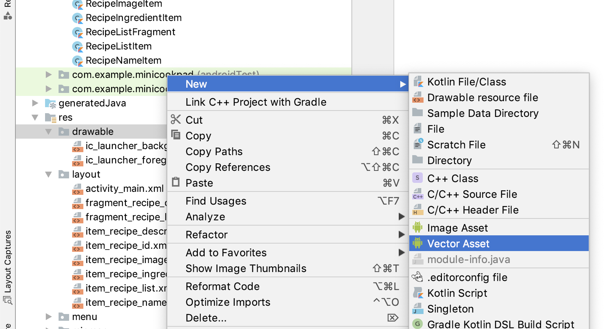

# 第5章: お気に入り機能を実装する

さて、ここまで実装した内容を応用することで、お気に入り機能は実装することが出来ます。

ここまでの講義で学んできたことは、以下のようなものでした。

- APIリクエストを行う
- レイアウトを作成する
- データとレイアウトをつなげる
- ユーザーのアクションによって処理を行う
- 画面遷移を行う

ここでいうお気に入り機能とは、以下の機能を指します。

- レシピ一覧画面(またはレシピ詳細画面)で、対象のレシピがお気に入りされているかどうかを表示する
- レシピ一覧画面(またはレシピ詳細画面)で、対象のレシピをお気に入りに登録、もしくは解除することができる
- お気に入り一覧画面ではお気に入りしたレシピの一覧を表示する

この時点でだいたい実装方法がピンときた方は、この先を見ずに独力で進めてみましょう。
まだ不安がある方は、この先を読み進めて実装していきましょう。

資料ではレシピ一覧画面で作業を行っていきますが、レシピ詳細画面でも同様の手順で作業を行うため、レシピ詳細画面に関しては記述を省略します。

## お気に入りを表示する

まずは、対象のレシピがお気に入りされているかどうかを表示する仕組みを実装しましょう。

ステップとしては、以下のように行っていきます。

- レイアウトファイルに、お気に入りを表すアイコンを表示するためのImageViewを配置する
- GraphQLのクエリを、お気に入り状態を返すように修正する
- サーバから受け取った値をViewに反映させる

### お気に入りを表すアイコンを表示するViewを配置する

まずは、アイコン画像を用意します。今回は favorite を用意しましょう。

- New > Vector Assets
- favorite



前章で用意した favorite_border と合わせて、

- お気に入りしている状態: favorite
- お気に入りしていない状態: favorite_border

という風に表現することとします。

次に、レシピ一覧画面の各レシピに対して、お気に入りされているかを表示するViewを配置します。

- res > layout > item_recipe_list.xml

```xml
<androidx.constraintlayout.widget.ConstraintLayout xmlns:android="http://schemas.android.com/apk/res/android"
    xmlns:app="http://schemas.android.com/apk/res-auto"
    xmlns:tools="http://schemas.android.com/tools"
    android:layout_width="match_parent"
    android:layout_height="wrap_content">

    <ImageView
        android:id="@+id/recipe_thumbnail"
        android:layout_width="60dp"
        android:layout_height="60dp"
        android:layout_marginStart="8dp"
        android:layout_marginTop="12dp"
        android:layout_marginEnd="8dp"
        android:layout_marginBottom="12dp"
        android:src="@mipmap/ic_launcher"
        app:layout_constraintBottom_toBottomOf="parent"
        app:layout_constraintStart_toStartOf="parent"
        app:layout_constraintTop_toTopOf="parent" />

    <TextView
        android:id="@+id/recipe_name"
        android:layout_width="0dp"
        android:layout_height="wrap_content"
        android:layout_marginStart="8dp"
        android:layout_marginEnd="8dp"
        app:layout_constraintBottom_toTopOf="@+id/recipe_description"
        app:layout_constraintEnd_toStartOf="@+id/recipe_liked"
        app:layout_constraintStart_toEndOf="@+id/recipe_thumbnail"
        app:layout_constraintTop_toTopOf="parent"
        app:layout_constraintVertical_chainStyle="packed"
        tools:text="レシピ名" />

    <TextView
        android:id="@+id/recipe_description"
        android:layout_width="0dp"
        android:layout_height="wrap_content"
        android:layout_marginStart="8dp"
        android:layout_marginEnd="8dp"
        app:layout_constraintBottom_toBottomOf="parent"
        app:layout_constraintEnd_toStartOf="@+id/recipe_liked"
        app:layout_constraintStart_toEndOf="@+id/recipe_thumbnail"
        app:layout_constraintTop_toBottomOf="@+id/recipe_name"
        tools:text="説明文" />

    <ImageView
        android:id="@+id/recipe_liked"
        android:layout_width="wrap_content"
        android:layout_height="wrap_content"
        android:layout_marginTop="8dp"
        android:layout_marginEnd="8dp"
        android:layout_marginBottom="8dp"
        app:layout_constraintBottom_toBottomOf="parent"
        app:layout_constraintEnd_toEndOf="parent"
        app:layout_constraintTop_toTopOf="parent"
        app:srcCompat="@drawable/ic_favorite_black_24dp" />

</androidx.constraintlayout.widget.ConstraintLayout>
```

これで、レイアウトファイルの準備は整いました。

### GraphQL のクエリを編集する

さて次は、GraphQLのクエリを編集して、お気に入り状態を取得するようにしましょう。

レシピ一覧画面で使用しているGraphQL クエリは Recipes.graphql に記載したので、 Recipes.graphql を開きましょう。

- src > main > graphql > package > Recipes.graphql

Recipe には isLiked が用意されているはずなので、追加します。

```diff
query RecipesQuery {
    recipes {
        id
        name
        description
+        isLiked
        media {
            thumbnail
        }
    }
}
```

graphql のファイルを編集したら、リビルドしてみましょう。

- Build > Rebuild Project

自動生成されたコードに isLiked が増えたはずです。これでGraphQLの準備も整いました。

### レイアウトにお気に入り状態を反映する

最後に、レイアウト上のViewにお気に入り状態を反映するようにしましょう。

RecipeListItem.kt を開きます。

```diff
class RecipeListItem(
    val recipe: RecipesQuery.Recipe
) : Item<ViewHolder>() {
    override fun getLayout(): Int {
        return R.layout.item_recipe_list
    }

    override fun bind(viewHolder: ViewHolder, position: Int) {
        viewHolder.root.setOnClickListener {
            val args = bundleOf("recipeId" to recipe.id)
            viewHolder.root.findNavController()
                .navigate(R.id.action_recipeListFragment_to_recipeDetailFragment, args)
        }

        viewHolder.root.recipe_name.text = recipe.name()
        viewHolder.root.recipe_description.text = recipe.description()

        Glide.with(viewHolder.root.recipe_thumbnail)
            .load(recipe.media?.thumbnail)
            .into(viewHolder.root.recipe_thumbnail)
+
+        if (recipe.isLiked) {
+            viewHolder.root.recipe_liked.setImageResource(R.drawable.ic_favorite_black_24dp)
+        } else {
+            viewHolder.root.recipe_liked.setImageResource(R.drawable.ic_favorite_border_black_24dp)
+        }
    }
}
```

画像リソースはプログラム上で、 R.drawable.filename でアクセスすることが出来ます。

また、ImageViewに画像リソースを設定する際には `setImageResource()` メソッドを使用します。

これで、お気に入りの状態をViewに反映させることが出来ました！
ただ、これだけではお気に入りは空っぽなのですべて表示が同じになってしまっています。

次は、選択したレシピをお気に入りに登録できるようにしましょう。

## 対象のレシピをお気に入りに登録する / 解除する

レシピをお気に入りに登録できるようにします。

- 特定のレシピIDを受け取って、AddLike mutationを扱うGraphQLクエリを追加する
- お気に入り画像をタップすることで、上記のクエリを実行する
- APIが成功したら表示を更新する（お気に入り状態に変化させる）

### AddLike, DeleteLike mutation を追加する

まずは、AddLike mutationを追加します。

GraphQLのファイルを新規で追加して、以下のクエリを記述しましょう。

- AddLike.graphql

```graphql
mutation AddLike($id: ID!) {
  addLike(recipeID: $id)
}
```

合わせて DeleteLike mutationも追加しておきましょう。

- DeleteLike.graphql

```graphql
mutation DeleteLike($id: ID!) {
  deleteLike(recipeID: $id)
}
```

GraphQLを記述したらリビルドです。

- Build > Rebuild Project

無事に完了したら次に進みましょう。

### お気に入り画像をタップしたときにクエリを実行する

「Viewがタップされたときに処理を実行する」「GraphQLクエリを実行する」と2つに分けて表現すると非常に簡単ですね。

では、 RecipeListItem.kt を開いて、以下の記述を追加しましょう。

```diff
        if (recipe.isLiked) {
            viewHolder.root.recipe_liked.setImageResource(R.drawable.ic_favorite_black_24dp)
        } else {
            viewHolder.root.recipe_liked.setImageResource(R.drawable.ic_favorite_border_black_24dp)
        }
+        viewHolder.root.recipe_liked.setOnClickListener {
+            if (!recipe.isLiked) {
+                apolloClient.mutate(AddLikeMutation(recipe.id)).enqueue(object : ApolloCall.Callback<AddLikeMutation.Data>() {
+                    override fun onFailure(e: ApolloException) {
+                    }
+
+                    override fun onResponse(response: Response<AddLikeMutation.Data>) {
+                    }
+                })
+            } else {
+                apolloClient.mutate(DeleteLikeMutation(recipe.id)).enqueue(object : ApolloCall.Callback<DeleteLikeMutation.Data>() {
+                    override fun onFailure(e: ApolloException) {
+                    }
+
+                    override fun onResponse(response: Response<DeleteLikeMutation.Data>) {
+                    }
+                })
+            }
+        }
```

`View.setOnClickListener {}` で「Viewがタップされたときに処理を実行する」を表現することができるのはchapter2で解説しました。

また、GraphQLのクエリを実行する際は、 ApolloClient を使ってコールバックを指定する形式であったことも今までと同様です。
今回は、query ではなく mutation だったので、使用するメソッドが多少異なっていますが、Android Studioの補完に従って進めば特に悩むこともないでしょう。

ここまでで、お気に入り画像をタップしたときにAddLike mutation, DeleteLike mutationを実行することはできるようになりました。

しかし、実行したあとには画面の表示を更新しなければ反映されません。次は、画面の表示を更新するように処理を記述していきます。

### APIリクエストが成功したときに画面の表示を更新する

APIリクエストが成功したときには、お気に入りの状態を反映する必要があります。

今回も、ApolloClientのコールバック内のスレッドはUIスレッドではないため、UIスレッド上に戻して実行する必要があるためHandlerを使用しましょう。

```diff
class RecipeListItem(
    val recipe: RecipesQuery.Recipe
) : Item<ViewHolder>() {
+
+    val handler = Handler(Looper.getMainLooper())
+
    override fun getLayout(): Int {
        return R.layout.item_recipe_list
    }

    override fun bind(viewHolder: ViewHolder, position: Int) {
        viewHolder.root.setOnClickListener {
            val args = bundleOf("recipeId" to recipe.id)
            viewHolder.root.findNavController()
                .navigate(R.id.action_recipeListFragment_to_recipeDetailFragment, args)
        }

        viewHolder.root.recipe_name.text = recipe.name()
        viewHolder.root.recipe_description.text = recipe.description()

        Glide.with(viewHolder.root.recipe_thumbnail)
            .load(recipe.media?.thumbnail)
            .into(viewHolder.root.recipe_thumbnail)

        if (recipe.isLiked) {
            viewHolder.root.recipe_liked.setImageResource(R.drawable.ic_favorite_black_24dp)
        } else {
            viewHolder.root.recipe_liked.setImageResource(R.drawable.ic_favorite_border_black_24dp)
        }
        viewHolder.root.recipe_liked.setOnClickListener {
            if (!recipe.isLiked) {
                apolloClient.mutate(AddLikeMutation(recipe.id)).enqueue(object : ApolloCall.Callback<AddLikeMutation.Data>() {
                    override fun onFailure(e: ApolloException) {
                    }

                    override fun onResponse(response: Response<AddLikeMutation.Data>) {
  +                      handler.post {
  +                          viewHolder.root.recipe_liked.setImageResource(R.drawable.ic_favorite_black_24dp)
  +                      }
                    }
                })              
            } else {
```

さて、これではお気に入りの状態はViewとしては変更されましたが、Itemが持つrecipeに関しては値が更新されていないため、もう一度押すとまたAddLikeのAPIを叩いてしまいます。
また、Apolloが生成するRecipesQuery.Recipeクラスは isLiked の値がfinalとして定義されているため、再代入できません。

これを回避するために、今回は「View用のRecipeクラス」を用意して、Itemで使用するRecipeモデルはそちらを使うようにしましょう。

また、Viewの更新に関しても、データを更新した後にItemのメソッドに `notifyChanged()` というものがあるので、これを使ってしまいましょう。

RecipeListItem.kt の最終形は以下のようになります。

```diff
class RecipeListItem(
-    val recipe: RecipesQuery.Recipe
+    val recipe: Recipe
) : Item<ViewHolder>() {

    val handler = Handler(Looper.getMainLooper())

    override fun getLayout(): Int {
        return R.layout.item_recipe_list
    }

    override fun bind(viewHolder: ViewHolder, position: Int) {
        viewHolder.root.setOnClickListener {
            val args = bundleOf("recipeId" to recipe.id)
            viewHolder.root.findNavController()
                .navigate(R.id.action_recipeListFragment_to_recipeDetailFragment, args)
        }

        viewHolder.root.recipe_name.text = recipe.name
        viewHolder.root.recipe_description.text = recipe.description

        Glide.with(viewHolder.root.recipe_thumbnail)
-            .load(recipe.media?.thumbnail)
+            .load(recipe.thumbnail)
            .into(viewHolder.root.recipe_thumbnail)

        if (recipe.isLiked) {
            viewHolder.root.recipe_liked.setImageResource(R.drawable.ic_favorite_black_24dp)
        } else {
            viewHolder.root.recipe_liked.setImageResource(R.drawable.ic_favorite_border_black_24dp)
        }
        viewHolder.root.recipe_liked.setOnClickListener {
            if (!recipe.isLiked) {
                apolloClient.mutate(AddLikeMutation(recipe.id)).enqueue(object : ApolloCall.Callback<AddLikeMutation.Data>() {
                    override fun onFailure(e: ApolloException) {
                    }

                    override fun onResponse(response: Response<AddLikeMutation.Data>) {
+                        recipe.isLiked = true
+                        handler.post { notifyChanged() }
                    }
                })
            } else {
                apolloClient.mutate(DeleteLikeMutation(recipe.id)).enqueue(object : ApolloCall.Callback<DeleteLikeMutation.Data>() {
                    override fun onFailure(e: ApolloException) {
                    }

                    override fun onResponse(response: Response<DeleteLikeMutation.Data>) {
+                        recipe.isLiked = false
+                        handler.post { notifyChanged() }
                    }
                })
            }
        }
    }
+
+    data class Recipe(
+        val id: String,
+        val name: String,
+        val description: String,
+        val thumbnail: String?,
+        var isLiked: Boolean
+    )
}
```

RecipeListItemにわたすRecipeのクラスを新たに定義して、それを渡すようにしました。
また、その中では isLiked の値は `var` で宣言することで再代入可能にしています。

そして、Viewの更新に関しては `notifyChanged()` を呼び出すだけになっています。
こうすることで、 `bind()` メソッドを再度呼び直してくれる形になるので、実装もシンプルになりますね。

RecipeListItemのコンストラクタの形を変えたので、利用側のコードも修正しましょう。

RecipeListFragment.kt を開き、以下のように修正します。

```diff

    fun renderRecipes(recipes: List<RecipesQuery.Recipe>) {
        val items = recipes.map { recipe ->
-            RecipeListItem(recipe)
+            RecipeListItem(
+                RecipeListItem.Recipe(
+                    id = recipe.id,
+                    name = recipe.name,
+                    description = recipe.description,
+                    thumbnail = recipe.media?.thumbnail,
+                    isLiked = recipe.isLiked
+                )
+            )
        }

        adapter.update(items)
    }
}

```

`RecipesQuery.Recipe` から `RecipeListItem.Recipe` のクラスへ変換をしてから、RecipeListItemを生成するようにしました。

これで、一通りの実装が完了しました。

アプリを起動して実行してみましょう！

## お気に入り一覧画面を作成する

では、前項でお気に入りができるようになったので、一覧画面を作っていきたいと思います。

とはいえ、これはほぼ今までのおさらいになるのでさくさく行きます。

- GraphQLクエリを書く
- レイアウトを用意する
- データとレイアウトを紐付ける

### GraphQL クエリを書く

さくっと書きましょう。なお、ページネーションに関しては発展課題を用意しているのでここでは省略します。

- src > main > graphql > package > LikesQuery.graphql

```graphql
query LikesQuery {
    likes {
        nodes {
            id
            name
            isLiked
            description
            media {
                thumbnail
            }
        }
        pageInfo {
            endCursor
            hasNextPage
        }
    }
}
```

### レイアウトを用意する

今回は、レシピ一覧画面で使用している RecipeListItem を再利用します。

なので、FavoriteFragment でRecyclerViewを扱えれば良さそうですね。 fragment_favorite.xml を開いてRecyclerViewを配置します。

- res > layout > fragment_favorite.xml

```xml
<?xml version="1.0" encoding="utf-8"?>
<androidx.constraintlayout.widget.ConstraintLayout xmlns:android="http://schemas.android.com/apk/res/android"
    xmlns:app="http://schemas.android.com/apk/res-auto"
    android:layout_width="match_parent"
    android:layout_height="match_parent">

    <androidx.recyclerview.widget.RecyclerView
        android:id="@+id/favorite_list"
        android:layout_width="match_parent"
        android:layout_height="match_parent"
        app:layout_constraintBottom_toBottomOf="parent"
        app:layout_constraintEnd_toEndOf="parent"
        app:layout_constraintStart_toStartOf="parent"
        app:layout_constraintTop_toTopOf="parent" />
</androidx.constraintlayout.widget.ConstraintLayout>
```

### データとレイアウトを紐付ける

これももうおなじみの作業なので、細かい説明は割愛します。

- FavoriteFragment.kt

```kt
class FavoriteFragment : Fragment() {

    val handler = Handler(Looper.getMainLooper())

    val adapter = GroupAdapter<ViewHolder>()

    override fun onCreateView(
        inflater: LayoutInflater,
        container: ViewGroup?,
        savedInstanceState: Bundle?
    ): View? {
        return inflater.inflate(R.layout.fragment_favorite, container, false)
    }

    override fun onActivityCreated(savedInstanceState: Bundle?) {
        super.onActivityCreated(savedInstanceState)

        favorite_list.adapter = adapter
        favorite_list.layoutManager = LinearLayoutManager(requireContext())

        apolloClient.query(LikesQuery())
            .enqueue(object : ApolloCall.Callback<LikesQuery.Data>() {
                override fun onFailure(e: ApolloException) {
                }

                override fun onResponse(response: Response<LikesQuery.Data>) {
                    val recipes = response.data()?.likes?.nodes ?: emptyList()
                    Log.d("apollo", "$recipes")

                    handler.post { renderRecipes(recipes) }
                }
            })
    }

    fun renderRecipes(nodes: List<LikesQuery.Node?>) {
        val items = nodes.mapNotNull {
            it?.let { node ->
                RecipeListItem(
                    RecipeListItem.Recipe(
                        id = node.id,
                        name = node.name,
                        description = node.description,
                        thumbnail = node.media?.thumbnail,
                        isLiked = node.isLiked
                    )
                )              
            }
        }

        adapter.update(items)
    }
}
```

はい、出来上がりです。
先ほど RecipeListItem のコンストラクタを書き換えたおかげで、別の画面（別のクエリ）からでも同じように扱うことができました。

便利ですね。

さて、終わったらアプリを起動してみましょう。

完成です！おめでとうございます！

ここまでで基本編は終了です。お疲れさまでした。

これ以降は、自身でアプリの機能拡張を行ってみましょう。
