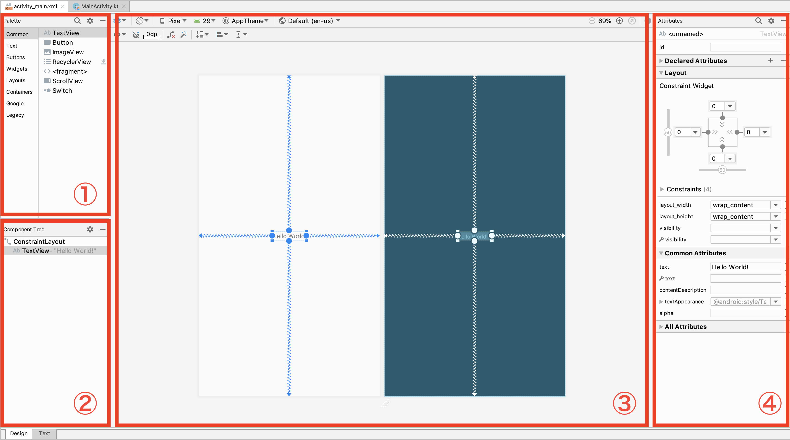
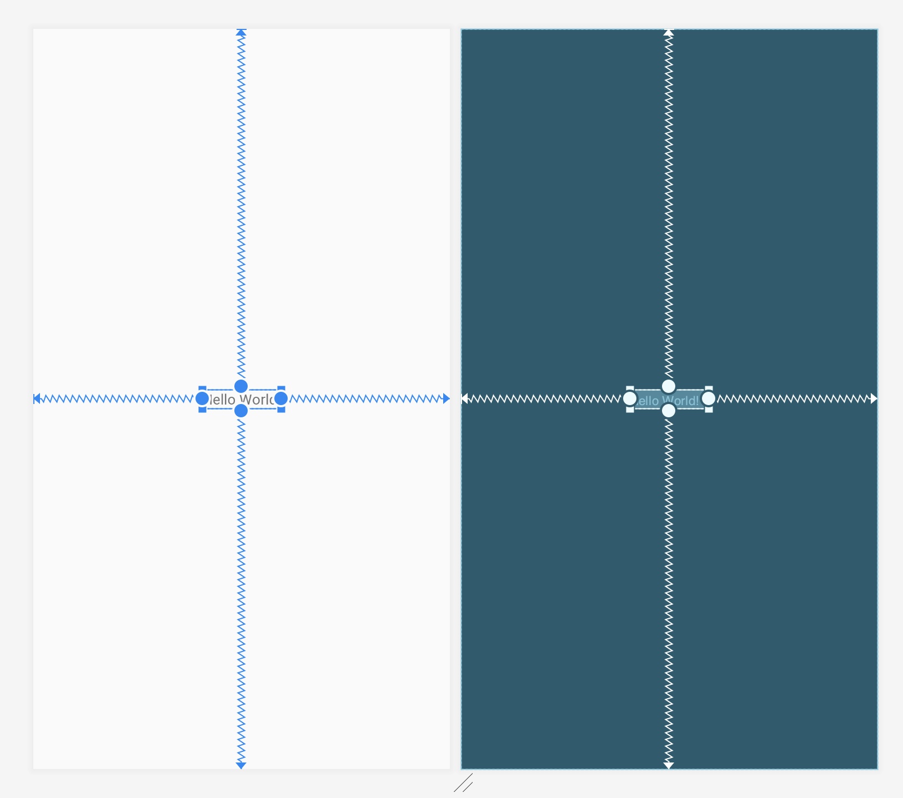
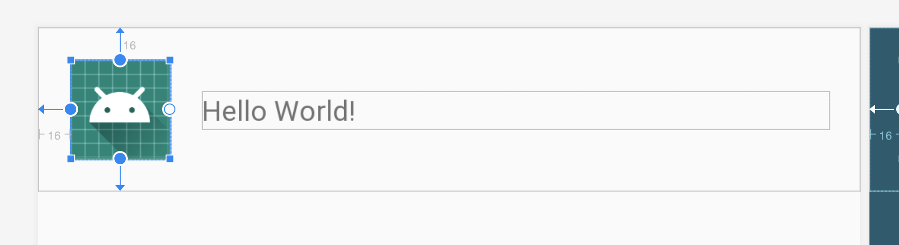
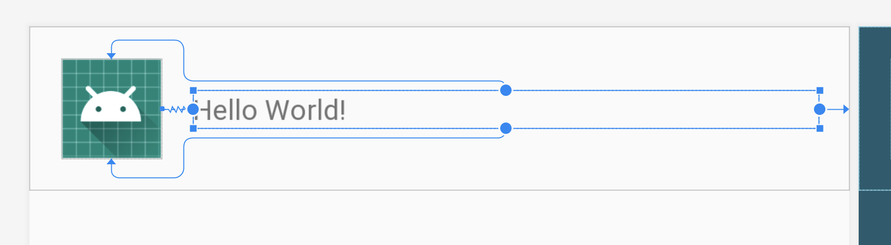

# Android レイアウトチートシート

## Android Studioのレイアウトエディタについて



- ① Palette: Viewコンポーネントを一覧できる。ここからPreviewやComponent TreeにドラッグアンドドロップでViewを配置できる
- ② Component Tree: Viewの構造をツリー構造で一覧できる
- ③ Preview: レイアウトのプレビュー画面。だいたいこの通りに描画されてくれる
- ④ Attributes: Viewのプロパティを設定したりできる
- 左下に、DesignタブとTextタブがある
  - TextタブではXMLを直接編集できる

Android Studioのレイアウトエディタは「触ってればなんとなく分かる」というくらいのUIになっていると思うので、詳細な操作方法は説明を省く。

## 基本

Androidのレイアウト構造は、XMLでViewコンポーネントを組み合わせて記述していく。もちろんプログラムから動的に作成することもできるが、今回は扱わない。

ReactやHTMLを想像してもらえば分かると思うが、だいたいあんな感じである。
たとえば、縦に3つテキストを並べる場合のレイアウトは以下のようになる。

```xml
<LinearLayout
  android:layout_width="match_parent"
  android:layout_width="match_parent"
  orientation="vertical">
    <TextView
      android:layout_width="match_parent"
      android:layout_height="wrap_content"
      android:text="1つめ" />

    <TextView
      android:layout_width="match_parent"
      android:layout_height="wrap_content"
      android:text="2つめ" />

    <TextView
      android:layout_width="match_parent"
      android:layout_height="wrap_content"
      android:text="3つめ" />
</LinearLayout>
```

それ単体で表現できるViewと、Viewの中にViewを持つことができるViewGroupの2種類の概念がある。
より正確には、Viewの中にはViewGroupが存在しており、ViewGroupのさらに拡張実装としてそれぞれのViewが存在する。

- View
  - TextView
  - ImageView
  - EditText
  - など
- ViewGroup
  - LinearLayout
  - FrameLayout
  - ConstraintLayout
  - など

基本は、ViewGroupで配置を決定し、Viewで文字や画像を表現することになる。

Android SDKには基本となる様々なViewが存在しており、また独自でViewを実装することもできるため、ライブラリなどで作られたカスタムViewを使って、実現したいレイアウトを組むのが定石である。

## View property

Viewにはプロパティと呼ばれる値を設定することができる。

これによって、例えば大きさ（縦、横のサイズ、TextViewなら文字の大きさ）やテキスト、文字色、背景、様々な値を設定できる。

プロパティを設定するときはXML上で開きタグ内にプロパティを宣言していく。

```xml
<TextView
    android:layout_width="match_parent"
    android:layout_height="wrap_content"
    android:text="表示したい文字"
    android:textSize="20sp" />
```

`android` はネームスペースだが今回は説明を割愛する。決まり文句だと思って良い。

`<ネームスペース>:<設定したいプロパティ名>="<設定する値>"` という風に値を入れていくことで、Viewの情報を更新していく。

layout_width, layout_heightは、以下で説明するViewGroup上で使用するプロパティで、ViewGroup内でのサイズを表現する。

wrap_content と指定した場合は、ViewのサイズはView自身によって決定することになる。（たとえば、表示したいテキストの長さ分だけViewのサイズを確保する）

match_parent と指定した場合は、自身の親Viewのサイズに合わせる形になる。（たとえば、親Viewのサイズが画面幅いっぱいならば、指定した子Viewのサイズも画面幅いっぱいになる）

その他にも、 `dp` `px` などの値を使って大きさを固定して表現することもできる。

```xml
<ImageView
    android:layout_width="40dp"
    android:layout_height="40dp" />
```

dp については詳細は省くが、要は「画面の解像度によらずにレイアウトを組める単位」くらいに覚えておけば良い。

## ViewGroup

ViewGroupは、含まれている子Viewの配置を決定するためのViewで、それぞれのViewが画面上(ViewGroup上)のどこにどういう風に設置されるか、を表現するのに使用する。

様々な種類のViewGroupがあるが、今回は3つのViewGroupを紹介する。

- LinearLayout
- FrameLayout
- ConstraintLayout

### LinearLayout

LinearLayoutは単純で、「子Viewを縦 もしくは 横に並べる」だけのViewGroupである。

orientationプロパティに vertical もしくは horizontal と指定すると、それぞれ縦 もしくは 横に子Viewを並べるようになる。

```xml
<LinearLayout
  android:layout_width="match_parent"
  android:layout_width="match_parent"
  orientation="vertical">
    <TextView
      android:layout_width="match_parent"
      android:layout_height="wrap_content"
      android:text="1つめ" />

    <TextView
      android:layout_width="match_parent"
      android:layout_height="wrap_content"
      android:text="2つめ" />

    <TextView
      android:layout_width="match_parent"
      android:layout_height="wrap_content"
      android:text="3つめ" />
</LinearLayout>
```

ここまでの知識で、一番最初に見せたXMLがおおよそ読めるようになるだろう。

### FrameLayout

FrameLayoutは、「子Viewを上に積み重ねていく」ViewGroupである。

「画像の上に文字を重ねたい」などのレイアウトを組むときに使うことができる。

### ConstraintLayout

今回紹介するこのConstraintLayoutだけ少し複雑で、「他のViewとの関係を記述することで配置を決定する」ViewGroupになっている。

言葉だと分かりづらいのでここからはAndroid Studioのレイアウトエディタの画像を交えながら紹介する。

まずは非常に単純なこのレイアウトについて、プレビューとXMLを見ながら説明する。

```xml
<androidx.constraintlayout.widget.ConstraintLayout
    android:layout_width="match_parent"
    android:layout_height="match_parent">

    <TextView
        android:layout_width="wrap_content"
        android:layout_height="wrap_content"
        android:text="Hello World!"
        app:layout_constraintBottom_toBottomOf="parent"
        app:layout_constraintLeft_toLeftOf="parent"
        app:layout_constraintRight_toRightOf="parent"
        app:layout_constraintTop_toTopOf="parent" />

</androidx.constraintlayout.widget.ConstraintLayout>
```



TextViewのプロパティに、 `layout_constraint~~~~` というプロパティが存在する。
これがConstraintLayoutでのレイアウトに必要なプロパティで、「他のViewとの位置関係」を表す。

冷静に一つずつ見ていくと、例えば `layout_constraintTop_toTopOf="parent"` プロパティに関しては、要はこういう風になっている。

- `constraint(Top <- 自身のTopを)_to(Top <- プロパティに定義されたViewのTopに設定する)="(parent <- 親View)"`
- 自身のViewの上端を、parentの上端に設定する

他のプロパティに関しても同じで、

`constraintRight(自身のViewの右端を)_toRight(他のViewの右端に設定する)="parent(他のView=親View)"`

という風に読み解くことができる。

なお、この `constraint~~~` なプロパティは、Previewの画面でカーソルをドラッグアンドドロップすることで簡単に設定することができる。


次は、もう少し複雑なレイアウトに関して見ていってみよう。

```xml
<androidx.constraintlayout.widget.ConstraintLayout
    android:layout_width="match_parent"
    android:layout_height="wrap_content">

    <ImageView
        android:id="@+id/imageView"
        android:layout_width="50dp"
        android:layout_height="50dp"
        android:layout_marginStart="16dp"
        android:layout_marginTop="16dp"
        android:layout_marginBottom="16dp"
        android:src="@mipmap/ic_launcher"
        app:layout_constraintBottom_toBottomOf="parent"
        app:layout_constraintStart_toStartOf="parent"
        app:layout_constraintTop_toTopOf="parent" />

    <TextView
        android:layout_width="0dp"
        android:layout_height="wrap_content"
        android:layout_marginStart="16dp"
        android:layout_marginEnd="16dp"
        android:text="Hello World!"
        app:layout_constraintBottom_toBottomOf="@id/imageView"
        app:layout_constraintEnd_toEndOf="parent"
        app:layout_constraintLeft_toLeftOf="parent"
        app:layout_constraintStart_toEndOf="@id/imageView"
        app:layout_constraintTop_toTopOf="@id/imageView" />

</androidx.constraintlayout.widget.ConstraintLayout>
```



まずはImageViewについて見ていく。これはさっきのTextViewと同様に、上端、左端、下端をparentの上端、左端、下端に合わせている。

そして、 `android:id="@+id/imageView"` というプロパティを定義している。
これは他のViewやプログラム上からこのImageViewを識別するためのID定義で、 `@+id` とすることで新たにIDを発行するという意味になる。

次にTextViewの方を見ていこう。



こちらは、先ほど定義したImageViewに対して上端、左端、下端を設定している。

ここで注目なのは、上端と下端を設定し、`android:layout_height="wrap_content"` と設定すると、中間に配置してくれるようになるという点。これは重要なテクニックなので覚えておこう。

また、左端と右端を設定し、 `android:layout_width="0dp"` と設定すると、左端から右端までの幅いっぱいに表示してくれるという仕組みもある。これも重要なテクニックなので合わせて覚えておこう。

と、このように「他のViewとの位置関係」を定義することでViewを配置していくことができる。

おそらくHTMLやReactなどのコンポーネントでは見てこなかったデザインシステムになっているので、最初はとっつきにくく感じるかもしれないが、慣れてくると「これがないとレイアウト組めない」ようになってしまう。

ConstraintLayoutは、GUIでのレイアウトエディタでの実装も非常に直感的に行うことができるので、何度か触っていれば自然とレイアウトを組むことができるようになるだろう。

## ConstraintLayoutがあれば大抵のレイアウトは組める

ConstraintLayoutを使えば、LinearLayoutやFrameLayoutができたことも実現できる。
ので、みんなでConstraintLayoutマスターになろう！

今回紹介した以外にも様々な機能を持っているので、興味のある人は調べてみると面白いだろう。
