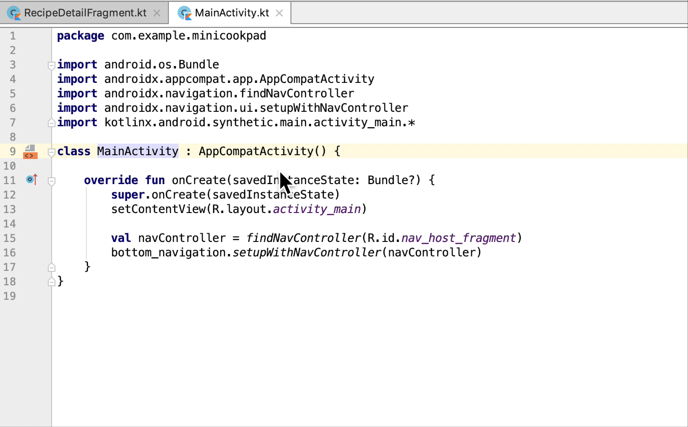
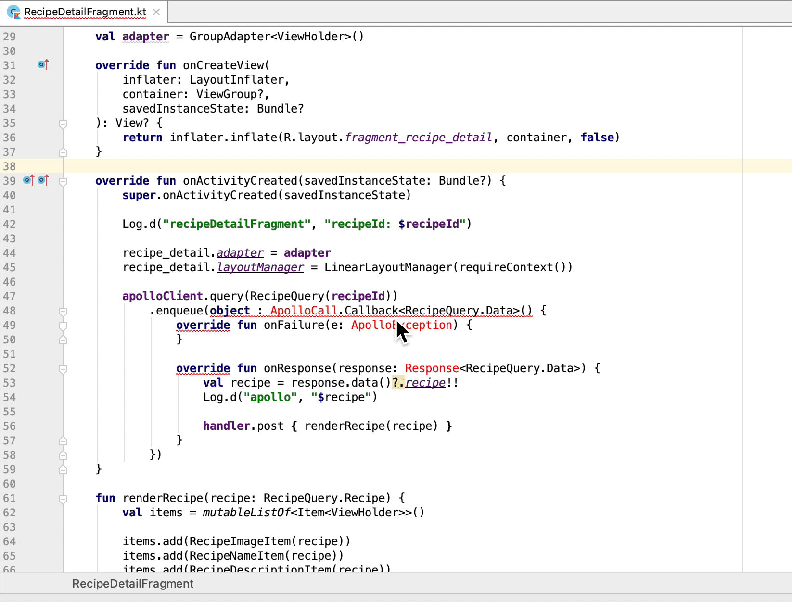

# Android Studio チートシート

Android Studioの便利ショートカットキーや使い方を紹介する。

## 便利なショートカットキー

ショートカットキー|効果
:-|:-
Cmd+O|クラス検索
Cmd+Shift+O|ファイル検索
Cmd+Option+O|シンボル検索
Cmd+F|ファイル内検索
Cmd+Shift+F|プロジェクト内検索
Shift 二度押し|なんでも検索
Cmd+Option+L|コードフォーマット
Ctrl+Option+O|importの整理(不要なimportを削除)
Ctrl+R|アプリ起動(Run build configuration)
Ctrl+D|デバッグモード起動
Ctrl+T|リファクタリングメニューを表示
Cmd+P|メソッドの引数を表示
Option+Enter|いい感じの提案をしてくれる(後述)

## 便利な機能

### Cmdキー

Cmdを押しながらクラスや変数、メソッドなどにマウスオーバーする or クリックすると、定義元へジャンプしたり様々な効能が得られる。

### Option+Enter

Option+Enterをすると、各箇所で様々な便利提案を行ってくれる。

例えば、importが定義されていないクラスがあったときには、自動的にimportを追加する機能が搭載されている。

他にも様々な効能が得られるので、「困ったらOption+Enter」とおぼえておくと良い。

- 未定義クラスの生成
- 未定義リソースの生成
  - レイアウトファイルなど

### ソースコードのコピーアンドペースト

ソースコードを左側にあるソースツリー上で Cmd+P (ペースト) すると、ファイルが自動生成される。地味に便利。

