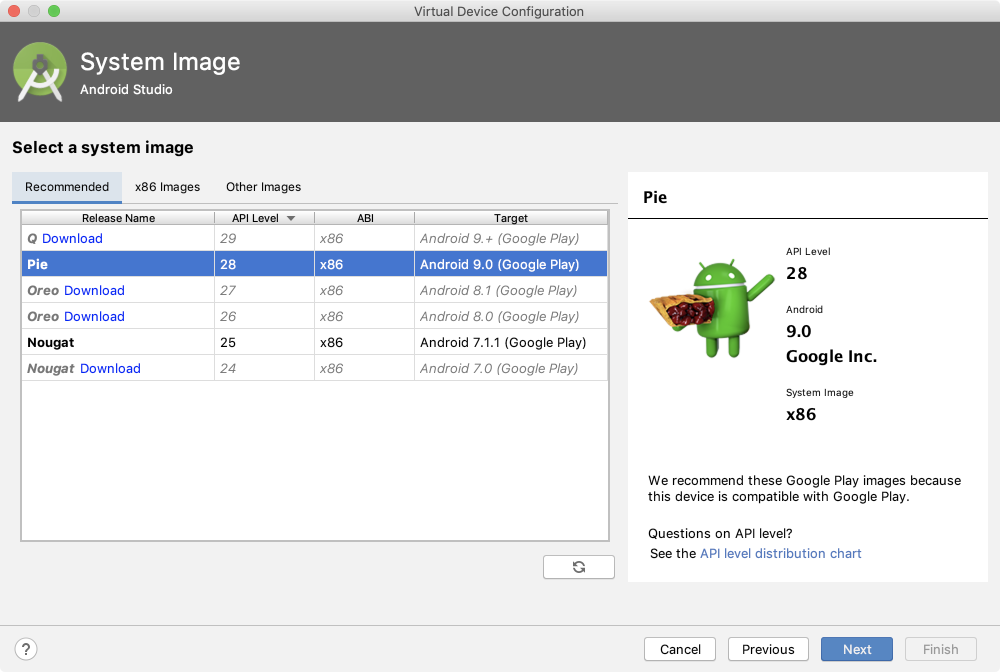

# 事前準備

- apollo-cliのインストール
- Android Studioのインストール
- [おまけ] GraphQL Pluginのインストール

## apollo-cliのインストール

シェルから以下のコマンドを実行(npmがインストールされていない場合は都度インストールしておくこと)

```
$ npm install -g apollo-cli
```

## Android Studioのセットアップ

下記リンクから、Android Studioをインストールする。

- https://developer.android.com/studio/install?hl=ja

Android Studioをインストールしたら、起動する。
ウィザードに従って進めていく。


途中、パスワードを求められる箇所があるが、Macのパスワードを入力してOKを押す。
HAXMというのはエミュレータ高速化用のツールで、これを入れないと激重エミュレータ上で開発を行うことになってしまうので、有無を言わさずインストールする。


## SDKのセットアップ

Android Studioの起動画面右下から進む。

- Configure > SDK Manager


右下の「Show package Details」を選択すると中身が見れるようになるので、

- Android 9.0 (Pie)
  - Android SDK Platform 28
  - Sources for Android 28
  - Google Play Intel x86 Atom System Image

にチェックを付けてOKを押す。


インストールするか？と聞かれるのでOKを押す。


ライセンス許諾は下のチェックを「Accept」に変更すると先に進める。


## AVD(Androidエミュレータ)のセットアップ

Android Studioの起動画面右下から進む。

- Configure > AVD Manager


ウィザードに従って先に進む。


ハードウェアは解像度、dpi、端末サイズなどエミュレートしたい端末を選ぶことができるので、好きなものを選んで良い。今回はPixel 2を選択する。


システムイメージを選択する。今回はSDKセットアップ時にダウンロードしたPieを選択する。



最後に端末の設定を色々と聞かれるが基本デフォルトでFinishを押す。
いじりたかったら好きにいじって良い。(個人的にはDevice FrameはOffにしておくのが好み)


このような形でエミュレータが作成されていれば成功。
▶ボタンを押して起動してみても良い。左下から別のデバイスも追加できるので、興味がある人は色々と試してみると良い。


## おまけ: GraphQL Pluginのインストール

余裕があれば、GraphQL用のプラグインをインストールしておくことをおすすめする。

今回は「JS GraphQL」というプラグインを使用する。
schemaファイルを読み込むことで、Android Studio上で補完やschema定義を表示するなどの仕組みが提供されている。
また、設定次第では指定のエンドポイントに対して記述したクエリをその場で実行することもできる。

講義ではプラグインの有無は問わないが、入れておいたほうが便利なので余裕があればぜひ入れておくことをおすすめする。(講義中に簡単に使い方を説明する予定)

Android Studio起動画面右下から進む。

- Configure > Plugins


上の検索ボックスから JS GraphQL Plugin をインストールする


プラグインインストール後は再起動を求められるので、指示に従って再起動する。
