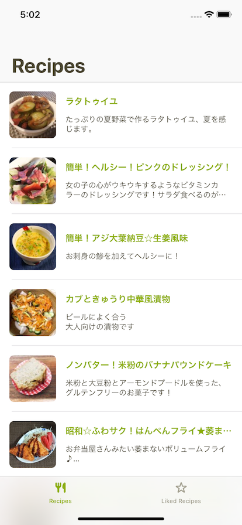

# アプリケーション開発 - iOS

## 講義の目的、目指すところ

シンプルなアプリケーションの実装を進めながら、iOSアプリ開発の基本を学びます。  
また、昨今ではサーバーからAPI等を通じてデータを取得して表示するといったことがほぼ必須事項として求められるので、　　
そうした部分も併せて学びます。

- iOSアプリ開発の始め方
- 複数の画面を行き来する
- サーバからデータを取得する
- 取得したデータをUIで表現する
- ユーザーの行動(アクション)に応じた処理を行う
- アプリ開発をする上で必要な設計方針を学ぶ

## 基礎となる知識

- [基礎知識](basics.md)

## 今日作るもの
「ミニクックパッド」という、レシピの一覧と詳細の閲覧、お気に入り付けられるだけのシンプルなサービスを、  
iOSアプリとして作成します。

| レシピ一覧                                         | レシピ詳細                                         |
| -------------------------------------------------- | -------------------------------------------------- |
|  |  |

完成形は[ここ](../ios)に置いてあります。[セットアップの手順](setup.md)を見てビルドすれば動かすことができます。

## 事前準備

必ずやっておいてね。絶対だよ。約束だよ。

- [事前準備](preparation.md)

## 「ミニクックパッド」を作ろう

### 基本講義

- 1: [はじめてのiOSアプリのビルドと実行](basic/chapter_1.md)
  - プロジェクトの作成
  - Xcodeの簡単な説明
  - ビルドをする
  - Hello, worldを表示しよう
- 2: [開発の前に下準備](basic/chapter_2.md) 
  - git のセットアップ
  - `.gitignore`の追加
  - `cocoapods`のインストール
  - `cocoapods`経由で必要なライブラリのインストールをする
  - `apollo`のインストール
  - schema.json のダウンロード
  - schema.json とクエリから GraphQL リクエストの定義を出力する
  - 出力されたファイルを Xcode プロジェクトに追加する
- 3: [UI作成と通信処理の実装とレシピ一覧画面の表示](basic/chapter_3.md)
  - RecipesViewControllerを作成する
  - リストを構成する(UITableView, UITableViewCell)
  - AuthoCenter
  - GraphQL リクエストの処理を書く
  - ViewModelクラスの作成
  - ViewModelとViewControllerの接続
- 4: [複雑なUIレイアウトとレシピ詳細画面](basic/chapter_4.md)
  - RecipeViewControllerの作成と遷移
  - RecipeViewControllerのUIを組む
  - 材料を表示するためのViewを作成
  - GraphQLのクエリの追加
  - ViewModelの作成
  - 取得したデータをUIに反映する
- 5: [よりアプリらしい見た目に](basic/chapter_5.md)
  - タブの表示
  - レシピ一覧の画面のUI改善
  - レシピ詳細画面のUI改善

## 発展課題

- 6: [レシピ一覧のページネーション](advanced/chapter_6.md)
- 7: [レシピにお気に入りを付ける/外す](advanced/chapter_7.md)
- 8: [お気に入りしたレシピ一覧画面の実装](advanced/chapter_8.md)
- 9: [さらなる改善へ](advanced/chapter_9.md)

## その他

- [ショートカットリスト](shortcuts.md)