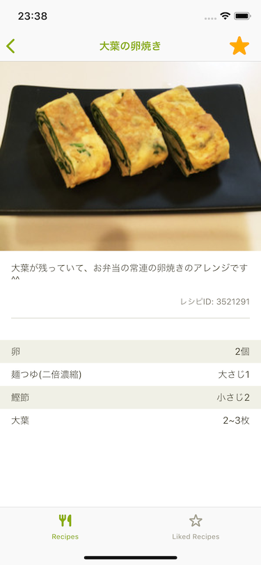

# 7. レシピにお気に入りを付ける/外す

レシピ詳細画面に、「☆/★」ボタンを表示し、押したときにレシピにお気に入りを付けたり、それを解除できるようにしましょう。

| お気に入り状態                                         | お気に入り解除状態                                     |
| ------------------------------------------------------ | ------------------------------------------------------ |
|  |  |

## ヒント

### addLike,delteLikeのクエリの追加

前日にやった講義を元に、`Recipe.graphql`に`addLike`,`deleteLike`のクエリを書いて、`GraphQLAPI.swift` を生成しましょう。

### APIClientに処理を追加

`APIClient.swift`の`getRecipes` 関数と同様に、`addLike`と`deleteLike`のmutation queryを実行する処理を書きましょう。

### レシピ詳細画面にお気に入りのボタンを配置する
レシピ詳細画面の右上、ナビゲーションバーの上に、お気に入りボタンを表示してみましょう。
次のコードを`loadView`に記述することで、お気に入りボタンを表示することができます。

```swift
let likeButtonImage: UIImage = CookpadSymbol.star
    .makeImage(
        symbolColor: UIColor.cookpad.yellow,
        size: .init(width: 30, height: 30
    )?
    .withRenderingMode(.alwaysOriginal)
navigationItem.rightBarButtonItem = UIBarButtonItem(
    image: likeButtonImage,
    style: .plain,
    target: self,
    action: #selector(RecipeViewController.toggleLike)
)

// ナビゲーションボタンを押した時の処理
@objc private func toggleLike() {
    //isLikedの情報を元に、addLike/deleteLikeを実行する
}
```

### ボタンを押したときに、今のお気に入りの状態を見てリクエストを投げる

`toggleLike`の関数内で、`recipe.isLiked`の状態をみて、それぞれ`addLike`,`deleteLike`を実行できるようにします。

`RecipeViewModelInputs`に、次のように定義を追加して、その実装を`RecipeViewModel`に記述していきましょう。

```swift
protocol RecipeViewModelInputs {
    func fetchRecipe()
    // 以下を追加
    func addLike(to recipeID: String)
    func deleteLike(from recipeID: String)
}
```

### リクエストが成功したらボタンの表示を切り替える

リクエストが成功して結果が返ってきたら、ボタンの表示を切り替えましょう。  
ナビゲーションバーのボタンの画像を次のように、`isLiked`の結果をみて変更出来るようにします。

```swift
    private func makeLikeImage(isLiked: Bool) -> UIImage? {
        return isLiked
        ? CookpadSymbol.star.makeImage(symbolColor: UIColor.cookpad.yellow, size: .init(width: 30, height: 30))?.withRenderingMode(.alwaysOriginal)
        : CookpadSymbol.starBlank.makeImage(symbolColor: UIColor.cookpad.yellow, size: .init(width: 30, height: 30))?.withRenderingMode(.alwaysOriginal)
    }

    // usage
    navigationItem.rightBarButtonItem?.image = makeLikeImage(isLiked: recipeIsLiked)
```