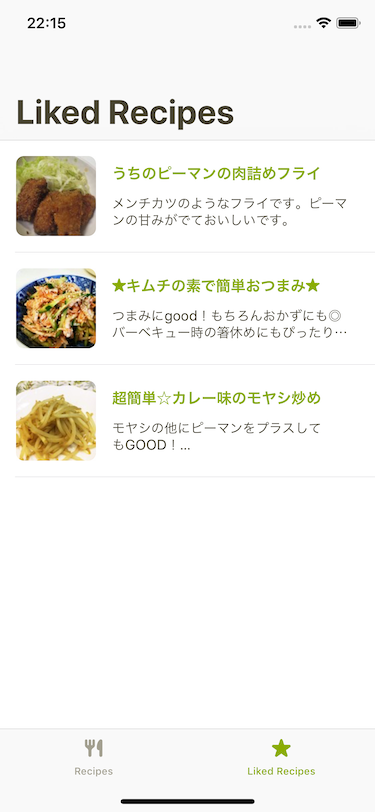

# 8. お気に入りしたレシピ一覧画面の実装

7章の発展課題でお気に入り機能を実装したので、今度は自分がお気に入りにしたレシピの一覧を表示してみましょう

  

## ヒント

### likesのクエリの追加と、APIClientに処理を追加
`Recipe.graphql`ファイルに、`likes`のクエリを追加して、コードを生成しましょう。  
その後は今までと同様、`APIClient`に取得の処理をラップした関数を実装します。

### 画面に必要なクラスを作成する

`LikesRecipesViewController`, `LikesRecipesViewModel`, `LikedRecipesCell`といったViewやViewModel,Cellを作成して実装を書いていきましょう。  

### データの反映とcursorページネーション

`likes`のクエリを実行すると、結果のレスポンスには次のようなものが含まれてくると思います。

- `nodes`
  - お気に入りしたレシピの一覧が入ってくる
- `pageInfo`
  - `endCursor`: ページネーションの次の開始位置のレシピID
  - `hasNext`: 次のページがあるかどうか

なので、レシピ一覧のときのように、`nodes`を扱えばそのままお気に入りのレシピ一覧の実装で必要なデータを扱うことができます。  
ページネーションは、前回のように`page`と`perPage`を渡す方式ではなく、GrapyQLのcursor paginationを使うことになります。
`pageInfo`に必要なデータが入ってくるので、それを基に判定したり、次のページを取得したりするようにしましょう。
