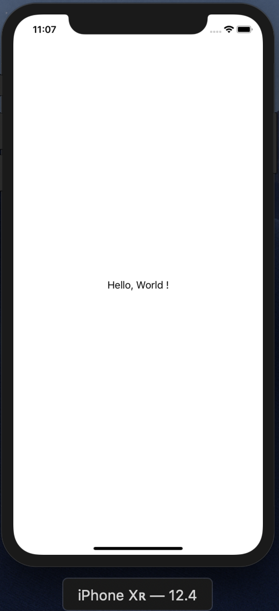

# 1. はじめての iOS アプリのビルドと実行

まずは、Xcode から iOS アプリを作成するための「プロジェクト」を作成し、  
ビルドをしてシミュレータ上で iOS アプリを動かすところまでやってみます。

## プロジェクトの作成

まずは、Xcode.app を開きます。  
「Create a new Xcode project」を選択しましょう。（`⌘⇧N`)

そうすると、どのテンプレートを選んでプロジェクトを新規作成するか問われるので、  
今回は「Single View App」を選択して作成します。はじめに単一の画面だけが用意されているテンプレートになります。  

選択したら、最後にプロジェクトの名前などを設定します。  
すべての項目、任意の名前で構いませんが、ひとまず迷ったら以下に従って入力してください。  
入力をしたらプロジェクトの保存場所を聞かれるので、任意の場所に保存しください。

- Product Name: `MiniCookpad`
- Team: `None` (今回はシミュレータのみ使用します)
- Organization Name: `Cookpad Inc.`
- Organization Identifier: `com.cookpad`
- Language: Swift
- Options: `Include Unit Tests` にチェックをつける

## Xcode の簡単な説明

プロジェクトを作成すると、次のようなエディタ画面が開きます。これが今日 1 日お世話になる Xcode のメイン画面となります。

簡単にそれぞれ説明していきます。

- ①: ナビゲーションエリア
  - ファイルツリーの表示、ツリーからファイルを選択してエディタエリアで開く、プロジェクト内検索（`⌘⇧F`）といった機能があります
- ②: エディタエリア
  - ソースコードを記述する場所になります。または storyboard などのレイアウトを構成する場所になります(Interface Builder)
- ③: デバッグエリア
  - 実行中のアプリケーションのログが流れてきたり、ブレークポイントをソースコードに設定してあれこれデバッグしたりすることができます
- ④: インスペクタエリア
  - 主にファイルの情報が表示されたり、storyboard 等を編集しているときの UI パーツのパラメータ調整をする場所になります
- ⑤: 実行、停止、アプリケーションの選択
  - ここで実行するアプリケーション、シミュレータを選んで実行、停止ができます。

### 💡 便利なショートカット

[ショートカットリスト](../shortcuts.md)に開発をする上で便利なショートカットを載せておくので、Chrome の別タブで開いたり、印刷して手元に置いたりしてみてください。  
また、講義資料内では、対応する動作にショートカットがある場合は、(`ショートカットキー`)という表記を付けておきます。

#### 記号

- ⌘: コマンドキー(cmd)
- ⇧: シフトキー(shift)
- ⌃: コントロールキー(ctrl)
- ⌥: オプションキー(opt/alt)

## ビルドをする

さて、新規プロジェクトを作成し、Xcode がどんなものかなんとなくわかったと思うので、  
まずは「ビルド」をして、シミュレーターを起動して実行してみましょう。  
画面左上の「▶」ボタンを押します。（`⌘R`)

また、単純にビルドを行い、ソースコードが正しくコンパイルできるかを実行する場合は（`⌘B`)でビルドのみ行うことができます。  
また、現時点では何も書いていないですが、UnitTest と呼ばれるテストを書いて実行する場合は（`⌘U`)で実行できます。

=====

実行すると真っ白の画面...ちょっとつまらないですね。  
この章では最後に画面に「Hello, World!」を表示させて終了としましょう。

## Hello, world を表示しよう

まず、ナビゲーションエリアから「Main.storyboard」を選択します（`⌘⇧Oを押して「main」と検索してEnter`）  
そうすると、エディタエリアで「Interface Builder」と呼ばれる、視覚的に画面を構成するための画面が表示されます。

ここで、様々な「UI パーツ」を配置して画面のレイアウトを構成することができます。

UI パーツを配置するには、（`⌘⇧L`）を押し、UI パーツの一覧(ライブラリ)を開き、そこからパーツを選択します。
そのままではたくさん表示されているので、検索窓から「label」と検索して、画面に文字を表示するための label パーツを画面にドラッグアンドドロップします。

label をドラッグアンドドロップできたら、ダブルクリックをして、「label」の文字を「Hello, World!」に変更します。

変更ができたら実行（`⌘R`）してみましょう。次のように表示されたらこの章は完成です。

