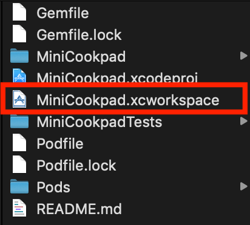
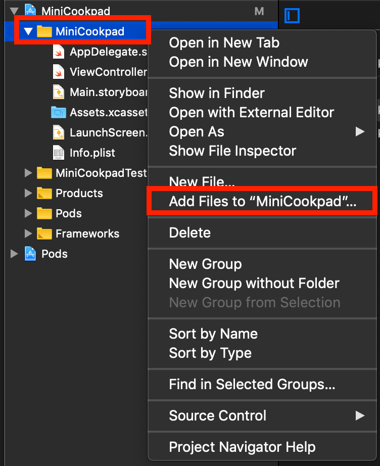
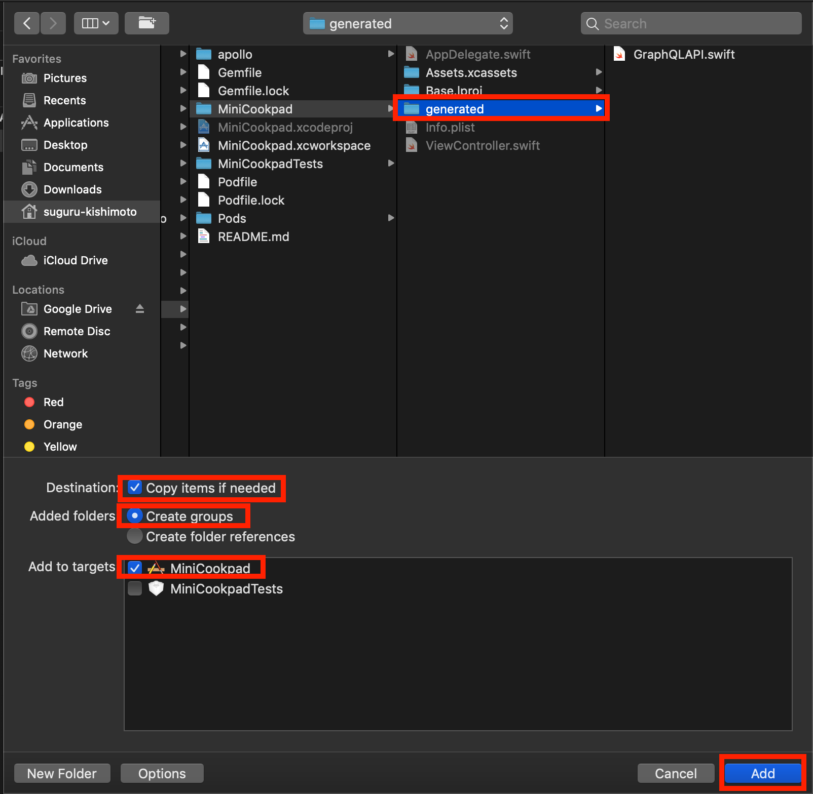
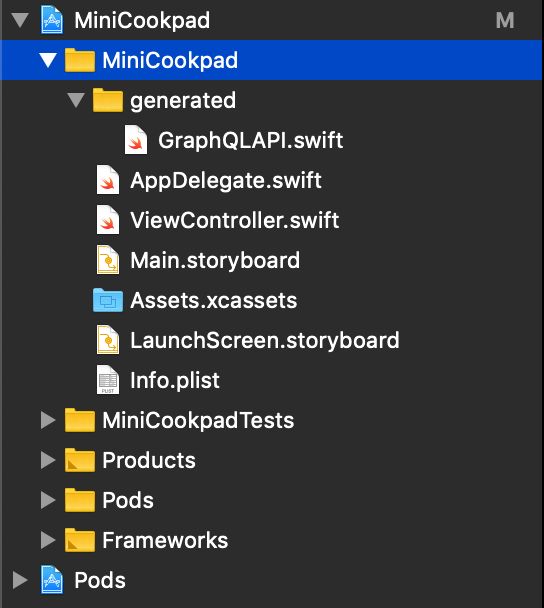

# 2. 開発の前に下準備

Xcode でプロジェクトを作成し、画面に「Hello, World!」も出力できたし、さあミニクックパッドを作るぞ！  
とその前に、開発に入る前の下準備をしましょう。

途中、`yarn`を使うことになるので、まだ事前準備が済んでいない人は[事前準備](../preparation.md)をみて準備してください。

## git のセットアップ

まずは git のセットアップをしましょう。今後何か作業をしてコミットをしたり、プッシュをしたりするのに何かと必要になります。
プロジェクのルート(`MiniCookpad.xcodeproj`が配置されているディレクトリ)で`git init`を実行します。

## `.gitignore`の追加

次に、前もって`.gitignore`を追加します。

[ここ](https://github.com/cookpad/cookpad-internship-2019-summer/blob/master/ios/.gitignore)から.gitignore に記述する内容をコピーし、
先ほどと同様プロジェクトのルートに配置します。

ここまでで、次のようなディレクトリ構造になっていると思います。

```bash
$ ls -al
drwxr-xr-x   8 user  staff   256  8 13 14:03 ./
drwxr-xr-x  20 user  staff   640  8 13 14:02 ../
drwxr-xr-x  11 user  staff   352  8 13 14:05 .git/
-rw-r--r--   1 user  staff  2735  8 13 14:03 .gitignore
drwxr-xr-x   7 user  staff   224  8  9 22:41 MiniCookpad/
drwxr-xr-x@  5 user  staff   160  8  9 22:41 MiniCookpad.xcodeproj/
drwxr-xr-x   4 user  staff   128  8  9 22:41 MiniCookpadTests/
-rw-r--r--   1 user  staff    61  8 13 14:02 README.md
```

ひとまず、ここまでの変更をコミットしておきましょう。

## `cocoapods`のインストール

次に、開発で使うライブラリ群をインストールするために、`cocoapods`と呼ばれるツールをインストールします。

まず、プロジェクトのルートに`Gemfile`に次の内容を書いて追加します。

```
# frozen_string_literal: true
source "https://rubygems.org"

gem 'cocoapods', '~> 1.7'
```

そしたら、プロジェクトのルートにて、

```bash
$ bundle install
```

を実行します。これで`cocoapods`がインストールされます。  
`bundle exec pod --version`と打ってバージョン番号が出力されれば成功です。

## `cocoapods`経由で必要なライブラリのインストールをする

`cocoapods`がインストールできたので、今度はこれを使って、今後の開発に必要なライブラリ群をインストールします。  
まずは、プロジェクトのルートで`bundle exec pod init`を実行します。そうすると、同ディレクトリ内に`Podfile`というファイルが作成されます。
作成された時点では次のような構成になっています。

```ruby
# Uncomment the next line to define a global platform for your project
# platform :ios, '9.0'

target 'MiniCookpad' do
  # Comment the next line if you don't want to use dynamic frameworks
  use_frameworks!

  # Pods for MiniCookpad

  target 'MiniCookpadTests' do
    inherit! :search_paths
    # Pods for testing
  end

end
```

この Podfile を次のように書き換えます。

```ruby
source 'https://github.com/CocoaPods/Specs'

target 'MiniCookpad' do
  # iOSでGraphQLを扱うためのライブラリ
  pod 'Apollo'
  # 使うときに説明しますが、UITableViewCellやUIViewControllerをxib等から生成するときに便利なライブラリ
  pod 'Instantiate'
  pod 'InstantiateStandard'
  # 画像の非同期読み込みをサポートしてくれるライブラリ
  pod 'Kingfisher'
  # HTTPクライアントライブラリ
  pod 'APIKit', '~> 5.0'

  target 'MiniCookpadTests' do
    inherit! :search_paths
  end
end
```

書き換えができたら、`bundle exec pod install`を実行します。
次のように出力され、成功すればライブラリ群のインストールが完了しています。

```bash
$ bundle exec pod install
Analyzing dependencies
Downloading dependencies
Installing APIKit (5.0.0)
Installing Apollo (0.14.0)
Installing Instantiate (4.0.0)
Installing InstantiateStandard (4.0.0)
Installing Kingfisher (5.7.0)
Generating Pods project
Integrating client project

[!] Please close any current Xcode sessions and use `MiniCookpad.xcworkspace` for this project from now on.
Sending stats
Pod installation complete! There are 6 dependencies from the Podfile and 6 total pods installed.
```

インストールが完了したら、一度 Xcode で開いている`MiniCookpad.xcproject`を閉じます。  
以降は、プロジェクトではなく、プロジェクトを束ねた「ワークスペース」という単位で開発を勧めていくことになります。  
`MiniCookpad.xcworkspace`を開いて開発をすすめていきます。  
GUI 上だと次のアイコンをクリックすれば開くことができます。Terminal から開くときは、`open MiniCookpad.xcworkspace`を叩くことで開くことができます。



一度ワークスペースを開いてビルドをしてみて、成功することを確認してください。ビルドが失敗する場合は

- 間違って`MiniCookpad.xcproject`で開いていないか
- `bundle install pod init`が成功するか

を確認してください。

## `apollo`のインストール

今度は、前日までで作った GraphQL サーバーとの通信をやりとりするための定義(schema.json)と、クエリから iOS で通信を行うためのリクエスト定義を生成するのに必要な`apollo(apollo-cli)`をインストールします。  
まず、プロジェクトのルート以下に、`apollo`ディレクトリを作成し、移動します。

```bash
$ mkdir apollo
$ cd apollo
```

`apollo/`ディレクトリ内に、`package.json`を作成し、次のように記述します。

```json
{
  "name": "ios-apollo",
  "version": "1.0.0",
  "private": true,
  "devDependencies": {
    "apollo": "^2.16.1"
  }
}
```

記述がおわったら、`yarn` と打って apollo のインストールをします。

## schema.json のダウンロード

`yarn`経由でインストールした apollo を使って、リスエスト定義出力に必要となる`schema.json`をサーバーから取得します。

`package.json`を開き、`devDependencies`の下に`scripts`を追加します。

---

**NOTE:** `--endpoint=`には、自身で作成したGraphQLサーバーのエンドポイントを指定してください。

---

```json
   "scripts": {
     "download-schema": "yarn apollo client:download-schema --endpoint=[enter_your_endpoint]"
   }
```

```diff
// diff
{
  "name": "ios-apollo",
  "version": "1.0.0",
  "private": true,
  "devDependencies": {
    "apollo": "^2.16.1"
-   }
+   },
+   "scripts": {
+     "download-schema": "yarn apollo client:download-schema --endpoint=[enter_your_endpoint]"
+   }
}
```

`scripts`以下に、`download-schema`というスクリプトを作成しました。  
これを呼び出せば、`apollo/` ディレクトリ内に`schema.json`がダウンロードされます。

```bash
$ yarn run download-schema
  ✔ Loading Apollo Project
  ✔ Saving schema to schema.json
✨  Done in 1.60s.
```

「Saving schema to schema.json」が出力されれば無事にダウンロードができています。

## schema.json とクエリから GraphQL リクエストの定義を出力する

後は、実際にどういうクエリを投げてリスエストをしたいかという`.graphql`ファイルを作成し、先程ダウンロードした`schema.json`と併せて`apollo`のコマンドを叩き、リクエスト定義を生成します。

まずは、`apollo/`ディレクトリに、`Recipe.graphql`というファイルを、次の内容で作成します。

```graphql
query Recipes($page: Int!, $perPage: Int!) {
  recipes(page: $page, perPage: $perPage) {
    id
    name
    description
    media {
      thumbnail
    }
  }
}
```

次に、`package.json`を再度開き、`scripts`で定義しているスクリプトを`generate`コマンドに変更します。

```json
"scripts": {
  "generate": "yarn apollo client:download-schema --endpoint=[enter_your_endpoint] && apollo client:codegen ../MiniCookpad/generated/GraphQLAPI.swift --target=swift --queries=./*.graphql --localSchemaFile=./schema.json"
}
```

```diff
// diff
{
  "name": "ios-apollo",
  "version": "1.0.0",
  "private": true,
  "devDependencies": {
    "apollo": "^2.16.1"
  },
  "scripts": {
-     "download-schema": "yarn apollo client:download-schema --endpoint=[enter_your_endpoint]"
+     "generate": "yarn apollo client:download-schema --endpoint=[enter_your_endpoint] && apollo client:codegen ../MiniCookpad/generated/GraphQLAPI.swift --target=swift --queries=./*.graphql --localSchemaFile=./schema.json"
  }
}
```

`download-shema`から`generate`に名前を変え、schema.json の取得から生成までを 1 つのスクリプトにしました。  
ここまでできたら生成...の前に、生成先のディレクトリを作成しましょう。プロジェクトのルートから見て、`MiniCookpad/`以下に、`generated`ディレクトリを作成します。

```bash
$ pwd
# path/to/project/apollo
$ cd ../
$ mkdir MiniCookpad/generated
```

ディレクトリを作成できたら、再度`apollo/`ディレクトリに戻り、generate スクリプトを実行します。

```bash
$ cd apollo/
$ yarn run generate
  ✔ Loading Apollo Project
  ✔ Saving schema to schema.json
  ✔ Loading Apollo Project
  ✔ Generating query files with 'swift' target - wrote 1 files
```

「Generating query files with 'swift' target - wrote 1 files」が出力されれば、無事に`MiniCookpad/generated`に`GraphQLAPI.swift`が出力されています。確認してみましょう。

## 出力されたファイルを Xcode プロジェクトに追加する

`MiniCookpad/generated/` 以下にファイルを出力しましたが、このままでは Xcode は自動的には認識してくれません 😇  
なので、次の手順で生成されたファイルを Xcode のプロジェクトに追加し、認識させます。

- `MiniCookpad.xcworkspace`を開く
- 左側にあるナビゲーションエリアから、フォルダマークの付いている「MiniCookpad」を右クリックし、「Add Files to "MiniCookpad..."」を選択



- 追加したいファイルを聞かれるので、`generated`ディレクトリを選択し、以下のオプションを確認し、「Add」を押します
  - 「Copy items if needed」にチェックがついている
  - Added folders の項目、「Create groups」が選択されている
  - Add to target の項目、「MiniCookpad」が選択されている



追加すると、プロジェクトの階層が次のようになると思います。



次回以降、`GraphQLAPI.swift`を再生成しても、出力先のディレクトリを変えなければ、都度プロジェクトに参照を追加し直すことは不要です。

最後にビルドを行い成功することを確認しましょう。

===============

ここまでで、次回以降の開発に必要な下準備ができました。
次回は実際に生成した GraphQL リクエストを使って、レシピ一覧画面の実装を進めていきます。
