# 3. UI作成と通信処理の実装とレシピ一覧画面の表示

前章までで、これから行う開発の下準備が整ったので、開発を進めていきます。  
この章で下記のように、実際にサーバーにGraphQLのクエリを投げてレシピ一覧を取得し、取得したデータを元にリスト表示をするところまで実装します。


## RecipesViewControllerを作成する

### ファイルの作成

まずは、`RecipesViewController`という、`ViewController`を作成します。iOSでは画面に何か表示するときは単純な`View`ではなく、`ViewController`を基点として表示することになります。  
Xcodeのナビゲーションエリアから、`MiniCookpad`のディレクトリ以下に、「Views」ディレクトリを作成し、更にその下に「Recipes」ディレクトリを作成します。  
Xcode上からディレクトリを作成する場合は、起点となる場所を右クリックし、「」を選択し、作成します。「New Group」という名前を適宜リネームして作成します。

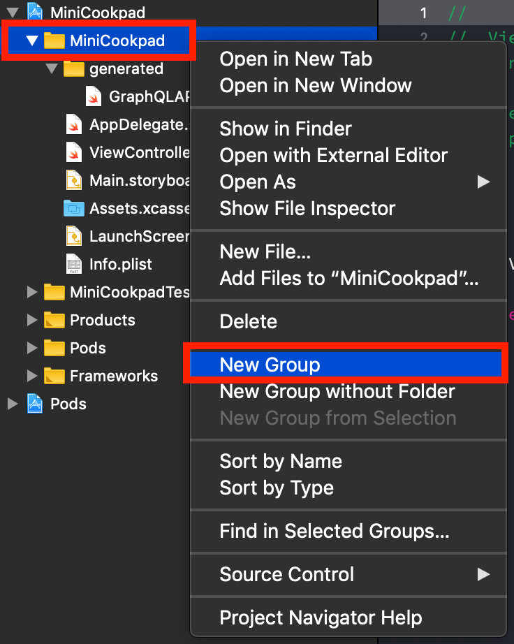

ここで作成したディレクトリはしっかり Finder 上でも作成されます。  
正しく作成できれば次のようなディレクトリ構成になると思います。

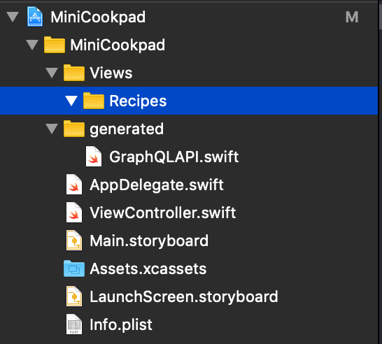

`Recipes`ディレクトリを選択し、「New File..」を選択して ファイルを作成します（`⌘N`）  
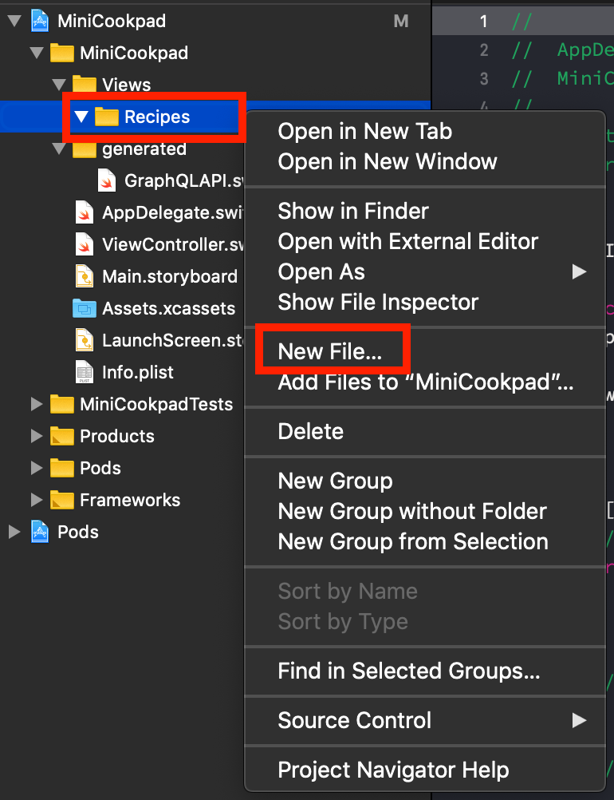  
`Swift File`を選択し、`RecipesViewController.swift`という名前で作成します。(`.swift`ははじめから補完されるので、`RecipesViewController`と打てば良いです。)

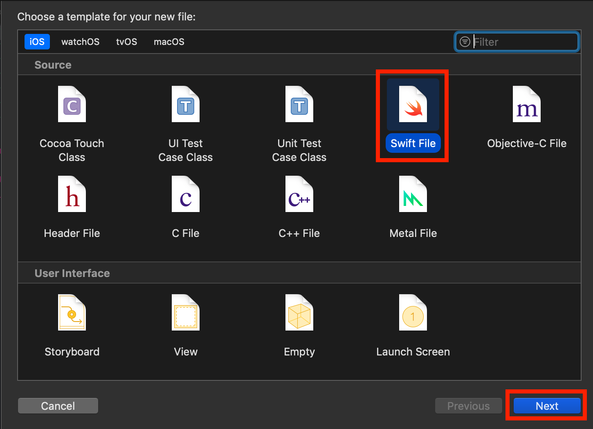  
<br />
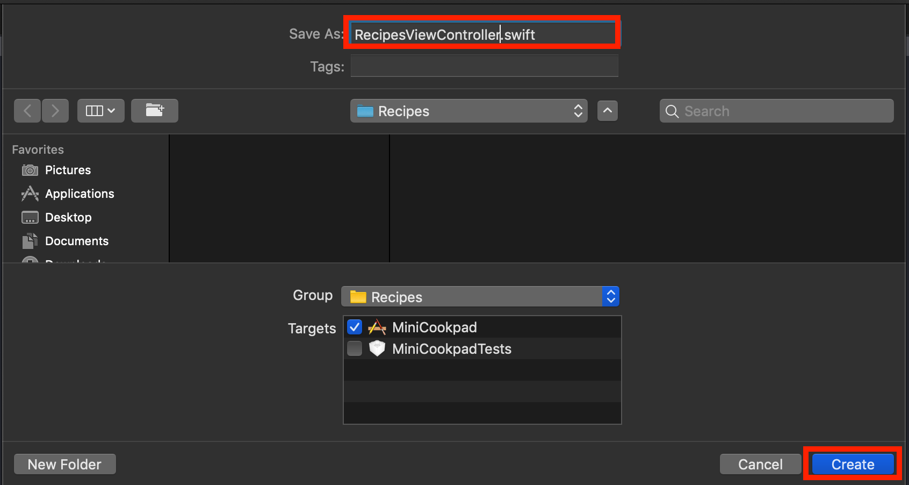

作成できたら、`RecipesViewController.swift`の内容を次のように変更しておきます。

```swift
import Foundation
import UIKit

final class RecipesViewController: UIViewController {
    init() {
        super.init(nibName: nil, bundle: nil)
        title = "Recipes"
    }

    override func loadView() {
        super.loadView()
        view.backgroundColor = .white
    }

    @available(*, unavailable)
    required init?(coder aDecoder: NSCoder) {
        fatalError("init(coder:) has not been implemented")
    }
}
```

今まで swift でのコードが出てきていなくて「いきなり」感がすごいので、軽く補足だけしておきます。

- `UIViewController`を継承したクラスとして定義している
- イニシャライザ(`init()`)で、RecipesViewControllerの持つ`title`プロパティに`Recipes`を代入
- ViewControllerのviewがロードされたタイミングで呼び出される`loadView()`関数で、view の背景色に白を設定
- このクラスはxibやstoryboardから生成することは今回しないので、`init?(coder aDecoder: NSCoder)`というイニシャライザに対して使わないよというアトリビュートを付与しています(`@available(*, unavailable)`)

ひとまずこの時点では`RecipesViewController`を生成するだけの準備をした、と思っておいてください。

### 👋`Main.storyboard`, `ViewController`

現状は、アプリを実行したときに、`Main.storyboard`をロードし、`ViewController`をロードして画面に表示するようになっていますが、  
ここを変更して、最初に先程作った`RecipesViewController`が表示されるようにします。

まず、ナビゲーションエリアの一番上にある「MiniCookpad」を押し、プロジェクトの設定画面を開き、【General】のタブを選択します。

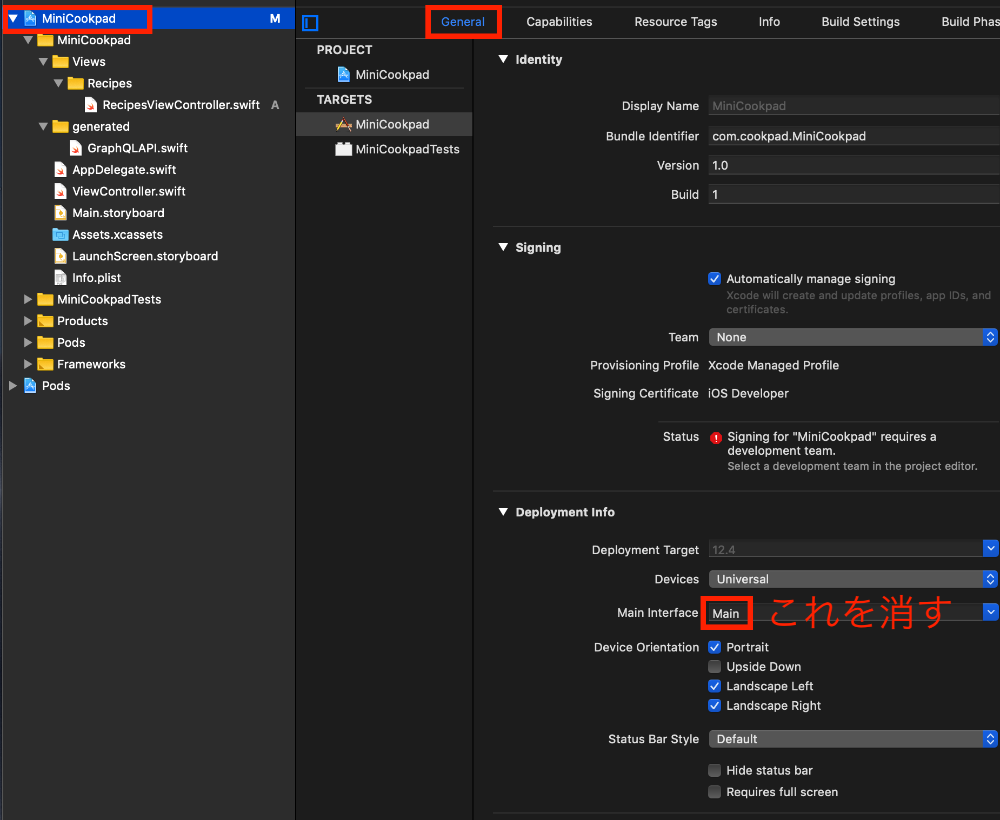

「Deployment Info」の項目に「Main Interface」というサブ項目があり、「Main」と書かれているのでこれを消します。  
その後、ナビゲーションエリアから、`Main.storyboard`と`ViewController.swift`を右クリックして「Delete」を選択します（`Back Space`）  
次のようなポップアップが表示され消しますか？と聞かれるので、「Move To Trush」を選択して削除しましょう。(Remove Reference だと実ファイルは残ったまま、プロジェクトの参照からは消えます)

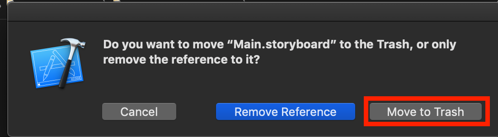

こうして`Main.storyboard`を使わないようにしてこのままビルドすると、真っ黒な画面だけが表示される状態になります。　　
`AppDelegate.swift`を開き、起動ができるように修正します。

```swift
    func application(_ application: UIApplication, didFinishLaunchingWithOptions launchOptions: [UIApplication.LaunchOptionsKey: Any]?) -> Bool {
        let window = UIWindow(frame: UIScreen.main.bounds)
        window.rootViewController = UINavigationController(rootViewController: RecipesViewController())
        self.window = window
        window.makeKeyAndVisible()
        return true
    }
```

```diff
// diff
    func application(_ application: UIApplication, didFinishLaunchingWithOptions launchOptions: [UIApplication.LaunchOptionsKey: Any]?) -> Bool {
-         // Override point for customization after application launch.
+         let window = UIWindow(frame: UIScreen.main.bounds)
+         window.rootViewController = UINavigationController(rootViewController: RecipesViewController())
+         self.window = window
+         window.makeKeyAndVisible()
        return true
    }
```

元々の設定では、`Main.storyboard`をロードし、ウィンドウと呼ばれるものに ViewController をセットして起動するところまで自動的に行なってくれていましたが、  
手動で設定するとこのようになります。これによって、今のアプリケーションの View の構造としてはこのようになります。

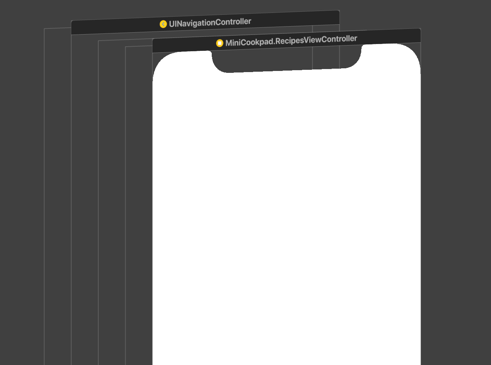

もう少し平たく、わかりやすくするとこのようになります

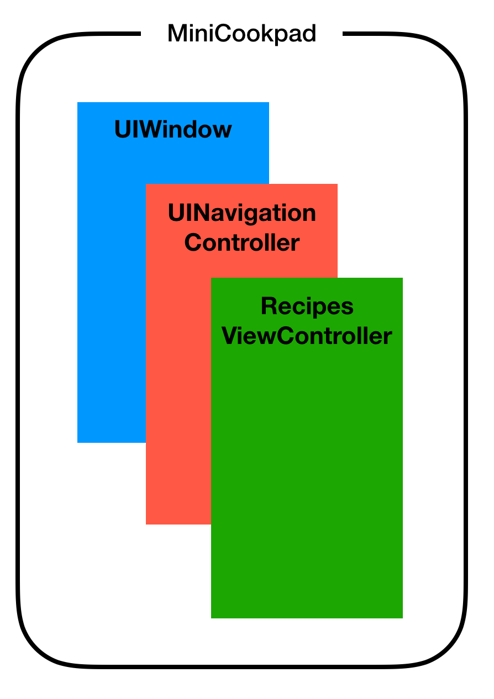

ここまででビルドをして、画面上部のナビゲーションバーに「Recipes」と書かれた RecipesViewController が画面に表示されていれば問題ないです。

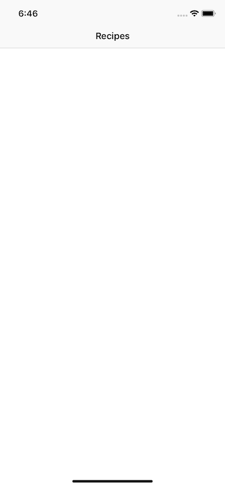

## リストを構成する(UITableView, UITableViewCell)

ひとまずレシピ一覧を表示するための画面を準備したので、少しずつ肉付けをしていきます。  
一覧を表示するためのパーツとしてリストを、この画面に追加していきます。  
iOS では、リスト表示を行うための UI パーツとして`UITableView`、`UITableViewCell`が用意されているので、こちらを使用します。

### RecipesViewController に UITableView を配置する

まずはリストを表示する土台となる`UITableView`を配置します。  
`RecipesViewController` を次のように書き換えます。  

```swift
final class RecipesViewController: UIViewController {
    private lazy var tableView: UITableView = {
        let tableView = UITableView(frame: .zero)
        tableView.translatesAutoresizingMaskIntoConstraints = false
        tableView.rowHeight = UITableView.automaticDimension
        return tableView
    }()

    init() {
        super.init(nibName: nil, bundle: nil)
        title = "Recipes"
    }

    override func loadView() {
        super.loadView()
        view.backgroundColor = .white
        view.addSubview(tableView)
        NSLayoutConstraint.activate([
            tableView.safeAreaLayoutGuide.topAnchor.constraint(equalTo: view.safeAreaLayoutGuide.topAnchor),
            tableView.bottomAnchor.constraint(equalTo: view.bottomAnchor),
            tableView.safeAreaLayoutGuide.leadingAnchor.constraint(equalTo: view.safeAreaLayoutGuide.leadingAnchor),
            tableView.safeAreaLayoutGuide.trailingAnchor.constraint(equalTo: view.safeAreaLayoutGuide.trailingAnchor),
        ])
    }

    @available(*, unavailable)
    required init?(coder aDecoder: NSCoder) {
        fatalError("init(coder:) has not been implemented")
    }
}
```

```diff
// diff
final class RecipesViewController: UIViewController {
+     private lazy var tableView: UITableView = {
+         let tableView = UITableView(frame: .zero)
+         tableView.translatesAutoresizingMaskIntoConstraints = false
+         tableView.rowHeight = UITableView.automaticDimension
+         return tableView
+     }()

    init() {
        super.init(nibName: nil, bundle: nil)
        title = "Recipes"
    }

    override func loadView() {
        super.loadView()
        view.backgroundColor = .white
+         view.addSubview(tableView)
+         NSLayoutConstraint.activate([
+             tableView.safeAreaLayoutGuide.topAnchor.constraint(equalTo: view.safeAreaLayoutGuide.topAnchor),
+             tableView.bottomAnchor.constraint(equalTo: view.bottomAnchor),
+             tableView.safeAreaLayoutGuide.leadingAnchor.constraint(equalTo: view.safeAreaLayoutGuide.leadingAnchor),
+             tableView.safeAreaLayoutGuide.trailingAnchor.constraint(equalTo: view.safeAreaLayoutGuide.trailingAnchor),
+         ])
    }

    @available(*, unavailable)
    required init?(coder aDecoder: NSCoder) {
        fatalError("init(coder:) has not been implemented")
    }
}
```

`private lazy var ...` の部分で UITableView の生成をしています。  
`NSLayoutConstraint.activate ...`の部分はやや複雑に見えますが、コード上で`AutoLayout`の設定をしていて、View の上下左右にぴったりくっつくように定義をしています。  
ビルドをして実行すると次のようになります。

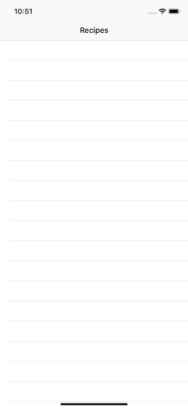

ここまででは、単に空っぽのリストが表示された状態です。(罫線だけ引かれていますね。)

### RecipesCell を xib ファイルで作成する

#### ファイルの作成と下準備

次は実際に項目を表示するための、「セル」と呼ばれる View を作成します。  
今度はコードで生成ではなく、`.xib`形式のファイルを作成し、GUI 上で View の構築をします。  
`RecipesViewController.swift`と同じ階層で右クリック右「New File..」（`⌘N`）を押し、

- 「Swift File」を選び、`RecipesCell.swift`
- 「User Interface」の項目にある「Empty」を選び、`RecipesCell.xib`

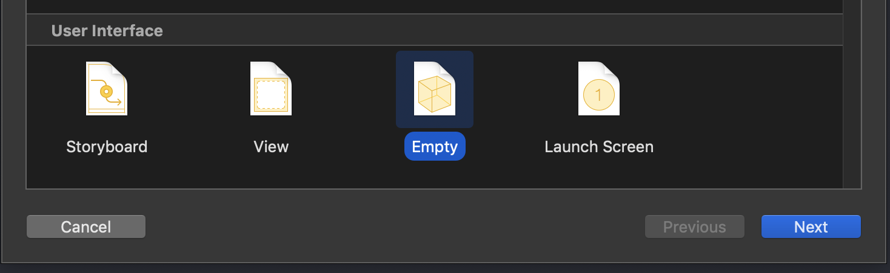

を作成します。作成後はこのようになっていると思います。

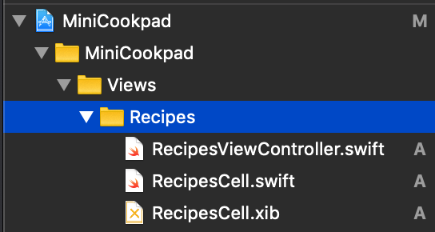

まずは、`RecipesCell.swift`に下準備をしておきます。

```swift
import Instantiate
import InstantiateStandard
import UIKit

final class RecipesCell: UITableViewCell, Reusable, NibType {
    @IBOutlet private weak var recipeImageView: UIImageView!
    @IBOutlet private weak var nameLabel: UILabel!
    @IBOutlet private weak var descriptionLabel: UILabel!
}
```

`RecipesCell`には、レシピの画像、レシピ名、レシピの説明を表示する予定なので、この 3 つを定義します。  
`@IBOutlet`というのを付けることで、この後作成する View のパーツと接続することができ、それぞれの View のパーツの情報を参照したり更新したりすることができるようになります。`@IBOutlet private weak var` くらいまでは(ひとまず)おまじないだと思っていて問題ないです。  
また、`Reusable, NibType`と書いている部分は、後で役に立つので今は記述だけしておきます。

次に`Recipes.xib`を開いて、View の構築をしていきます。  
開いた直後は何もない状態なので、（`⌘⇧L`）を押し、「uitableviewcell」と検索し、`UITableViewCell`をなにもない空間にドラッグアンドドロップして配置します。

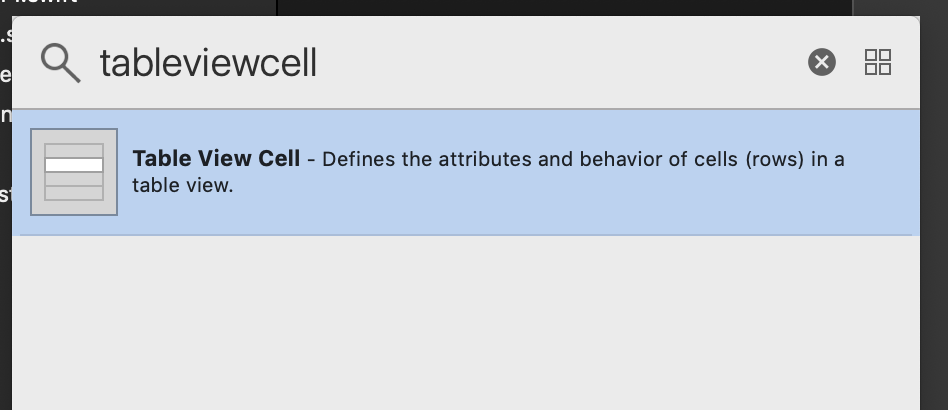  
  
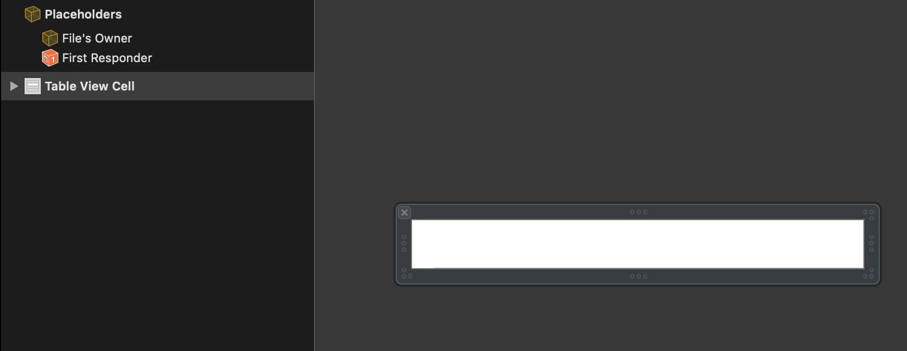

セルが配置できましたが、このままだと小さくて作業しづらいので、ひとまずセルのサイズを変更します。  
下の図のように、セルのサイズを変更します。

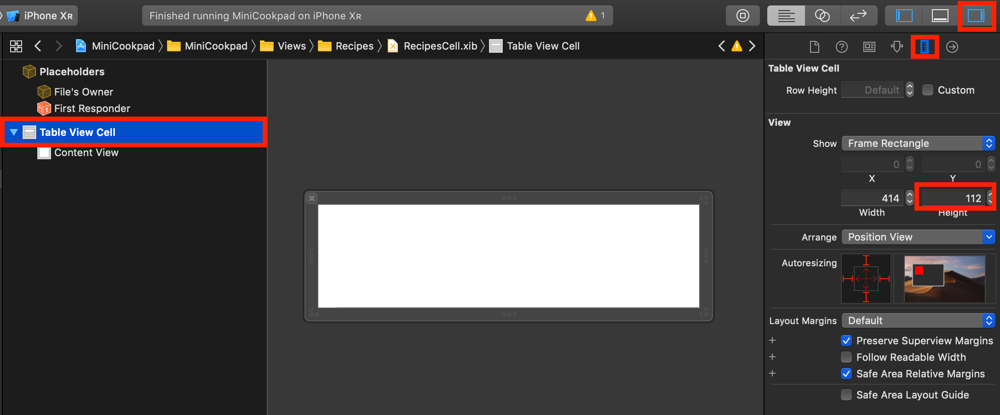

- 「Table View Cell」をクリック
- エディタ右側のインスペクタエリアの中にある、アイコンが 6 つくらい並んでいる部分があるので右から 2 つ目を押す
  - もしエディタ右側にインスペクタエリアがでていない場合は右上のアイコンから表示させることができます。(`⌘⌥0`)
- 「View」項目の「height」を 112 に変更

これで大きくなって作業がしやすくなりました。  
また、このように数値を変えなくても、セルの外枠の「◯◯◯」をドラッグすることで幅や高さを調整することも可能です。

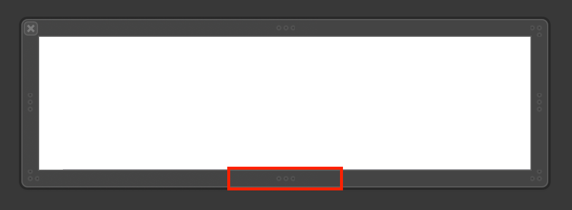

サイズを大きくしたので、次は「レシピ写真」「レシピ名」「レシピ説明」を表示するためのパーツ`UIImageView` `UILabel`を配置します。
先程と同様に（`⌘⇧L`）を押して、 「image」と検索して`UIImageView`を、「label」と検索して`UILabel`を 2 つ配置します。
配置場所はだいたいでいいのでこんな感じに配置します。  
`UIImageView`はドラッグアンドドロップした直後はやや大きいので、一度置いた後に四隅にある □ を押しながら適当にサイズを小さくします。

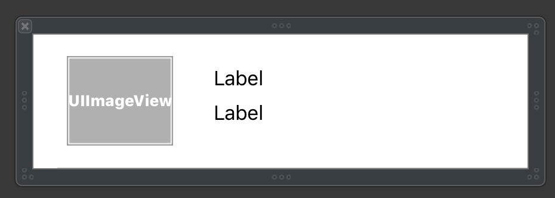

配置ができたら、次は 2 つのラベルを同時に選択し、画面下にある下矢印のついたアイコンを押し、「Stack View」を選択して、2 つのラベルを縦にグルーピングします。

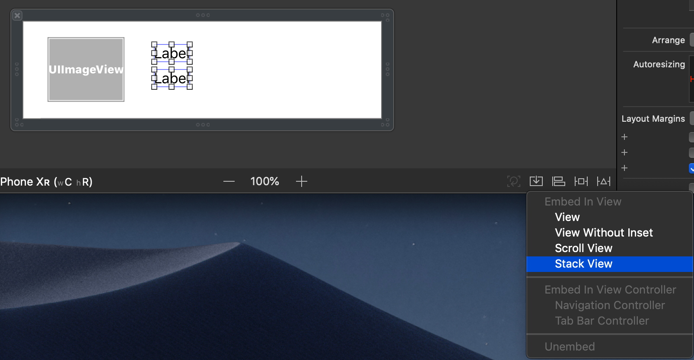

View の階層がこの様になっていれば問題ないです。

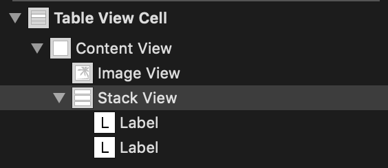

StackView に入れた 2 つの Label の間のスペースを 12px に設定しておきましょう。

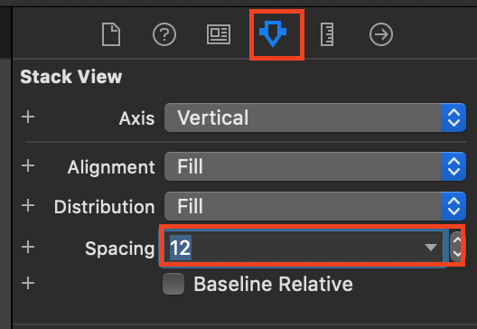

#### AutoLayout の設定

ここまでできたら、`AutoLayout`を設定して、View の配置方法を定義します。

まずは UIImageView を選択して、次のように設定します。

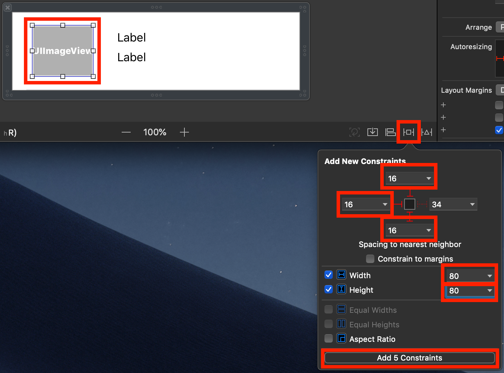

- UIImageView の上端、左端、下端にセルのそれぞれの端から 16px の位置にくるようにする
- 幅、高さを 80px ずつに設定し、正方形にする

制約を付けました。  
次は UIImageView と StackView の 2 つを選択して、次のように制約を追加します。  
(うまく選択できない場合は、View の階層ツリーの部分で、該当のパーツを（`⌘ Click`）すると複数選択できます。)

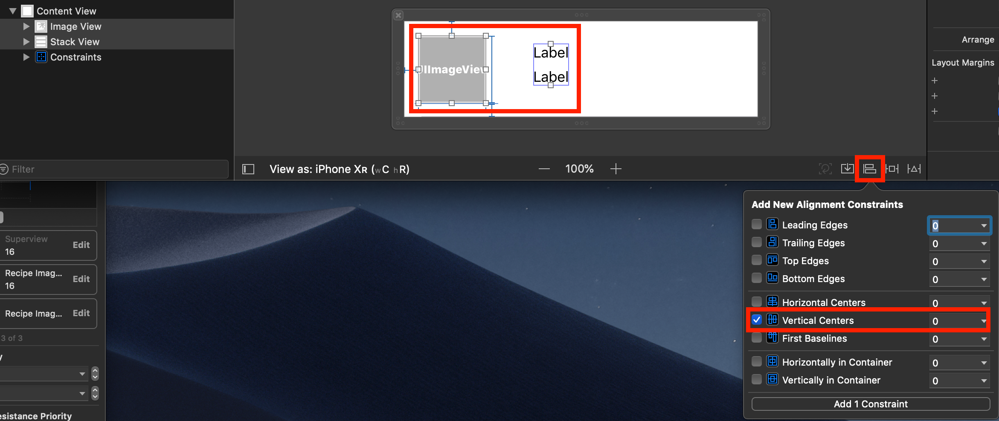

今度は、UIImageView と StackView の間に、UIImageView の位置を基点に、縦方向に対して中央揃えになるように制約を加えました。  
おや、今の制約を追加したことでエラーがでましたね。でも慌てなくて大丈夫です。今の制約を加えたことにより、StackView の、横方向に対する位置と、幅が未確定になってしまうため、エラーになっているだけです。  
最後に次の制約を StackView に追加します。

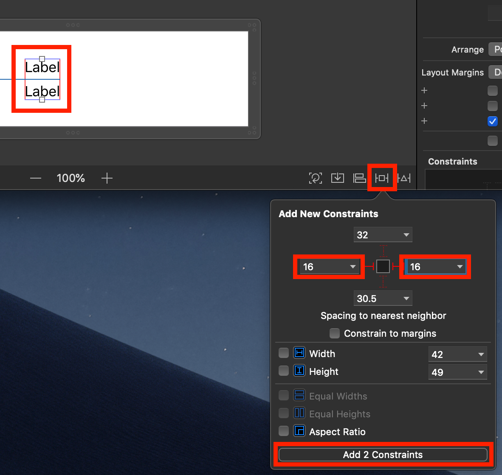

StackView の左端、右端にそれぞれ 16px ずつの制約を追加します。これにより先程のエラーは解消され、矛盾なく AutoLayout によってレイアウトを組むことができました。  
これでひとまず制約の設定ができたのですが、後の実装で実行時に AutoLayout のエラーが発生しうる箇所があるので、その対処だけおまじないとして行っておきます。
UIImageView の下端につけた制約を選び、この制約の priority(優先度)を`750`に設定します。  
(これについては詳細は割愛します。後で実行したときに謎のエラーがでてしまうのを防ぐためだと思ってください.)

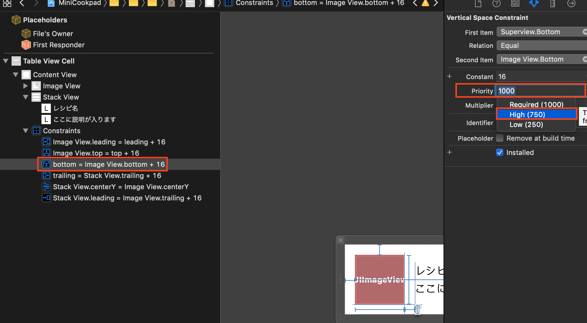

ここまでで、設定した AutoLayout の制約をもう少しわかりやすくすると、次のような感じになります。

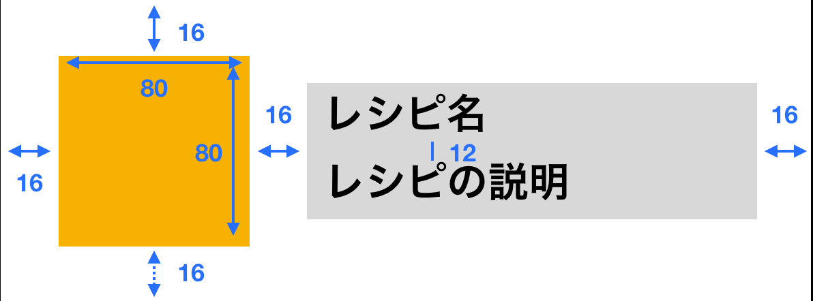

ここまでできて、エラー(赤いエクスクラメーションマーク)が出ていなければ正しく View の構築ができています。  
もしエラーが出ている場合は、AutoLayout の制約にどこか矛盾が起きていることになります。

最後に、このままだと UIImageView は現状ただの透明な View に過ぎず、UILabel も「Label」と書かれただけなので、ひとまず適当な色や文字で placeholder を設定しておきましょう。

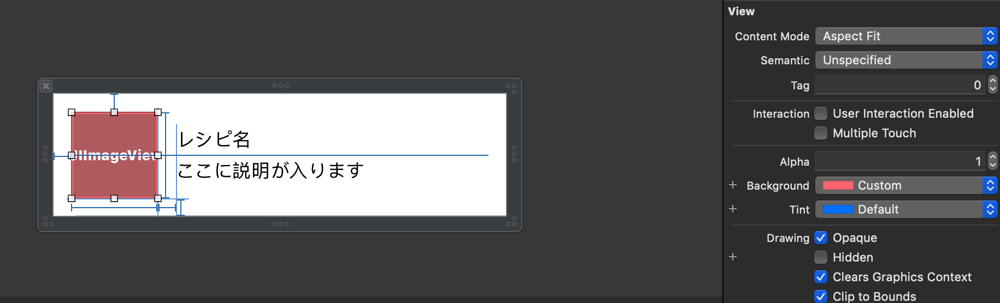

#### xib 上の View とソースコード上の View のクラスの接続

ここまでで、ソースコード上でのセルの定義と、xib ファイル上でのセルの View 構築が終わったので、この両者を紐付けます。  
`RecipesCell.xib`を開き、次のように、UITableViewCell のクラスに`RecipesCell`を指定します

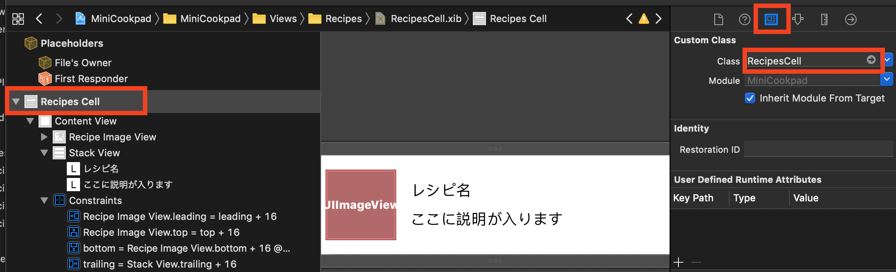

これにより、xib 上で作成した UITableViewCell は RecipesCell として認識されるようになります。  
次に、RecipesCell のそれぞれの要素(画像やラベル)をソースコードと紐付けます。
`Recipes Cell`を押し、インスペクタエリアの右上にある項目「Outlets」に、xib 上のパーツと紐付け可能な変数名が並んでいます。

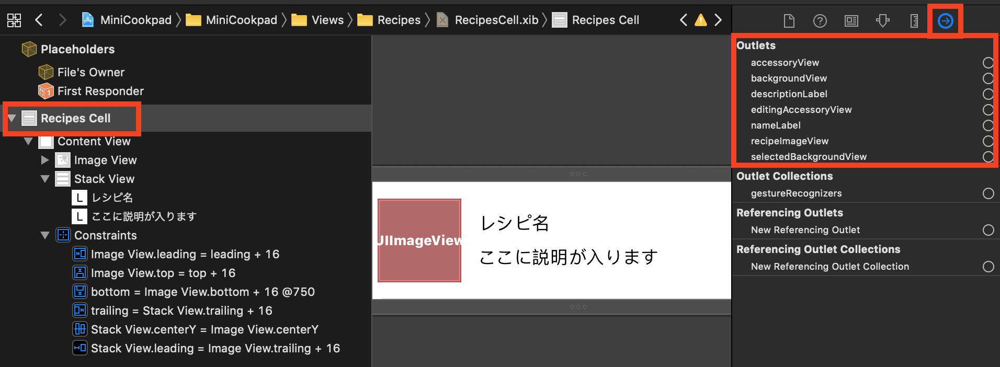

`◯`の部分にマウスを持っていき、ドラッグアンドドロップで、` recipeImageView` `nameLabel` `descriptionLabel`を紐付けたいパーツまで引っ張っていき紐付けます。

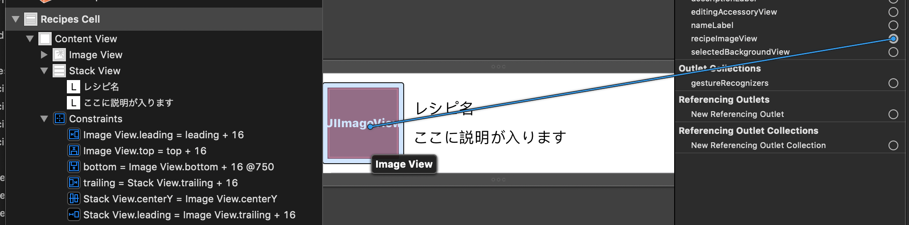

最終的に「Outlets」の部分が次のようになっていれば、xib とソースコードとの紐付けは完了です。

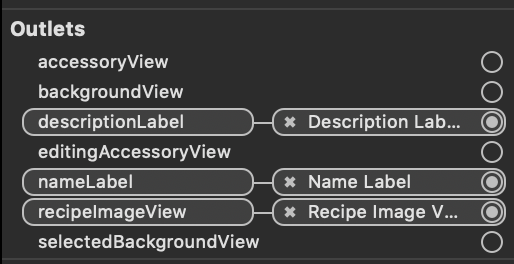

### まずは通信処理なしで表示する

後でここは通信処理をして取得したデータを基に動的に変更できるように修正します。

UITableView を使ったときに、

- 「何個の要素を載せたいのか」
- 「各要素の View はどういうものか」
- 「要素の高さはどれくらいか」
- 「要素をタップしたときの動作は何か」

といったものを定義するために、「delegate」を利用して実装します。
`RecipesViewController`に、`UITableView`側から「何個の要素を載せたいのか」というのを問われたときに、その問に答えるためのメソッドを定義し、こちらの要望を`UITableView`側に伝え、リスト表示を行います。

`RecipesViewController`を次のように書き換えます。

```swift
import UIKit
import Instantiate

final class RecipesViewController: UIViewController {
    // 省略

    override func loadView() {
        super.loadView()
        view.backgroundColor = .white
        view.addSubview(tableView)
        NSLayoutConstraint.activate([
            tableView.safeAreaLayoutGuide.topAnchor.constraint(equalTo: view.safeAreaLayoutGuide.topAnchor),
            tableView.bottomAnchor.constraint(equalTo: view.bottomAnchor),
            tableView.safeAreaLayoutGuide.leadingAnchor.constraint(equalTo: view.safeAreaLayoutGuide.leadingAnchor),
            tableView.safeAreaLayoutGuide.trailingAnchor.constraint(equalTo: view.safeAreaLayoutGuide.trailingAnchor),
        ])
        tableView.registerNib(type: RecipesCell.self)
    }

    override func viewDidLoad() {
        super.viewDidLoad()
        tableView.dataSource = self
    }

    @available(*, unavailable)
    required init?(coder aDecoder: NSCoder) {
        fatalError("init(coder:) has not been implemented")
    }
}

extension RecipesViewController: UITableViewDataSource {
    func tableView(_ tableView: UITableView, numberOfRowsInSection section: Int) -> Int {
        return 20
    }

    func tableView(_ tableView: UITableView, cellForRowAt indexPath: IndexPath) -> UITableViewCell {
        let cell = RecipesCell.dequeue(from: tableView, for: indexPath)
        return cell
    }
}
```

```diff
// diff
import UIKit

final class RecipesViewController: UIViewController {
    // 省略

    override func loadView() {
        super.loadView()
        view.backgroundColor = .white
        view.addSubview(tableView)
        NSLayoutConstraint.activate([
            tableView.safeAreaLayoutGuide.topAnchor.constraint(equalTo: view.safeAreaLayoutGuide.topAnchor),
            tableView.bottomAnchor.constraint(equalTo: view.bottomAnchor),
            tableView.safeAreaLayoutGuide.leadingAnchor.constraint(equalTo: view.safeAreaLayoutGuide.leadingAnchor),
            tableView.safeAreaLayoutGuide.trailingAnchor.constraint(equalTo: view.safeAreaLayoutGuide.trailingAnchor),
        ])
+         tableView.registerNib(type: RecipesCell.self)
    }

+     override func viewDidLoad() {
+         super.viewDidLoad()
+         tableView.dataSource = self
+     }

    @available(*, unavailable)
    required init?(coder aDecoder: NSCoder) {
        fatalError("init(coder:) has not been implemented")
    }
}

+ extension RecipesViewController: UITableViewDataSource {
+     func tableView(_ tableView: UITableView, numberOfRowsInSection section: Int) -> Int {
+         return 20
+     }
+
+     func tableView(_ tableView: UITableView, cellForRowAt indexPath: IndexPath) -> UITableViewCell {
+         let cell = RecipesCell.dequeue(from: tableView, for: indexPath)
+         return cell
+     }
}
```

ここまで実装してビルドすると、やや不格好ですが、このように指定した数だけ、リスト表示されるようになりました 🎉

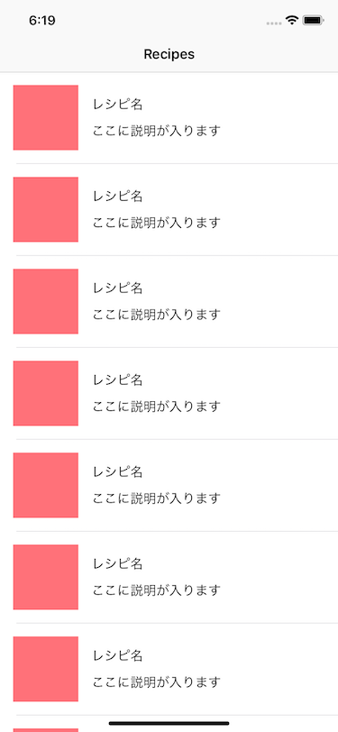

## AuthoCenter

先程までで、静的にリスト表示を行うことができました。  
ここから、サーバーからデータを取得して表示するための実装を進めていきます。  
データを

- AuthoCenter から`user_id`を指定して`id_token`を取得する
- `id_token`を Header に付けて、指定したクエリでデータを取得する

ので、まずは AuthoCenter から`id_token`をもらうためのリクエストを実装します。

`MiniCookpad/API` ディレクトリを作成し、その中に`AuthoCenterTokenRequest.swift`を作成し、次のようにコードを記述します。

```swift
import Foundation
import APIKit

final class DecodableDataParser: DataParser {
    var contentType: String? {
        return "application/json"
    }

    func parse(data: Data) throws -> Any {
        return data
    }
}

struct AuthoCenterTokenRequest: Request {
    struct Response: Decodable {
        let idToken: String
        let tokenType: String
        let expiresIn: Int
    }

    let baseURL: URL = URL(string: "[enter_your_auth_center_endpoint]")!
    let method: HTTPMethod = .post
    let path: String = "token"
    let userID: Int
    init(userID: Int) {
        self.userID = userID
    }

    var bodyParameters: BodyParameters? {
        return FormURLEncodedBodyParameters(formObject: [
            "grant_type": "big_fake_password",
            "user_id": "\(userID)",
            "password": "kogaidan",
            "konmai": true // 有効期限を伸ばすためのものなので不要になったら削除する
        ])
    }

    let dataParser: DataParser = DecodableDataParser()

    func response(from object: Any, urlResponse: HTTPURLResponse) throws -> Response {
        guard let data = object as? Data else {
            throw ResponseError.unexpectedObject(object)
        }
        let decoder = JSONDecoder()
        decoder.keyDecodingStrategy = .convertFromSnakeCase
        return try decoder.decode(Response.self, from: data)
    }
}
```

これが実装できると、次のように記述することで`id_token`が取得出来るようになります。

```swift
Session.shared.send(AuthoCenterTokenRequest(userID: userID)) { result in
    switch result {
    case let .success(response):
        print(response.idToken)
    case let .failure(error):
        print(error)
    }
}
```

説明するとやや時間がかかるのと、今回の講義の本質部分ではないので、詳細は割愛します。この時点では「こんなもんだなあ」、「認証用トークンを受け取って通信リクエストに使うための実装をとりあえずした」くらいで流しておいて大丈夫です。

### Result 型?

ここでの`result`変数は、`Result`型と呼ばれる型になっていて、「成功か失敗かどちらかの値を持つ型」を表現することができます。  
定義としてはこのようになっています。

```swift
public enum Result<Success, Failure> where Failure: Error {
    case success(Success)
    case failure(Failure)
}
```

これを活用することで、「成功の時の値もエラーの値も両方あるかもしれない/どちらもないかもしれない」というのを防ぐことができ、コードの見通しが良くなります。

## GraphQL リクエストの処理を書く

`schema.json`と、`Recipe.graphql`から生成した`GraphQLAPI.swift`を素のまま使うと扱いづらく、リクエストを叩く前に AuthoCenter から発行した id_token を取得できていない場合は取得する必要があるので`APIClient.swift`という名前で諸々の処理をラップしたクラスを作成します。

`MiniCookpad/API`以下に`APIClient.swift`を作成し、次のように記述します。

```swift
import Apollo
import Foundation
import APIKit

final class APIClient {
    enum APIError: Error {
        case invalidResult
    }
    private static func makeApolloClient(idToken: String) -> ApolloClient {
        let configuration: URLSessionConfiguration = .default
        configuration.httpAdditionalHeaders = [
            "Authorization": "Bearer \(idToken)"
        ]
        configuration.requestCachePolicy = .reloadIgnoringLocalCacheData
        return ApolloClient(networkTransport: HTTPNetworkTransport(
            url: URL(string: "[enter_your_endpoint]")!, // NOTE: ここのURLは自分のGraphQLサーバーのendpointにすること
            configuration: configuration
        ))
    }

    static let shared: APIClient = .init()
    private var idToken: String?
    let userID: Int
    private init() {
        userID = 9976705 // NOTE: ひとまずこのIDを使ってください。
    }

    private func getIDToken(session: Session = .shared, completion: @escaping (Swift.Result<String, Error>) -> Void) {
        if let idToken = idToken {
            completion(.success(idToken))
            return
        }
        session.send(AuthoCenterTokenRequest(userID: userID)) { [unowned self] result in
            self.idToken = (try? result.get())?.idToken
            completion(result.map { $0.idToken }.mapError { $0 })
        }
    }

    func getRecipes(page: Int = 1, perPage: Int = 20, completion: @escaping (Swift.Result<[RecipesQuery.Data.Recipe], Error>) -> Void) {
        getIDToken { result in
            switch result {
            case let .success(idToken):
                APIClient
                    .makeApolloClient(idToken: idToken)
                    .fetch(query: RecipesQuery(page: page, perPage: perPage)) { result in
                        completion(result.map { $0.data?.recipes.compactMap { $0 } ?? [] })
                    }
            case let .failure(error):
                completion(.failure(error))
            }
        }
    }
}
```

...やや大きめの実装なので、大事なところだけ何点か補足していきます。

### シングルトンクラス

この`APIClient`はいわゆるシングルトンと呼ばれるデザインパターンを用いて定義しています。  
アプリの実行中に一度だけ初期化されて、以降は同一のインスタンスが使われます。  
上記の長い処理を最小に留めて記述すると次のようになります。

```swift
final class APIClient {
    static let shared: APIClient = .init()
    private var idToken: String?
    let userID: Int
    private init() {
        userID = 12345 // NOTE: 任意のIDを指定してください
    }
}
```

アクセスするときは、`APIClient.shared.[メソッド名]`のようにします。

### ApolloClientの生成

AuthoCenterで発行した`id_token`をHeaderに含む形で`ApolloClient`を生成するようにしています。

```swift
private static func makeApolloClient(idToken: String) -> ApolloClient {
    let configuration: URLSessionConfiguration = .default
    configuration.httpAdditionalHeaders = [
        "Authorization": idToken
    ]
    configuration.requestCachePolicy = .reloadIgnoringLocalCacheData
    return ApolloClient(networkTransport: HTTPNetworkTransport(
        url: URL(string: "[enter_your_endpoint]")!,
        configuration: configuration
    ))
}
```

生成したApolloClientを使うと、次のようにリクエストを実行することができるようになります。

```swift
let client = makeAppoloClient(idToken: "xxx")
client.fetch(query) { result in
    // ...
}
```

### id_tokenの取得 -> リクエスト

`id_token`を取得する関数を定義します。  
もし既に取得済みだったら取得済みの`id_token`をコールバックに即渡し、そうでなければリクエストを投げて`id_token`を取得し、コールバックに渡すようにします。

```swift
private func getIDToken(session: Session = .shared, completion: @escaping (Swift.Result<String, Error>) -> Void) {
    if let idToken = idToken {
        completion(.success(idToken))
        return
    }
    session.send(AuthoCenterTokenRequest(userID: userID)) { [unowned self] result in
        self.idToken = (try? result.get())?.idToken
        completion(result.map { $0.idToken }.mapError { $0 })
    }
}
```

これを用いると次のような形で書けるようになります。  

```swift
getIDToken { result in
    switch result {
    case let .success(idToken):
        APIClient.makeApolloClient(idToken: idToken)
            .fetch(query) { result in 
                // ...
            }
    case let .failure(error):
        completion(.failure(error))
    }
}
```

ここまでで、AuthoCenter で`id_token`を発行し、その`id_token`を使ってリクエストを投げるところまで実装ができました。  
あとはこれを呼び出す処理を`RecipesViewController`に...  
ではなく、今回はMVVMというアーキテクチャで設計をしつつ、リクエスト処理を記述する場所を`RecipesViewController`にしないようにします。

## ViewModelクラスの作成

ということで、`RecipesViewController.swift`と同じ階層に、`RecipesViewModel.swift`を作成します。

### (補足)MVVM とは...?

MVVM とは、アーキテクチャの一つで、  
ある画面を構成するときに「**M**odel - **V**iew - **V**iew**M**odel」という 3 つの層に分け、それぞれに責務を振り分け実装していく手法になります。  

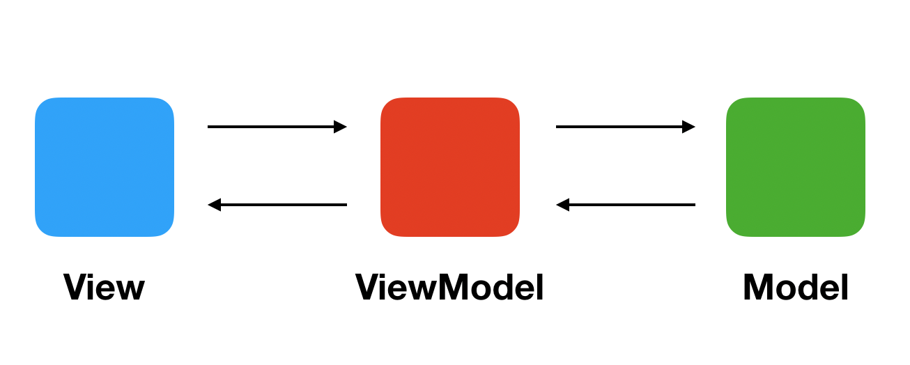

他にも、MVC,MVP,VIPER,Clean Architecture 等あります。iOS の場合やや特殊ですが、ViewController が MVC でいう View と Controller の役割をすることもあります。なので ViewController に色々書いてしまいがち。。になるのですが、それを避けたいので今回は MVVM というアーキテクチャで設計していくこととします。  
また、MVVM を取ってみても書き方が色々あるのですが、今回は「[kickstarter/ios-oss](https://github.com/kickstarter/ios-oss)」で使われている書き方を採用しています。  
(例: [SerchViewModel.swift](https://github.com/kickstarter/ios-oss/blob/master/Library/ViewModels/SearchViewModel.swift))

iOS の実際の開発現場では、RxSwift と呼ばれる FRP のフレームワークの一つを使って、それぞれの層とのやりとりを記述することが多いですが、今回は少々古典的ですがメソッド呼び出しとコールバックで実現することにします。

### 実装

`RecipesViewModel`に、以下のように実装を加えます。

```swift
protocol RecipesViewModelInputs {
    func fetchRecipes(page: Int)
}

protocol RecipesViewModelOutputs {
    func recipesFetched(_ block: @escaping ([RecipesQuery.Data.Recipe], Int) -> Void)
    func recipesFetchFailed(_ block: @escaping (Error) -> Void)
}

protocol RecipesViewModelType {
    var inputs: RecipesViewModelInputs { get }
    var outputs: RecipesViewModelOutputs { get }
}

final class RecipesViewModel: RecipesViewModelType, RecipesViewModelInputs, RecipesViewModelOutputs {
    var inputs: RecipesViewModelInputs { return self }
    var outputs: RecipesViewModelOutputs { return self }
    private var _recipesFetched: (([RecipesQuery.Data.Recipe], Int) -> Void)?
    private var _recipesFetchFailed: ((Error) -> Void)?
    private var isRequesting: Bool = false

    func fetchRecipes(page: Int) {
        if isRequesting { return }
        isRequesting = true

        APIClient.shared.getRecipes(page: page) { [weak self] result in
            guard let self = self else { return }
            self.isRequesting = false
            switch result {
            case let .success(recipes):
                self._recipesFetched?(recipes, page)
            case let .failure(error):
                self._recipesFetchFailed?(error)
            }
        }
    }

    func recipesFetched(_ block: @escaping ([RecipesQuery.Data.Recipe], Int) -> Void) {
        _recipesFetched = block
    }

    func recipesFetchFailed(_ block: @escaping (Error) -> Void) {
        _recipesFetchFailed = block
    }
}
```

`RecipesViewModelInputs`,`RecipesViewModelOutputs`というprotocol定義で、このViewModelへの入力と出力をそれぞれ定義します。  
そして、inputs/outputsを持つViewModelの型であるというのを`RecipesViewModelType`としてprotocol定義をし、その実装として`RecipesViewModel`を定義しています。  
  
`func fetchRecipes(page: Int)` 関数内で、先程作成したAPIClientの処理を呼び出して、結果を`recipesFetched`または`recipesFetchFailed`として返すようにしています。

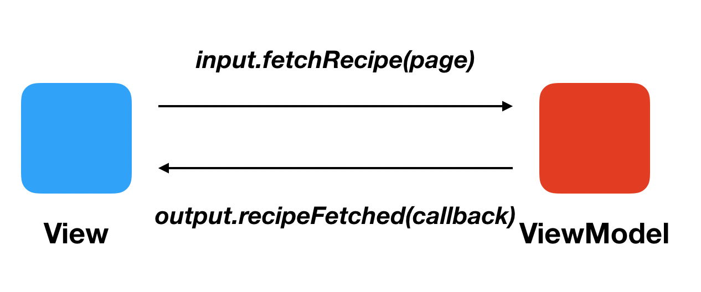


## ViewModelとViewControllerの接続

ViewModelの実装ができたので、`RecipesViewController`と`RecipesCell`に以下のように変更を加え、

- `RecipesViewModel`の生成
- input/outputの処理
- データを取得できたときに、リストの内容を動的に変える

といった実装に変えていきます。

- `RecipesCell`

```swift
import Instantiate
import InstantiateStandard
import UIKit
import Kingfisher

final class RecipesCell: UITableViewCell, Reusable, NibType {
    @IBOutlet private weak var recipeImageView: UIImageView!
    @IBOutlet private weak var nameLabel: UILabel!
    @IBOutlet private weak var descriptionLabel: UILabel!

    func inject(_ dependency: RecipesQuery.Data.Recipe) {
        nameLabel.text = dependency.name
        descriptionLabel.text = dependency.description
        recipeImageView.kf.setImage(with: dependency.media?.thumbnail.flatMap(URL.init(string:)))
    }
}
```

```diff
// diff
import Instantiate
import InstantiateStandard
import UIKit
+ import Kingfisher

final class RecipesCell: UITableViewCell, Reusable, NibType {
    @IBOutlet private weak var recipeImageView: UIImageView!
    @IBOutlet private weak var nameLabel: UILabel!
    @IBOutlet private weak var descriptionLabel: UILabel!

+     func inject(_ dependency: RecipesQuery.Data.Recipe) {
+         nameLabel.text = dependency.name
+         descriptionLabel.text = dependency.description
+         recipeImageView.kf.setImage(with: dependency.media?.thumbnail.flatMap(URL.init(string:)))
+     }
}
```

- `RecipesViewController`

```swift
final class RecipesViewController: UIViewController {
    private lazy var tableView: UITableView = ...
    private let viewModel: RecipesViewModelType
    private var recipes: [RecipesQuery.Data.Recipe] = []
    // 省略

    init(viewModel: RecipesViewModelType = RecipesViewModel()) {
        self.viewModel = viewModel
        super.init(nibName: nil, bundle: nil)
        title = "Recipes"
    }

    override func viewDidLoad() {
        super.viewDidLoad()
        tableView.dataSource = self

        viewModel.outputs.recipesFetched { [weak self] recipes, page in
            self?.recipes.append(contentsOf: recipes)
            self?.tableView.reloadData()
        }

        viewModel.inputs.fetchRecipes(page: 1)
    }

    // 省略
}

extension RecipesViewController: UITableViewDataSource {
    func tableView(_ tableView: UITableView, numberOfRowsInSection section: Int) -> Int {
        return recipes.count
    }

    func tableView(_ tableView: UITableView, cellForRowAt indexPath: IndexPath) -> UITableViewCell {
        let cell = RecipesCell.dequeue(from: tableView, for: indexPath, with: recipes[indexPath.row])
        return cell
    }
}
```

```diff
// diff
final class RecipesViewController: UIViewController {
    private lazy var tableView: UITableView = ...
+     private let viewModel: RecipesViewModelType
+     private var recipes: [RecipesQuery.Data.Recipe] = []
    // 省略

-     init() {
+     init(viewModel: RecipesViewModelType = RecipesViewModel()) {
+         self.viewModel = viewModel
        super.init(nibName: nil, bundle: nil)
        title = "Recipes"
    }

    override func viewDidLoad() {
        super.viewDidLoad()
        tableView.dataSource = self

+         viewModel.outputs.recipesFetched { [weak self] recipes, page in
+             self?.recipes.append(contentsOf: recipes)
+             self?.tableView.reloadData()
+         }

+         viewModel.inputs.fetchRecipes(page: 1)
    }

    // 省略
}

extension RecipesViewController: UITableViewDataSource {
    func tableView(_ tableView: UITableView, numberOfRowsInSection section: Int) -> Int {
-         return 20
+         return recipes.count
    }

    func tableView(_ tableView: UITableView, cellForRowAt indexPath: IndexPath) -> UITableViewCell {
-         let cell = RecipesCell.dequeue(from: tableView, for: indexPath)
+         let cell = RecipesCell.dequeue(from: tableView, for: indexPath, with: recipes[indexPath.row])
        return cell
    }
}
```

ここまで変更ができ、ビルドエラーが起きずに実行することができれば、次のように、取得したデータを使ってリスト一覧が表示出来るようになったと思います。

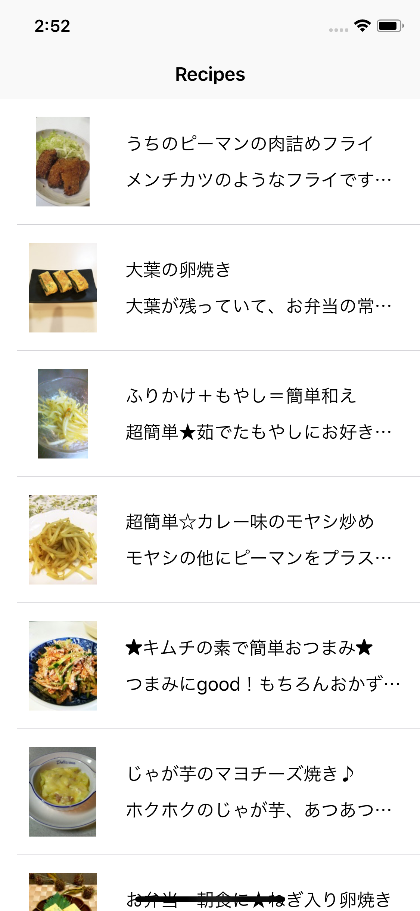  

---

3章、とても長い道のりでしたが、これでリスト一覧の表示が実装できました。🎉  
ここまで作成することができれば、iOS アプリ開発初心者は脱出したようなものです！
次は、このリストの要素をタップしたときに、レシピ詳細画面に遷移し、詳細を表示するための画面の実装をします。
