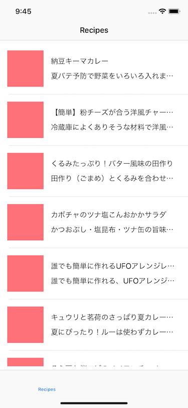
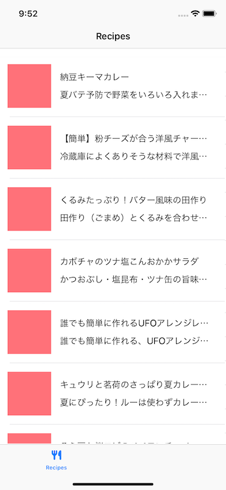
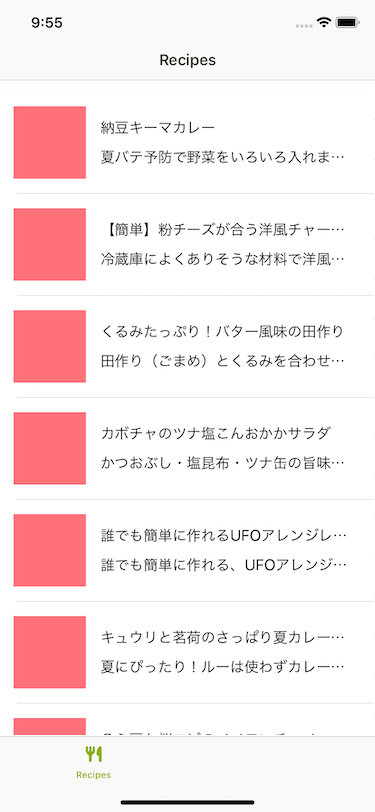
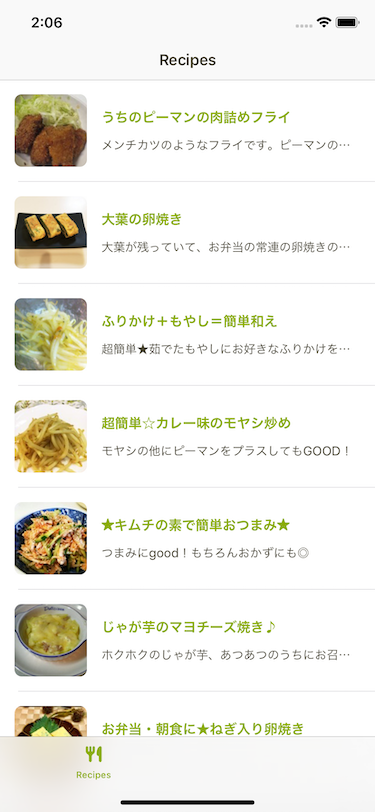
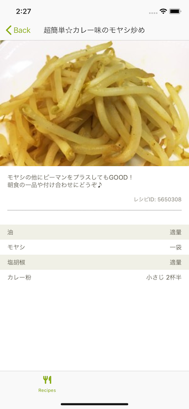

# 5. よりアプリらしい見た目に

ここまでで一覧画面と詳細画面と実装してきましたが、正直なところデザイン(UI)がイケてなさすぎて全然アプリっぽくないですよね。  
なのでこの章では、発展課題に備えるべく、新たに`タブ`というものを加えつつ、今までおざなりにしてきた「文字の大きさ」「文字の色」「UIパーツの色」といったものを整えていきます。

### 注意

講義時点では、Cookpad内で使っているUIライブラリを使って色や画像を指定していました。  
資料の公開時点では、こちらを使うことができないので、次のような記述が講義資料にある場合は、適宜ご自身で色やフォント、画像をごしてください。

```swift
view.backgroundColor = UIColor.cookpad.green
// 変更後
view.backgroundColor = .green

label.font = UIFont.cookpad.small
// 変更後
label.font = .systemFont(ofSize: 12.0)

imageView.image = CookpadSymbol.recipe.makeImage(symbolColor: .black, size: .init(width: 20, height: 20))
// 変更後
imageView.image = UIImage(named: "recipe_icon")
```

この注意点はこの章以降すべて共通です。

## タブの表示

まずはタブの表示をしてみましょう。  
`AppDelegate.swift`を開き、次のように変更を加えます。

```swift
    func application(_ application: UIApplication, didFinishLaunchingWithOptions launchOptions: [UIApplication.LaunchOptionsKey: Any]?) -> Bool {
        let window = UIWindow(frame: UIScreen.main.bounds)
        let tabBarController = UITabBarController()
        tabBarController.setViewControllers([
            UINavigationController(rootViewController: RecipesViewController()),
            UINavigationController(rootViewController: UIViewController())
        ], animated: false)

        window.rootViewController = tabBarController
        self.window = window
        window.makeKeyAndVisible()
        return true
    }
```

これでビルドして実行してみると、次のようになると思います。

  

画面の下にタブバーが現れましたね。右側は、今後発展課題で取り組むときに修正をするので、タブバーに何も表示されていなくて、タップしても真っ暗な状態なのはひとまず置いておきましょう。  
タブバーに`Recipes`という文字はでているものの、アイコンがないと寂しい感じなので、アイコンを追加します。  
`ReciepsViewController`を開き、次のようにコードを追加します。

```swift
// ファイルの上部にimportを追加
import CookpadUI

    init(viewModel: RecipesViewModelType = RecipesViewModel()) {
        self.viewModel = viewModel
        super.init(nibName: nil, bundle: nil)
        title = "Recipes"
        // 追加
        tabBarItem.image = CookpadSymbol.recipe.makeImage(symbolColor: .black, size: .init(width: 20, height: 20))
    }
```

今回はクックパッドで使っているアイコンをロードして設定するようにしました。  
実行すると次のようになります。  

  


さらに、

- タブバーの文字色
- タブバーのアイコンの色
- ナビゲーションバーの文字の色

を変更してみましょう。`UIAppearance`を活用することで、アプリケーションのすべてのタブバーやナビゲーションバーに対して一括で色などを設定することができます。  
個別に設定する場合は、それぞれのUIパーツのインスタンスに対して設定します。今回はこの`UIAppearance`を活用します。  
`AppDelegate`を開き、`window.makeKeyAndVisible()`と書いている行のすぐ下に以下のコードを追加します。

```swift
// ファイルの上部にimportを追加
import CookpadUI

    func application(_ application: UIApplication, didFinishLaunchingWithOptions launchOptions: [UIApplication.LaunchOptionsKey: Any]?) -> Bool {
        // 省略

        window.makeKeyAndVisible()
        // 追加
        UIBarButtonItem.appearance().tintColor = UIColor.cookpad.green
        UINavigationBar.appearance().titleTextAttributes = [.foregroundColor: UIColor.cookpad.black]
        UINavigationBar.appearance().largeTitleTextAttributes = [.foregroundColor: UIColor.cookpad.black]
        UITabBar.appearance().tintColor = UIColor.cookpad.green
        UITabBar.appearance().unselectedItemTintColor = UIColor.cookpad.gray

        return true
    }
```

実行すると次のようになります。  

  

見た目が少し改善されましたね。次はレシピ一覧画面のセルのUIを改善していきましょう。


## レシピ一覧の画面のUI改善
次にレシピ一覧のセルの文字の大きさや色、画像を角丸にする、といった処理を実装しましょう。
`RecipesCell.swift`を開き、次のように修正を加えます。  

```swift
// CookpadUI をimport する
import CookpadUI

    // 各種IBOutletの変数定義のあとに、`didSet`を加える
    @IBOutlet private weak var recipeImageView: UIImageView! {
        didSet {
            recipeImageView.layer.masksToBounds = true
            recipeImageView.layer.cornerRadius = 8.0
            recipeImageView.backgroundColor = UIColor.cookpad.gray
            recipeImageView.contentMode = .scaleAspectFill
        }
    }
    @IBOutlet private weak var nameLabel: UILabel! {
        didSet {
            nameLabel.font = UIFont.cookpad.defaultBold
            nameLabel.textColor = UIColor.cookpad.green
        }
    }
    @IBOutlet private weak var descriptionLabel: UILabel! {
        didSet {
            descriptionLabel.font = UIFont.cookpad.small
            descriptionLabel.textColor = UIColor.cookpad.black
        }
    }
```

`@IBOutlet`で定義した変数に`didSet`を足し、そこに処理を書くことで、Viewがxibからロードされたタイミングで、記述した処理を行うことができます。  
ここではロードが終わったタイミングで文字の色や大きさ、画像を角丸にするといった処理をかけています。  
<br />
ここまでで実行すると次のように見た目が変化します。  

  

また、別の方法としては、xib上で直接ラベルの文字や色を変更する方法もあります。  
すべてをInterfaceBuilder上で設定するのもありですが、コードとして差分が追いづらくなるというのもあるので、今回は

- 複雑なAutoLayoutはxibファイル上で設定
- それ以外のUIのappearance(色や文字の大きさ、角丸)はコード上で設定

というようにしました。ラベルは、

- `label.textColor`で文字色を変更
- `label.font`でフォントの指定

をしています。画像は、

- `imageView.layer.masksToBounds` で、Viewの外側にはみ出てしまう画像をクリップ
- `imageView.layer.cornerRadius` で角丸の大きさを指定
- `imageView.backgroundColor` で、画像が読み込めなかった場合のplaceholder的な色を
- `imageView.contentMode` で、画像を、Viewの短辺に合わせて表示するようにしています。

というように設定しています。  
また、レシピ一覧画面でセルを選択したときに、グレーの色になってしまうものは、`RecipesViewController`の`func tableView(_ tableView: UITableView, didSelectRowAt indexPath: IndexPath)`関数の最初の行に以下のコードを入れます。

```swift
    func tableView(_ tableView: UITableView, didSelectRowAt indexPath: IndexPath) {
        // これを加える
        defer { tableView.deselectRow(at: indexPath, animated: true) }
        let vc = RecipeViewController.instantiate(with: recipes[indexPath.row].id)
        navigationController?.pushViewController(vc, animated: true)
    }
```

これで、選択したときのみグレーがかかり、タップし終わったときには元の色に戻るようになります。

## レシピ詳細画面のUI改善

次にレシピ詳細画面のUIを変更していきましょう。`RecipeViewController`を開き次のようにコードを修正していきます。

```swift
// import を忘れずに
import CookpadUI

final class RecipeViewController: UIViewController, StoryboardInstantiatable {
    // didSetの処理を追加する
    @IBOutlet private weak var scrollView: UIScrollView! {
        didSet {
            scrollView.alwaysBounceVertical = true
        }
    }
    @IBOutlet private weak var recipeImageView: UIImageView! {
        didSet {
            recipeImageView.contentMode = .scaleAspectFill
        }
    }
    @IBOutlet private weak var descriptionLabel: UILabel! {
        didSet {
            descriptionLabel.font = UIFont.cookpad.small
            descriptionLabel.textColor = UIColor.cookpad.black
        }
    }
    @IBOutlet private weak var recipeIDLabel: UILabel! {
        didSet {
            recipeIDLabel.font = UIFont.cookpad.extraSmall
            recipeIDLabel.textColor = UIColor.cookpad.darkGray
        }
    }
}
```

更に、`IngredientView`を開き、次のようにコードを修正します。

```swift
    @IBOutlet private weak var nameLabel: UILabel! {
        didSet {
            nameLabel.font = UIFont.cookpad.small
            nameLabel.textColor = UIColor.cookpad.black
        }
    }
    @IBOutlet private weak var quantityLabel: UILabel! {
        didSet {
            quantityLabel.font = UIFont.cookpad.small
            quantityLabel.textColor = UIColor.cookpad.black
        }
    }
```

また、材料の一覧のViewの背景色は、奇数偶数で色を変えているのですが、現状のグレーの色が濃いのでここも修正します。

```swift
recipe.ingredients?.compactMap { $0 }.enumerated().forEach { index, ingredient in
    let ingredientView = IngredientView.instantiate(with: ingredient)
    ingredientView.backgroundColor = index % 2 == 0 ? UIColor.cookpad.cardBaseBackground : .white
    //     ingredientView.backgroundColor = index % 2 == 0 ? .gray : .white
    self.ingredientsStackView.addArrangedSubview(ingredientView)
}
```

ここまでで実行すると次のような見た目に変わります。

  

この章の初めの頃より、とてもいい感じにUIが整ったと思います。  
次章以降は発展課題となるので、よりアプリらしい挙動にするべく挑戦してみてください。
