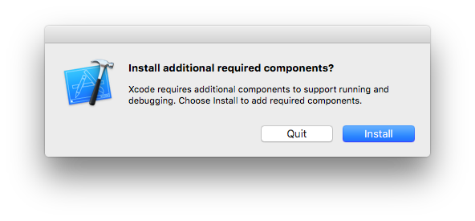
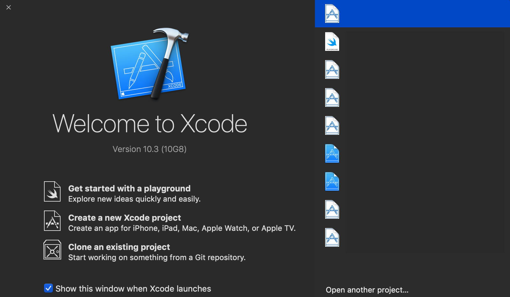

# 事前準備

## Xcodeのインストール

万が一、端末にXcodeがインストールされていなければ、Xcodeをインストールしてください。

- [インストール先](https://itunes.apple.com/jp/app/xcode/id497799835?mt=12&uo=4&at=10lbMu)

基本的にはXcode 10.2以降であれば困ることはありません。

### Install additional required component

Xcodeをインストールし、はじめて起動する場合に次のように求められることがあるので、インストールをしておく。2,3分ほどかかります。



ここまで済ませておけば、Xcodeの場合はAndroid Studioとは違い、古いバージョンのiOSシミュレータを使わない限りは手動でシミュレータをダウンロードしたりすることは不要です。

### 確認

Terminal.appを開き、下記のコマンドを叩いて出力結果が一致すればXcodeを使って開発をする準備が整ったと思います。

```bash
$ xcode-select -p
/Applications/Xcode.app/Contents/Developer
```

(※自分でXcodeを複数管理している場合は異なる場合があります.)

また、Xcode.appを起動し、次のような画面が出れば準備完了です。



## yarn のインストール

npmではなくyarnを使う予定です。インストールしておいてください。

```bash
$ npm install -g yarn
```

## Cocoapodsのインストール(任意)

グローバル領域にcocoapodsを入れておきたい場合は以下の手順でインストールしてください。  
(講義ではGemfileをプロジェクトに置いてプロジェクト内で管理する予定です)


## apolloのインストール(任意)
グローバル領域にapolloを入れておきたい場合は以下の手順でインストールしてください。  
(講義ではpackage.jsonにて管理する予定です。)

```bash
$ yarn global add apollo
```
